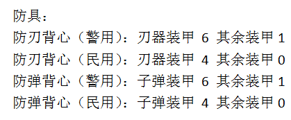
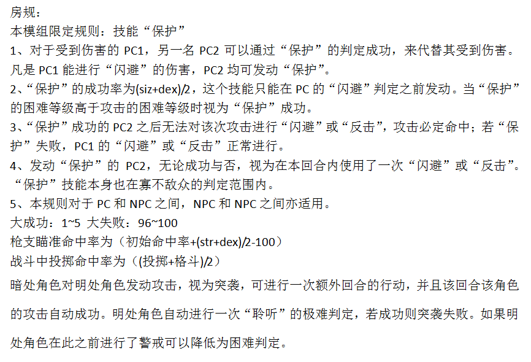
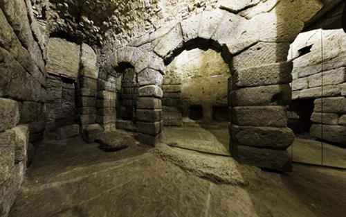
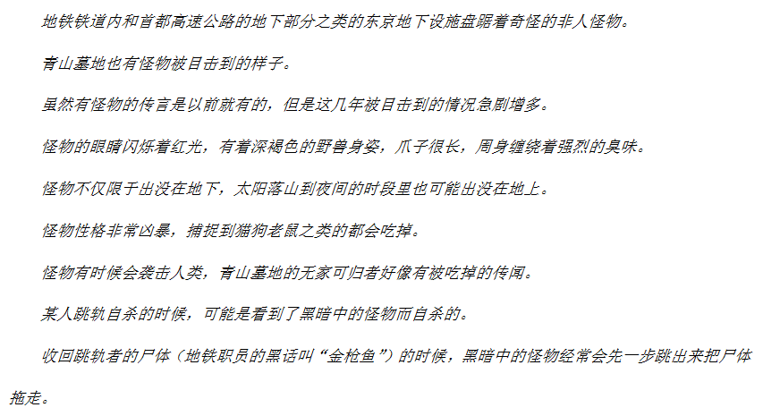
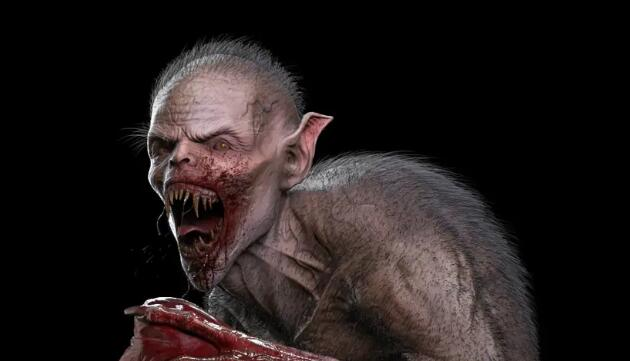
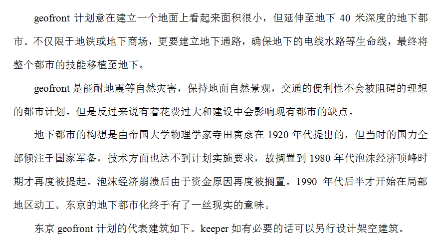
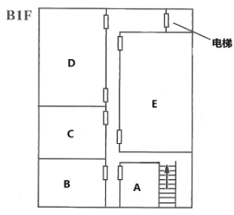
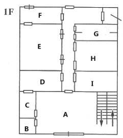
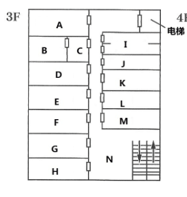

# 奇妙的共斗
**扮演：阿尾博政（间谍）**

**房规**

## 调查员
1. 宫本贤治：从乡下来的15岁少年，目前在侦探社工作。社长让他来调查地铁事件
2. 鸟居龙藏：东京大学的民俗学家，对地铁事件比较了解
3. 东云霖：一名出色的话剧演员，修行剑道
4. 五叶：一名程序员，喜欢看话剧

## 事件进展
1. 组织派我监视鸟居龙藏，我发现他和宫本一起进了地铁站。于是潜伏跟了上去，进入了A站台。
2. 我被东云和五叶发现了，为了自保，我想先出去再说，却不想发现外面有装弹的声音。我跳下了站台，发现了宫本和鸟居。
3. 四名武装者进入，和东云他们发生争执；我和宫本及鸟居出面调停。五个人都被赶了出去。
4. 我的身份被鸟居识破了。
5. 所有人决定第二天早上在鸟居办公室集合。
6. 当晚我重新乔装后继续跟踪鸟居，被鸟居识破了。于是我们两个一起去了地铁站。
7. 我们发现了一些自动步枪的弹壳、一具被啃咬的人类尸体，以及一些血迹。我们一直走到了下一站都没有遇上怪物或者人，于是我们原路返回了。我将针孔摄像机放在了尸体旁边。
8. 第二天，我们又去了地铁站。拿回了摄像机，发现尸体不在了，旁边有一些爪印。
9. 我们取到青山墓地，这里传言晚上有怪物出现，并且有人失踪。
10. 我们决定晚上在墓地埋伏怪物。晚上，食尸鬼来袭。宫泽翻出墙外，五叶则昏厥了。
11. 恶斗一番后，食尸鬼首领平冈公威制止了争斗，并透露他们曾经是人类。只是偶尔攻击活着的人。他希望我们除掉Shield的指挥官古鹰源三。并告诉了我们关于蛇人的事情。我们应该相信这些食尸鬼吗？
12. 第二天，我和宫泽与龙藏在平冈的带领下来到了蛇人宫殿。我们什么也没发现。

13. 其余二人去了岩井家查探情报，却遇上岩井被Shield刺杀。他们救下了岩井，我们在诊所会面了。
14. 我们决定前往Geofront的工地K。鸟居、五叶和东云被发现了，但是增山敬一郎放过了他们，还说「只要我增山敬一郎还活着一天，我就不会允许任何邪恶种族毁灭这座城市」。我在工地调查了一番，没什么收获。
15. 我和东云决定去白蛇之家看看。我们从水管爬进了锅炉房，没想到Shield已经派人守在了门口。这时候小早川穗子出现救了我们。她和我们说了一些蛇人的事，希望我们帮他杀掉增山。
16. 第二天，我们对于现状争执不休，小早川又打来了电话询问状况。我们搪塞了过去，下午去看完了岩井。岩井透露了更多木曜会的信息，并介绍我们一个叫做白河的木曜会成员。我们开始怀疑蛇人，并联系了白河，但他已经被蛇人控制了，并且把我们的行动告诉了小早川。
17. 小早川质问我们是否怀疑她，我们决定将计就计。因此我录下了我们的通话，并赶往增山的家。利用小早川引出增山后，我们向他播放了录音并说明了蛇人的危险。但他看上去很自负，而且似乎早就知道蛇人的问题，并没有特别在意。我们又向他建议和食尸鬼停战，增山表示只要食尸鬼退出神殿，不再返回地面，他就退兵。
18. 我们把消息传递给了平冈，他提醒我们，增山过于自负，神殿很可能被蛇人趁虚而入。他建议我们去白蛇之家。
19. 我们又进入了白蛇之家，这里已经发生了战斗。我们搜出了魔导书，一路来到了第四层，发现了S队队员的尸体。我们之后发现了一道暗门，里面是小早川的邪恶仪式！我们和小早川以及她的液体生物展开了殊死搏斗，我不幸阵亡，但所幸小早川被击毙了。

## 信息
1. 旧初站台发生了怪物目击事件，其中一个是A站台。
2. 一群人在追踪一个奇怪的生物，他们现在深入了铁道
3. 食尸鬼的情报

4. 四人小队深入了铁道。
5. 铁道内有一具被啃咬的人类尸体
6. 怪物暗中行动，攻击性强，尽管近年来目击次数增加，却还算隐秘——它们应该有智慧或者有组织，而且发展到了一个关键的阶段

7. 食尸鬼由人类变化而来。头领是平冈，他说：

> 食尸鬼在东京地下各处都有巢穴。在东京geofront计划开始前，东京地下就有很多地下通道与地下空洞了。在超过地下200米的最深处还有一座超古代都市的废墟，我们的根据地就在那里。

> 随着geofront计划的进行，东京地下也变得喧闹了起来，比以往更深的地下开发计划开始威胁到了我们的生存
>
> 然而最近几个月开始，geofront计划工地附近进驻了一批负责实行食尸鬼讨伐计划的武装士兵。士兵们显然知道我们的存在，甚至非常熟悉我们的习性
>
> 事实上，这群人是隶属于一个名为"shield"的部队。估计是政府内部的高官为了扩大自卫队在城市战里的权限和与警察的SAT对抗而设立的反恐部队吧。或者是某些跟geofront开发计划有关的人，认为我们食尸鬼会对开发计划造成危害，为了彻底歼灭我们食尸鬼而设立的部队。
>
> 据我的了解，shield部队似乎是数年前由防卫省内部设立的一支特殊部队。但shield与大多数部队不同，不仅是自卫队内部，就连防卫省内知道这支部队的人也少之又少。shield部队兵不属于自卫队的组织范畴，而更像是直属于内阁府的秘密行动部队。
>
> 而从我们跟他们之间的战斗来看，他们的成员大概不少于20人，训练与装备都达到了很高水平，并且对我们的作战中连战连胜。为了对应与我们的战斗，部队全员均擅长近身战，是格斗技和刀术的达人
>
> 他们的基地我也不知道，但据我观察他们的活动范围目前仅限于东京geofront开发现场附近的地下空间，不会在地面上活动
>
> 迄今为止都是在各处散居的食尸鬼在此大难临头之际团结了起来抵抗危机。但是《SHIELD》的力量过于强大，我们没有办法，只能向浅层地下迁移。这就是最近突然增多的人类目击食尸鬼现象的原因。

8. shield的长官叫古鹰源三，是一个「冷酷无情，杀人不眨眼的家伙」（食尸鬼语）。古鹰之前曾在日本自卫队服役，在自卫队内是个时常引发暴力事件的问题人物，近两年获得了提升，从自卫队被调走，但其目前服役情况并不清楚
9. 食尸鬼透露：

> 我们现在所居住的超古代地下都市可能是关于一个称作“瓦卢西亚的蛇人族”的东西。
>
> 根据我对地下都市里文字与图画的研究，我已经对蛇人族的生态与历史有了一定的了解。地下都市里有几处类似神殿的场所，这次的食尸鬼讨伐计划的范围不仅仅是geofront工地，这些神殿也处在重点清理的范围内，目前这些超古代神殿遗址正处在政府的严密警戒下
>
> 根据我的了解，人类以前曾经有从邪恶的神话种族中夺取神殿，取得了神殿里的秘密的传说，这个传说说的是不是就是当时蛇人族的末裔呢？
>
> 就我所知，蛇人族中偶尔会出现“返祖”的现象。此外，蛇人族还能通过毒液来操纵人心。如果是蛇人族为了回归祖先留下的城市，或者是为了什么更大的目标而操纵人类实行这个计划呢？也许他们是为了召唤信仰的邪神？这些神殿本来就是用来干这个的设施。
>
> 至于现在，已经有一座神殿落入了他们手中，其余几所在这几天里大概也会沦陷。我们的成员已经减少了很多了，被灭绝也只是时间上的问题。我在这里向诸位恳求能否替我们争取一点时间，说不定能让敌人背后的蛇人暴露出来，破坏它们的计划。当然，你们会觉得困惑是理所当然的，但是请记住，我们食尸鬼毁灭后，下一个就是你们人类，到那时，东京的繁荣将不复存在。

另：

> 蛇在世界各国神话中都十分重要，基本都是被当作恶神的形象来崇拜，日本神社的祭祀仪式上也必定会出现蛇的神性（比如注连绳和茅轮都是仿照蛇的模样制作的，神话中蛇身的神也不在少数）。蛇神比起救济众生来说更多的代表了大自然的威胁与恶意，日本人自古以来都认为蛇是有着恐怖神性的动物。

10. shield和一个叫增山敬一郎的人有关。

> 增山是日本的防卫大臣辅佐官，以热衷于设立特种部队闻名，之前在内阁中。有一名叫做岩井宽治的人似乎与他政见不和，曾经反对过增山增设特种部队的提案。但之后岩井宽治在和增山的斗争中下台，目前在隐居中。

11. 岩井现在隐居地点在M地，平时爱打打高尔夫球什么的，另外本人似乎对剑道也略有心得
12. 虽然geofront是一个持续了很久的项目，但近一年来，geofront项目进展似乎加快了很多。geofront项目的一个工地所在位置为K地。这个工地位于A站地下铁道附近。
13. 食尸鬼的巢穴深处有一个通往幻梦境的入口
14. 增山最近和新右翼团体往来甚密，最近他常常接触的名为《木曜会》的政治团体里，也有许多突然改变政治信条的政客。木曜会的成员每周六都会定期到某个宗教团体的大楼。教团名为《白蛇之家》。他们的头目，是一个叫做小早川奈穗子的蛇人。她平时出现的时候大概是伪装成30岁左右的模样，但实际上她真实年龄应该已经70岁左右了
15. 蛇人宫殿中有强大灵力。蛇人想要召唤的应该是蛇神依格。
16. 增山敬一郎说：「只要我增山敬一郎还活着一天，我就不会允许任何邪恶种族毁灭这座城市」
17. shield队员每人除了手持突击步枪之外，还可以看到身上佩戴有自动手枪和战斗刀，队员的护甲内藏有震撼弹之类的东西，背上还有狙击步枪，此外他们头上都戴了夜视仪。
18. 小早川说：

> 我们一族原本是以地下神殿作为根据地的蛇人，信仰的是蛇神依格。但是随着时间的推移，我们一族每一代的智力，体力，魔力等都比上一代要退化一些，失去全部能力沦为野兽也只是时间的问题。到了我这一代，我认为蛇神依格已经无法庇佑自己的族人，便带领着族人背弃了对蛇神依格的信仰。蛇神依格恼羞成怒，遂将地下神殿摧毁殆尽，我们不得不背井离乡。之后，我从东京开始了全日本的修行生活，寻访了各处灵山。之后更是环游世界，调查了世界各处的蛇人遗迹。最终我回到东京，建立了白蛇之家教团。
>
> shield是由增山敬一郎提议设立的陆上自卫队反恐特殊部队。虽然其名义上是防卫省内部的特种部队，但其不属于自卫队的组织范畴，而是直属于内阁府的秘密行动部队。实际上shield跟增山的私兵没什么两样，增山本人具有绝对领导权。
>
> 增山的shield部队实际上跟我们之间是合作关系，我们的目的，只不过是不想让自己的故乡被食尸鬼那样的恶心的种族所占据罢了。至于增山，他的目的应该就是通过要求进行食尸鬼的歼灭活动，扩大shield部队的势力。
>
>木曜会实际上是以增山为首的右翼政治团体，他们每周六傍晚都会来白蛇之家集会。但是增山本人似乎对我们非常戒备，已经好几周没有来了。增山老奸巨猾，他可不会轻易就喝下我们的甘露——那玩意儿也就是我们蛇人族可以用来影响人意志的毒液
>
>虽然我跟增山名义上是合作关系，但事实上，随着时间的推移，我越来越不信任增山和他的部队。就像你们刚才看到的，虽然增山名义上是说因为有人——也就是你们插手这件事而派人来保护我们，但我怀疑这些部队其实是来监视我们的。 等到shield部队彻底剿灭了食尸鬼一族，我猜测他们下一步就会立刻攻击白蛇之家，将我们蛇人一族消灭殆尽。
>
>根据我掌握的情报，周六晚上，shield部队可能就要对食尸鬼根据地展开总攻了。
>
>我想，增山这么做的最终目的可能就是像那只食尸鬼生前一样，利用自己的私人武装发动一场政变吧。我所担心的是，虽然我们的地下神殿已经被毁，但是神殿周围的强大灵气仍然存在。东京地下的食尸鬼一族似乎就是借助于地下的灵气将死去的人类转变为食尸鬼。只要是具有强大魔力的任何生物，在那里召唤任何邪神也都是有可能的。

19. Shield根据地在R地
20. 白蛇之家平面图：

