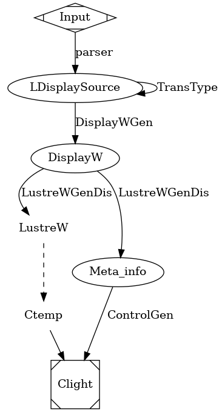

# 初期开发总结

LDisplay的开发历经半年，期间有两三次重写，到现在我自己都不太能确定开发方向是正确的。究其原因，是前期需求不明确，设计也不准确，编码过早。当然，软件工程的败笔只是其一，我自己对于同步建模的认识缺乏也是一方面。

目前LDisplay还是有一定的完成度，生成的代码可以在PC平台上跑起来（通过SDL的运行时），并且和Lustre的逻辑可以对接；当初设计的时候没有写死API，所以扩展性也不算差。只不过其被设计为了一个简单的代码生成工具，而不论是XML解析还是代码生成，都已经有比较健全的解决方案了，实在没必要用Coq写。惟一创新之处在于「同步式」HMI，也是这一点使得运行时的构建比较麻烦。

同步式HMI的原理，说起来其实相当简单。在底层的图形库之上，仍然使用组件（widget）作为控件的抽象，并通过图形规范（这里即XML）规定的组件树确定GUI结构。事件被分发至组件——比如鼠标点击事件并不是用(x,y)坐标标定，而是由点击的组件给出——这一点和普通的GUI是一致的。但是处理事件的方式不是回调，运行时也不负责维护事件循环，事件的获取和组件参数的更新都是由使用方显式进行的。

时间被分为时钟周期。一般而言，在每一个时钟周期的开始，会从GUI组件处得到上一个时钟周期的事件值——突发事件一般是一个布尔值标识其是否发生，而其他带参数的事件则带有对应的参数值——将这些事件值传入控制逻辑（同步式语言编写的模型，比如Lustre），得到一组新的参数。之后将这组参数更新给对应的GUI组件，使其呈现不同的显示效果，或是调整其内部状态。

LDisplay设计从一种Lustre的扩展语言编译出C代码。这种拓展语言包括Lustre的基础功能，以及一些为GUI规范设计的特性。换言之LDisplay实际上承担了Lustre编译器的功能，Lustre编译器是LDisplay的一部分，或者说后端。LDisplay本体所做的事情，只是简单地将源语言中和GUI相关的信息剥离，然后将生成的Lustre代码输入给Lustre编译器；然后利用这些信息和组件树的信息，通过一些中间步骤生成C控制代码。

LDisplay和Lustre编译器的耦合过大，而现在看来，LDisplay的定位应该是独立的显示工具，和Scade Display类似。其中应该包括自定义组件、类型检查、代码生成等功能。而代码生成验证也是很重要的一部分。为了方便验证，应该引入C之上的，专用于GUI的中间表示。

当前的这种设计，主要是为了和L2C共用接口的数据结构。如果设计为独立的显示开发工具，那么保证在后端逻辑和前端显示之间的数据一致性就比较困难。如果二者完全分离，那么只能采取和C一致的办法：用名称标识类型和常量。通过引入预处理器或者包管理机制，可使Lustre和Display代码共用同一份声明。但由于L2C和Lustre-V6模型的C表示不同，使得对于同一声明，LDisplay必须用不同的方式解释和生成代码，以兼容不同Lustre编译器。这一部分是后端代码生成时需要考虑的，前端也需要支持切换目标Lustre编译器。

在这种构想下，LDisplay还是以节点为单位，和Lustre之间通过一组统一的数据结构沟通。对接要么通过扩展Lustre编译器，使其支持外部定义的节点来完成；要么通过手工编写驱动代码，或用一个自动生成工具完成。这种工具只是用来绑定接口，作用有限但是可以省下不少人力。在之后，还可以开发联合仿真的工具（类似Scade）。