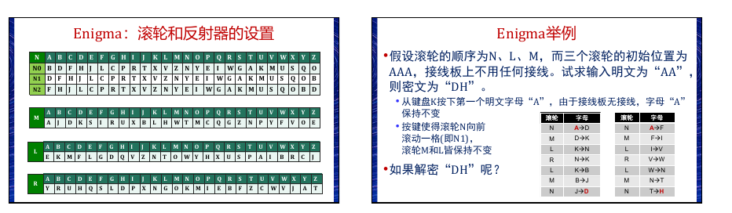

# Enigma
键盘一共有26个键，键盘排列和广为使用的计算机键盘基本一样，只不过为了使通讯尽量地短和难以破译，空格、数字和标点符号都被取消，而只有字母键。键盘上方就是显示器，这可不是意义上的屏幕显示器，只不过是标示了同样字母的26个小灯泡，当键盘上的某个键被按下时，和这个字母被加密后的密文字母所对应的小灯泡就亮了起来，就是这样一种近乎原始的“显示”。在显示器的上方是三个直径6厘米的转子，它们的主要部分隐藏在面板下，转子才是“恩尼格玛”密码机最核心关键的部分。如果转子的作用仅仅是把一个字母换成另一个字母，那就是密码学中所说的“简单替换密码”，而在公元九世纪，阿拉伯的密码破译专家就已经能够娴熟地运用统计字母出现频率的方法来破译简单替换密码，柯南·道尔在他著名的福尔摩斯探案《跳舞的小人》里就非常详细地叙述了福尔摩斯使用频率统计法破译跳舞人形密码（也就是简单替换密码）的过程。——之所以叫“转子”，因为它会转！这就是关键！当按下键盘上的一个字母键，相应加密后的字母在显示器上通过灯泡闪亮来显示，而转子就自动地转动一个字母的位置。举例来说，当第一次键入A，灯泡B亮，转子转动一格，各字母所对应的密码就改变了。第二次再键入A时，它所对应的字母就可能变成了C；同样地，第三次键入A时，又可能是灯泡D亮了。——这就是“恩尼格玛”难以被破译的关键所在，这不是一种简单替换密码。同一个字母在明文的不同位置时，可以被不同的字母替换，而密文中不同位置的同一个字母，又可以代表明文中的不同字母，字母频率分析法在这里丝毫无用武之地了。这种加密方式在密码学上被称为“复式替换密码”。 
但是如果连续键入26个字母，转子就会整整转一圈，回到原始的方向上，这时编码就和最初重复了。而在加密过程中，重复的现象就很是最大的破绽，因为这可以使破译密码的人从中发现规律。于是“恩尼格玛”又增加了一个转子，当第一个转子转动整整一圈以后，它上面有一个齿轮拨动第二个转子，使得它的方向转动一个字母的位置。假设第一个转子已经整整转了一圈，按A键时显示器上D灯泡亮；当放开A键时第一个转子上的齿轮也带动第二个转子同时转动一格，于是第二次键入A时，加密的字母可能为E；再次放开键A时，就只有第一个转子转动了，于是第三次键入A时，与之相对应的就是字母就可能是F了。
因此只有在26x26=676个字母后才会重复原来的编码。而事实上“恩尼格玛”有三个转子（二战后期德国海军使用的“恩尼格玛”甚至有四个转子！），那么重复的概率就达到26x26x26=17576个字母之后。在此基础上谢尔比乌斯十分巧妙地在三个转子的一端加上了一个反射器，把键盘和显示器中的相同字母用电线连在一起。反射器和转子一样，把某一个字母连在另一个字母上，但是它并不转动。乍一看这么一个固定的反射器好像没什么用处，它并不增加可以使用的编码数目，但是把它和解码联系起来就会看出这种设计的别具匠心了。当一个键被按下时，信号不是直接从键盘传到显示器，而是首先通过三个转子连成的一条线路，然后经过反射器再回到三个转子，通过另一条线路再到达显示器上，比如说上图中A键被按下时，亮的是D灯泡。如果这时按的不是A键而是D键，那么信号恰好按照上面A键被按下时的相反方向通行，最后到达A灯泡。换句话说，在这种设计下，反射器虽然没有像转子那样增加不重复的方向，但是它可以使解码过程完全重现编码过程。
使用“恩尼格玛”通讯时，发信人首先要调节三个转子的方向（而这个转子的初始方向就是密匙，是收发双方必须预先约定好的），然后依次键入明文，并把显示器上灯泡闪亮的字母依次记下来，最后把记录下的闪亮字母按照顺序用正常的电报方式发送出去。收信方收到电文后，只要也使用一台“恩尼格玛”，按照原来的约定，把转子的方向调整到和发信方相同的初始方向上，然后依次键入收到的密文，显示器上自动闪亮的字母就是明文了。加密和解密的过程完全一样，这就是反射器的作用，同时反射器的一个副作用就是一个字母永远也不会被加密成它自己，因为反射器中一个字母总是被连接到另一个不同的字母。
“恩尼格玛”加密的关键就在于转子的初始方向。当然如果敌人收到了完整的密文，还是可以通过不断试验转动转子方向来找到这个密匙，特别是如果破译者同时使用许多台机器同时进行这项工作，那么所需要的时间就会大大缩短。对付这样“暴力破译法”（即一个一个尝试所有可能性的方法），可以通过增加转子的数量来对付，因为只要每增加一个转子，就能使试验的数量乘上26倍！不过由于增加转子就会增加机器的体积和成本，而密码机又是需要能够便于携带的，而不是一个带有几十个甚至上百个转子的庞然大物。那么方法也很简单，“恩尼格玛”密码机的三个转子是可以拆卸下来并互相交换位置，这样一来初始方向的可能性一下就增加了六倍。假设三个转子的编号为1、2、3，那么它们可以被放成123－132－213－231-312－321这六种不同位置，当然收发密文的双方除了要约定转子自身的初始方向，还要约好这六种排列中的一种。
而除了转子方向和排列位置，“恩尼格玛”还有一道保障安全的关卡，在键盘和第一个转子之间有块连接板。通过这块连接板可以用一根连线把某个字母和另一个字母连接起来，这样这个字母的信号在进入转子之前就会转变为另一个字母的信号。这种连线最多可以有六根（后期的“恩尼格玛”甚至达到十根连线），这样就可以使6对字母的信号两两互换，其他没有插上连线的字母则保持不变。——当然连接板上的连线状况也是收发双方预先约定好的。
