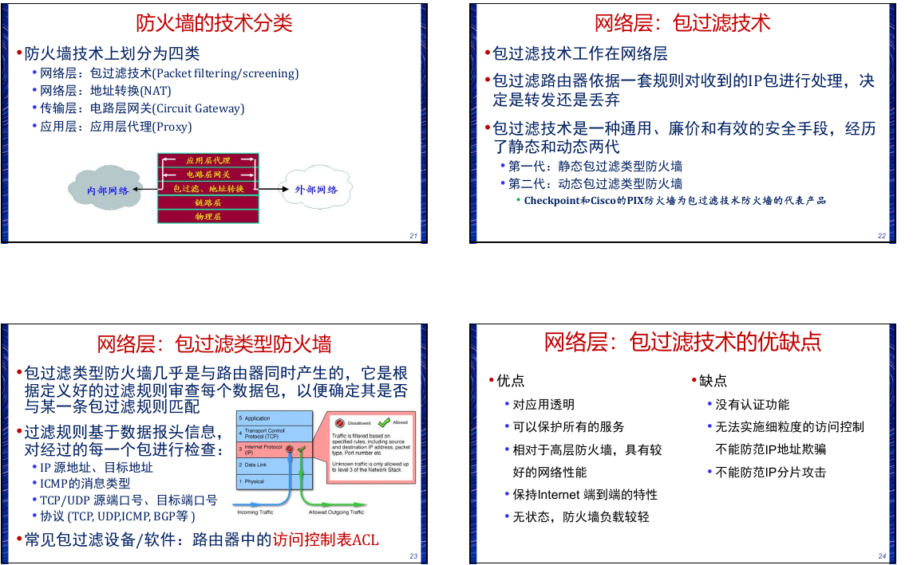
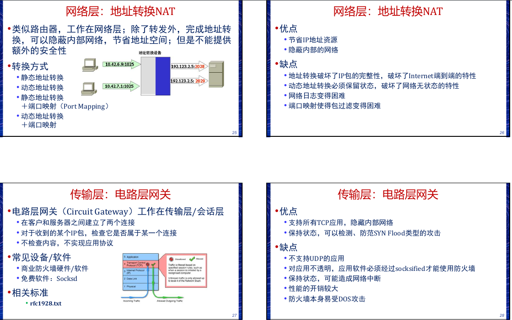
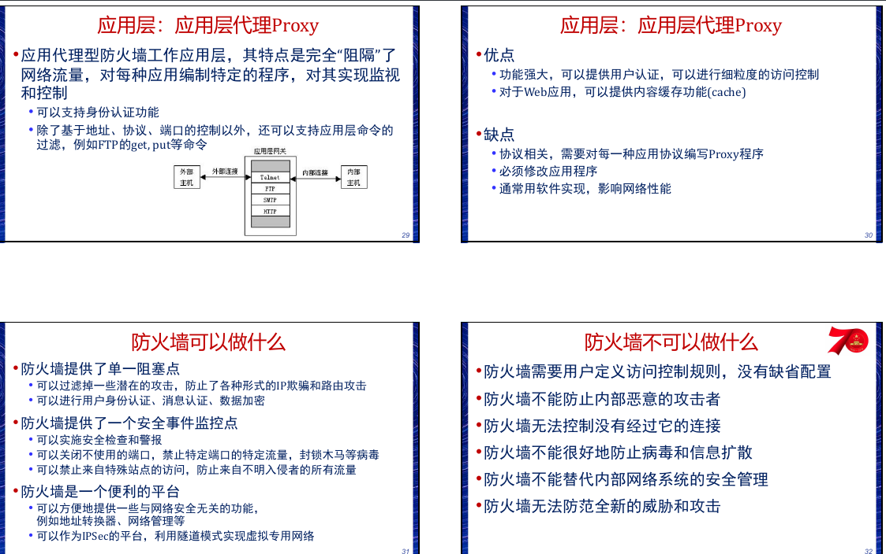
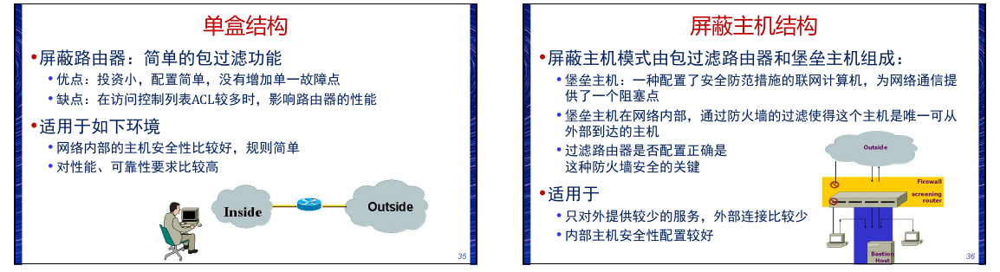
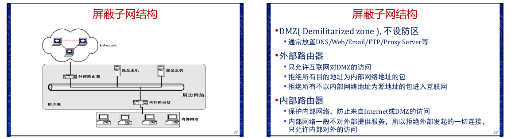

# 防火墙技术

防火墙是在被保护网络和其他网络之间实施访问控制政
策的一组设备,由软、硬件设备组成、在内网和外网之
间、专用网与公共网之间的界面上构造的保护屏障
防火墙的作用
• 隐藏内部网络结构及资源
• 保护不安全的网络服务
• 执行网络间的访问控制策略
• 统一集中的安全管理
• 记录并统计网络使用情况
• 监视和预警

## 技术分类

## 配置结构
1. 单盒结构(Single-Box Architecture)
2. 屏蔽主机结构(Screened Host Architecture)

3. 屏蔽子网结构(Screened Subnet Architecture)
