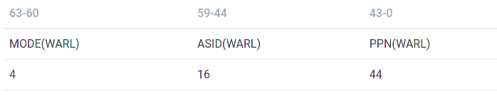
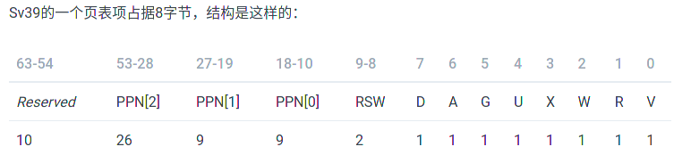

# riscv分页机制

CSR`satp`记录了最高级页表的物理页号，以及一些控制信息：

Mode表示不使用页表、SV39页表或者SV48页表

## SV39

虚拟地址有39位，其中低12位是页内偏移。高27位分为3组，每组9位，分别表示三级、二级、一级页号。

采用分级页表机制。三级页表->二级页表->一级页表。一个页表项8字节，每个页表512项，刚好存在一个物理页里。

其中，对于三级和二级页表项而言，如果XWR三位都是0，则表示此页表项指向的是下一级页表所在的页。否则，则表示此页表项直接指向一个大页。三级页表可以直接指向1GB的大页，二级页表则是2MB大页。

## TLB

TLB刷新用`sfence.vma`指令，后可以加需要刷新的虚拟地址。不加则默认全部刷新。