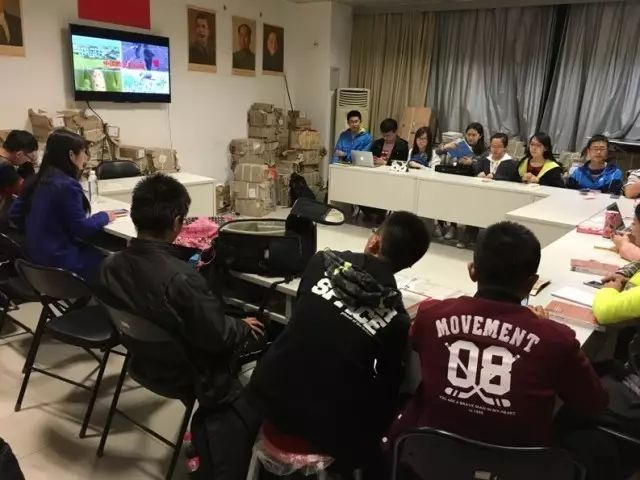

# 扣好人生第一颗扣子：新生入党指南

对于刚入学的0字班新生, “入党”似乎是一个全新的概念。你也许心向往之，却又茫然不知所措。希望这篇简短的文章能帮助你了解中国共产党，并解答关于入党的一些问题。

## 为什么要入党

首先需要明确，入党是一个人崇高的理想与人生追求，是一项本人自愿的、非常严肃认真的事情，不容轻怠。党员虽然光荣，却也要承担更多的责任和义务，随时准备为国家和人民牺牲一切。入党需要经过深思熟虑，有的同学入党只是听从父母亲人的劝告，或是想要用党员的身份撑场面，又或者是为了找份好工作。入党并不要求你已有很高的觉悟，抱有这些想法无可厚非，不过在漫长的考察发展过程中，应当不断地提高自身的思想，端正入党动机。

但其实相对于这些实实在在的“好处”，入党有着更深刻的好处。它们无关物质利益，却极为重要：

1. 入党是值得孜孜以求的人生理想，也是实现自我价值的重要途径。中国共产党领导全国人民取得的举世瞩目的伟大成就，以及许许多多优秀共产党人的感人事迹都说明了党的先进性。青年需要党，而党也需要青年，大学生更是肩负着建设祖国的重任，因此有抱负有觉悟的学生，将加入中国共产党作为自己的人生追求。
2. 入党也是学习理解掌握马克思主义方法的有效途径。马克思主义是党的信仰和行动指南，为深刻理解和把握资本主义生产方式提供了关键武器。有志于学习马克思主义的同学在党组织的系统培训中更易于掌握它的全貌，培养承担建设社会的责任感和使命感，并在实践中将其运用到人类的解放斗争中去。
3. 入党还可以让有志于学习了解党的历史，并从中探寻党改变中国命运关键方法的同学认识国情民情，更好地使自己的思想和方案落地扎根，服务于祖国和人民，从而实现自己的人生价值。在满目疮痍的中国，中国共产党通过严密的组织和纪律，不辍奋斗28年，成功实现了马克思主义中国化，建立了新中国，使我们的国家从濒临开除球籍到屹立在世界中心，贡献了21世纪科学社会主义的中国方案。但这个过程并不是一蹴而就的，我们在整个入党的学习过程中也会有更多的细节发现——党之所以成功并不是因为她做对了什么，而是因为她做错了什么然后又做对了什么。

## 如何才能入党

### 提交申请书

党章规定，「**年满十八岁**的中国工人、农民、军人、知识分子和其他社会阶层的先进分子，承认党的纲领和章程，愿意参加党的一个组织并在其中积极工作、执行党的决议和按期交纳党费的」，可以向工作、学习所在单位党组织提出入党申请。

要求入党的人员必须**亲自**向党组织提出申请。申请可分为口头申请和书面申请两种形式。通常情况下，应写书面申请。填写入党申请书应注意以下几点：

1. 要联系自己的思想实际谈对党的认识和入党动机，重点是要**反映自己的思想**，不要以旁观者身份一味评论别人。
2. 即使目前理论水平和对党的认识可能不深刻，也应向党组织反映真实的思想情况。提交申请书后，会有更多的机会了解相关的知识。
3. 申请书要写得朴实、庄重，不要追求华丽的辞藻，夸夸其谈。

> 点击`阅读原文`，可以下载申请书范文

### 后续流程

提交申请书后，将根据谈话情况和表现确定积极分子。成为积极分子后，需要完成党课集中学习，并参加各项课外活动。

每一个班级都会组建党课小组，积极分子在考察期内，以党课小组的形式参加各项党课活动。除集中的党课培训外，系里也会举办读书研讨、讲座报告、课外时间等活动。

经过1年以上培养教育和考察、基本具备党员条件的入党积极分子，有资格成为预备党员，预备期为1年。因此，从提交申请书到成为正式党员，至少需要2年的时间。

总结起来，整个入党流程分为五个阶段：

1. 申请入党
2. 入党积极分子的确定和培养教育
3. 发展对象的确定和考察
4. 预备党员的接收
5. 预备党员的教育考察和转正

## 总结

提交申请书是了解党、向党靠拢的第一步，也是大家思想上成熟的开始。入党并不是一件神秘而遥不可及的事情，它更多代表的是一种责任和担当。只要你有提升自身的想法，建设祖国的意愿，都可以提交入党申请书。

最后，请准备入党的0字班新生，在xx前将申请书交到xxx。如有此文未竟的问题，可咨询辅导员xxx，联系方式xxx