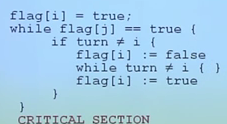

# L10 同步互斥

进程并发执行的优点：

- 共享资源
- 加速
- 模块化

但同时，也引入了程序运行的不确定性

**原子操作**：一次不存在任何中断或失败的操作。

| 进程相互感知的程度 |         交互关系         |             进程间影响             |
| ----------------------------- | -------------------------- | ----------------------------------- |
| 相互不感知                 | 独立                         | 无影响                                 |
| 间接感知                     | 通过共享进行协作 | 结果依赖共享资源的状态 |
| 直接感知                     | 通过通信进程协作 | 结果依赖其他进程的信息 |

- **互斥**：一个进程占用资源，其他进程就不能使用
- **死锁**：多个进程占用一部分资源
- **饥饿**：其他进程轮流获得资源，一个进程一直得不到资源

## 临界区

**临界区**是进程中需要互斥执行的代码

**进入区**检查可否进入临界区，并设置正在访问临界区的标志

**退出区**清除对应标志

临界区的访问规则
- 空闲则入
- 忙则等待
- 有限等待
- 让权等待

临界区实现方法

### 禁用中断

临界区可能很长，进程无法被停止

### 软件方法

通过共享一些变量来控制进程同步

简单的算法：

1. 使用共享变量表示允许进入临界区的进程->可能不满足空闲则入
2. 使用变量表示进程是否在临界区内->不满足忙则等待
3. 使用变量表示进程是否希望进入临界区->不满足空闲则入

### Peterson算法

设置一个turn变量表示谁在临界区；再设置flag数组表示进程是否希望进入临界区。

```c
flag[i] = true;
turn = j;
while (flag[j] && turn == j);

...

flag[i] = false;
```

用于两个进程

> 应该注意的是，实际上Peterson算法是一个描述两个进程互相谦让的算法。大致过程如下：
>  
> 进程0与进程1均想要某个资源。他们先均表示自己想要，然后均表示谦让。如果一个进程要最终占有资源，那么其须抢先谦让，让对手不得不随后谦让，然后名正言顺地接过资源的控制权。这样就解决了忙则等待的问题。

### Dekkers算法

标志同前，进入区改为：



易于扩展到多个线程的情况

### 缺点

复杂，需要忙等待

### 高级抽象方法

#### 锁

有一个二进制变量表示锁的状态以及两个原语：
- Acquire锁定
- Release解锁

#### 原子操作指令

- 测试与置位指令：从内存单元读值，测试是否为1（将测试结果返回），最后将1写回
- 交换指令：交换内存中两个值

##### 实现自旋锁

```c

while (test-and-set(value)); // Acquire

value = 0; // Release
```

等待时需要耗费CPU时间

可以加入一个等待队列，实现无忙等待的锁

##### 原子操作指令锁的特征

优点：
- 适用多处理器中任意数量的进程同步
- 支持多临界区
- 简单

缺点：
- 忙等待
- 可能导致饥饿
- 死锁