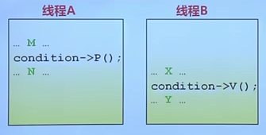
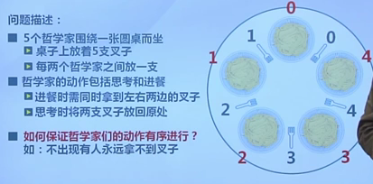
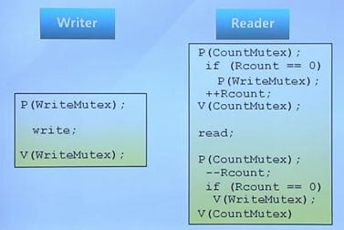

# L11 信号量和管程

## 信号量

操作系统提供的协调共享资源的方法。

和软件方法的对比：
- 软件同步方法是平等线程之间的同步协商机制。
- 信号量则是由OS管理。

由一个整型变量sem和两个原子操作组成：
- P操作：sem减一；如果sem<0进入等待。可能阻塞
- V操作：sem加一，如sem<=0,唤醒一个等待进程。不会阻塞

信号量是被保护的整数变量，初始化完成后，只能通过P和V操作修改。OS保证PV操作是原子的。

和自旋锁对比：
- 信号量可以实现先入先出
- 自旋锁则无法实现

### 分类

- **二进制信号量**：取值为0或1
- **资源信号量**:资源数为任何非负值
两者等价，可以相互实现

### 信号量的使用

#### 互斥访问

每类资源设置一个信号量，初始为1。

```c
m->p(); 
critical
m->v();
```

必须成对使用PV操作

#### 条件同步

设置一个信号量，初值为0。

在先执行的线程执行V操作，需要后执行的线程进行P操作。



#### 生产者-消费者问题

1. 任何时刻只有一个线程操作缓冲区 互斥访问
2. 缓冲区空，消费者必须等生产者 条件同步
3. 缓冲区满，生产者必须等消费者 条件同步

可以用三个信号量。

#### 问题

容易出错，不能解决死锁。

## 管程

多线程互斥访问资源的结构，采用OOP方法，任一时刻最多一个线程执行管程代码。

管程中的线程**可以临时放弃管程的互斥访问**，等待事件出现时恢复。

### 组成

- 一个锁
- 0或多个条件变量

### 条件变量

- wait操作将自己阻塞在队列，唤醒一个等待者，或释放管程的互斥访问
- signal操作将等待队列中的一个线程唤醒。如果队列是空，无效果。

#### 两种释放处理方式

**Hansen管程**：signal后当前线程会继续执行。高效
**Hoare管程**：signal后当前进程放弃执行，被唤醒的进程立即执行。确定性好

## 经典同步问题

### 哲学家就餐



#### 信号量实现思路

- 每个叉子对应一个信号量。依次尝试获取两边的叉子。这样有可能死锁
- 额外加一个互斥量，只允许同时有一个哲学家就餐。效率低
- 五个信号量。按照哲学家编号，让偶数先拿左边，奇数先拿右边。正确，且可有多个人同时就餐

### 读者写者问题

两类共享数据的使用者：
- 读者只读取数据，不修改
- 写者读取和修改数据

读读允许，读写互斥，写写互斥

#### 信号量思路

用信号量描述三个约束

- writemutex控制读写操作的互斥，初始化1
- rcount记录读的数目，初始化0
- countmutex用于保护读者计数的修改

两种策略：
- 读者优先

- 写者优先

#### 管程思路

一个锁和两个条件变量okread,okwrite.