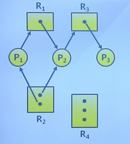
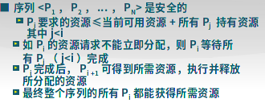
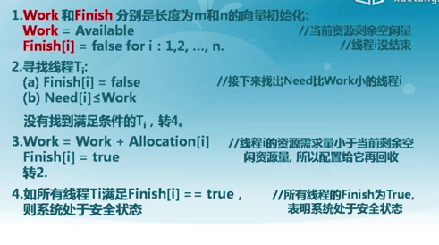
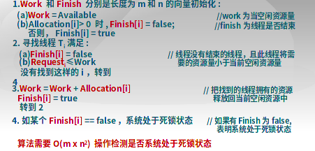

# 死锁

## 死锁问题

### 资源分类

- 可重用资源：资源不能删除，任意时刻只有一个进程使用；进程释放资源后，其他进程可用。可能死锁
    - 硬件：处理器、I / O通道、主和副存储器、设备等
    - 软件：文件、数据库和信号量等数据结构
- 消耗资源：消耗资源实例，可能死锁
    - 在I/O缓冲区的中断、信号、消息等

### 资源分配图

两类顶点
- 所有进程
- 所有资源

两类有向边
- 资源请求边
- 资源分配边

图中有循环不一定死锁

### 死锁的必要条件

- 互斥：任何时刻只有一个进程使用
- 持用并等待：进程保持至少一个资源，并正在等待获取其他进程持有的资源
- 非抢占：资源只能在进程使用后自愿释放
- 循环等待

## 处理方法

- 死锁预防：确保不会进入死锁状态
- 死锁避免：在使用前进行判断，只允许不会出现死锁的进程请求资源
- 死锁检测与恢复：在检测到运行系统进入死锁状态后，进行恢复
- 由应用进程处理

### 死锁预防

预防是采用某种策略，限制并发进程对资源的请求，使系统在任何时刻都不满足死锁的必要条件。

- 互斥：把互斥的共享资源封装为可以同时访问
- 持用并等待：
    - 进程请求资源时，要求它不持有任何其他资源
    - 仅允许进程在开始执行时，一次请求所有需要的资源
    - 资源利用率低
- 非抢占：如进程请求不能立即分配的资源，则释放已占有资源。只在能够同时获得所有需要资源时，才执行分配操作
- 循环等待：对资源排序，要求进程按顺序请求资源

### 死锁避免

在分配资源时判断是否会出现死锁，只在不会死锁时分配资源

- 要求进程声明需要资源的最大数目
- 限定提供与分配的资源数量，确保满足进程的最大需求
- 动态检查的资源分配状态，确保不会出现环形等待

#### 安全状态

系统处于安全状态：针对所有已占用进程，存在安全序列。

处于安全状态，一定没有死锁；反之不一定成立。

#### 银行家算法

n：线程数量，m：资源类型数量

数据结构：
- Max：总需求量，n\*m矩阵。线程I最多请求J型资源Max(i,j)个。
- Ava：剩余量，m维向量。
- Alloc，分配量，n\*m矩阵
- Need：需要量，n\*m矩阵。线程I未来需要J型资源的数量。

need  = max - alloc

判断安全状态：

分配算法：

### 死锁检测

定期调用死锁检测算法来搜索图中是否存在死锁。出现死锁时，用死锁恢复机制进行恢复

数据结构：Ava和Alloc

检测算法：

### 死锁恢复

终止死锁进程，一次只终止一个进程，直到死锁消除。

终止顺序
- 优先级
- 已经运行时间
- 已占用资源
- 进程完成所需资源
- 终止进程数目
- 进程类型

终止方法
- 抢占
- 进程回退

可能出现饥饿

## 并发错误检测

- atomicity violation
- order violation