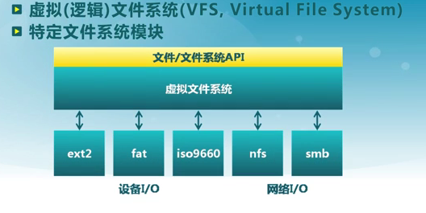
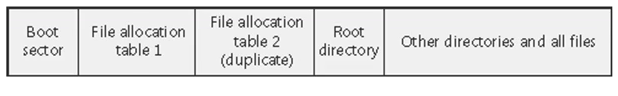

# L14 文件系统

## 概述

文件系统是操作系统中管理持久性数据的子系统, 提供数据存储和访问功能

**文件**是具有符号名,由字节序列构成的数据项集合。是文件系统的基本数据单位。

### 文件系统的功能

- 分配文件磁盘空间
    - 管理文件块（位置+顺序
    - 管理空闲空间（位置
    - 分配算法
- 管理文件集合
    - 定位：文件及其内容
    - 命名：通过名字找文件
    - 文件系统结构
- 数据可靠和安全
    - 安全
    - 可靠：持久保存文件

### 文件属性

名称、类型、位置、大小、保护、创建者、创建时间、最近修改时间……

**文件头**:文件系统元数据中的文件信息
- 文件属性
- 文件存储位置和顺序

### 文件描述符

内核跟踪进程打开的所有文件

**文件描述符**：操作系统在打开文件表中维护的打开文件状态和信息

- 文件指针：最近一次读写位置，每个进程单独维护
- 文件打开次数
- 文件的磁盘位置
- 访问权限

### 文件的视图

- 用户视图：持久的数据结构
- 系统访问接口：数据块的集合，系统不关心磁盘上的数据结构

> 最小访问单位是数据块。最小的物理单位是扇区。

### 访问模式

- 顺序访问：按字节依次读取
- 随机访问
- 索引访问：依据数据特征索引

### 访问控制

每个用户能够获得哪些文件的哪些访问权限

访问模式:读、写、执行、删除、列表等

文件访问控制列表ACL： <用户|组|所有人,读|写|可执行>

#### 语义一致性

规定多进程如何同时访问共享文件

- 会话语义：写入内容在关闭后才可见
- 读写锁

### 分层文件系统

文件以目录的方式组织起来

目录是一种特殊的文件，其内容是文件索引表

典型目录操作
- 搜索文件
- 创建文件
- 删除文件
- 列目录
- 重命名文件
- 遍历路径

只能由内核修改目录，通过系统调用操作目录

#### 目录的实现

- 线性列表
- 哈希表

#### 文件别名

两个或多个文件名关联同一个文件

**硬链接**:多个文件项指向一个文件
**软链接**:以“快捷方式”指向其他文件。通过存储真实文件的逻辑名称来实现

可能导致文件目录的循环

解决方法：
- 只允许到文件的链接，不允许在子目录的链接
- 增加链接时，用循环检测算法检测
- 限制遍历文件目录的深度

**路径遍历**或**名字解析**：逻辑名字->物理资源。遍历文件目录知道知道目标文件

**当前工作目录**：每个进程设置一个文件目录用于解析。此时，允许指定相对目录进行查找

### 文件系统挂载

文件系统需要先挂载才能访问

文件系统挂载在**挂载点**上

### 文件系统的种类

- 磁盘文件系统
- 数据库文件系统：文件特征可寻址/辨识
- 日志文件系统：记录文件系统的事件
- 网络/分布式文件系统
- 特殊/虚拟文件系统

## 虚拟文件系统

目的：对所有文件系统的抽象。

功能：
- 提供相同的接口
- 管理关联的数据结构
- 高效查询例程，
- 与特定文件系统的交互

### 基本数据结构

文件卷控制块：每个文件系统一个，文件系统的详细信息

文件控制块：每个文件一个，文件的详细信息

目录项：每个目录项一个，指向文件控制块、父目录、子目录等

这些结构都存在外存，当需要时加载进内存

## 文件缓存和打开

可能的缓存：
- 磁盘控制器的扇区缓存
- 内存的数据块缓存

数据块按需读入内存，可以预先读取后面的数据块

数据块使用后被缓存
- 假设数据将会再次用到
- 写操作可能被缓存和延迟写入

虚拟页式存储可以把虚拟页面映射到本地外存文件中。因此，在虚拟内存中文件数据块被映射成页，文件的读写操作转换为对内存的访问。

### 打开文件的数据结构

- 文件描述符
- 打开文件表：每个进程一个+系统级的打开表
- 打开文件锁
    - 强制
    - 劝告：进程可以查找锁的状态来决定其行为

## 文件分配

如何表示分配给一个文件数据块的位置和顺序

- 大多数文件很小->块空间不能太大
- 一些文件很大->必须支持大文件

分配方式：
- 连续分配
- 链式分配
- 索引分配

### 连续分配

文件头指定起始块和长度。分配连续的数据块

缺点：
- 无法利用碎片
- 文件增长问题->预先分配……

### 链式分配

文件用数据块链表的方式分配。文件头包含了第一块和最后一块的指针

增加删除比较容易，没有碎片，但是无法实现随机访问

可靠性差，破坏一个链，则后面的数据都丢失

### 索引分配

为每个文件创建一个索引数据块（指向文件数据块的指针列表）

文件头包含了到索引数据块的指针

容易创建和增减，支持直接访问，没有碎片

缺点:
- 文件很小时，开销大
- 文件很大时，一个索引块无法表示=>链式索引/多级索引

## 空闲空间管理

跟踪记录文件卷中未分配的数据块

### 位图

用位图表示空闲数据块列表。0表示空闲，否则已分配

简单，但是空间可能很大。

查找空闲块的平均扫描长度是n/r r是空闲块数目。

### 其他

- 链表
- 链表索引

## RAID

冗余阵列技术

### 磁盘分区

分区是一组**柱面**的集合。通过分区可以限制寻道时间

典型的文件系统组织，是文件卷常驻在磁盘的单个分区上

### RAID-0

把数据块分成多个字块，存储在独立的磁盘中

### RAID-1

向两个磁盘写入，从任何一个读取

可靠性成倍增长，读取性能线性增加

### RAID-4

数据块级条带化+专用奇偶校验磁盘

允许从任意一个磁盘中恢复

### RAID-5

带分布式校验的磁盘条带化

## 文件系统实例

### FAT

FAT和根目录存在固定位置。 文件分配表File Allocation Table（FAT）存在卷的开头

> FAT有一个拷贝以提高可靠性

FAT中每一个表项都对应磁盘的一个簇（或扇区）。FAT16表示表项编号是16位，FAT32表示表项编号是32位等。

文件名：8字节+3字节扩展名；可以用多个目录项创建长文件名

### EXT4

#### 大容量存储

用**extent**表示一段连续的存储块（长度+起始地址+逻辑位移）

可以用B树组织extent结构，支持更大的文件

#### 异常恢复

- fsck：File System Checker 太慢
- 日志
    - 崩溃发生在完全写入日志之前：抛弃部分写入的日志即可
    - 崩溃发生在事务写入日志，但在检查点完成之前完成：按照日志重放操作

日志优化：
- 批处理日志更新
- 循环日志
- 日志超级块

Metadata Journaling可以进一步提高速度： （顺序很重要）
1. 写数据块
2. 元数据写入日志
3. 日志更新
4. 写入元数据
5. 释放日志

### ZFS

- 存储池
- 对象事务系统
- 端到端数据完整性