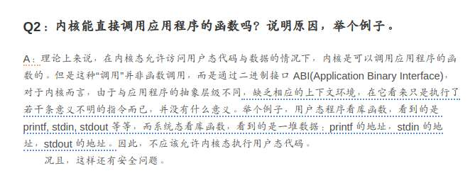
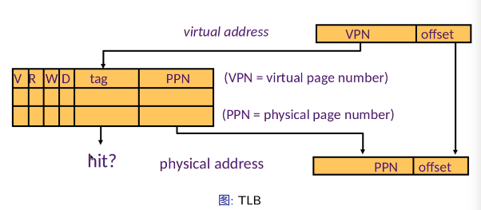

# 操作系统与系统结构和程序设计语言

## 从OS角度看计算机系统

### 隔离

程序无法直接调用内核的函数，内核也无法使用应用程序中的函数。因为应用程序不可靠，强制**隔离**以避免对整个系统的可用性/安全的影响。运行的程序通常都是隔离的单元。

主要的隔离方法有：

+ 地址空间
    - 程序仅寻址自己的内存
    - 无法访问不属于自己的内存。
+ 硬件特权模式/中断机制
    - 防止程序访问敏感的设备和寄存器

### 虚拟内存

每个进程有页表，基本页表存储于内存，定义了逻辑地址与物理地址的映射。*TLB*是页表的缓存。一般存在多级页表。

### 特权模式

若CPU硬件支持不同的特权模式：Kernel mode vs. User Mode。 内核态可以执行用户态无法执行的特权操作。

若CPU硬件支持中断/异常的处理：中断是异步发生，来自处理器外部IO设备的信号。硬件中断的异常处理程序称为中断处理程序。处理器处理中断时，切换到内核态。

定时器可以稳定地定时产生中断

- 防止程序独占CPU
- 使内核可以周期性进行资源管理

## 系统编程语言

用于构建控制底层计算机硬件的软件系统；离不开汇编语言。

高级语言编译到机器指令的调用约定：
- 如何传递参数
- 值如何返回
- 谁保存寄存器

## 从OS角度看RISC-V

### RISC-V特权架构

分为四种模式：U S H M

设置CSR（控制状态寄存器，用来描述机器的状态）实现隔离

高特权模式下的软件可以授权低特权模式软件处理中断

### RISC-V CPU启动

1. 初始化CPU，寄存器
2. 初始化内存 （*板极控制量，而不是内存内容）
3. 初始化基本外设
4. 执行ROM中固化代码

CPU初始化，进入M态，设置寄存器和PC。