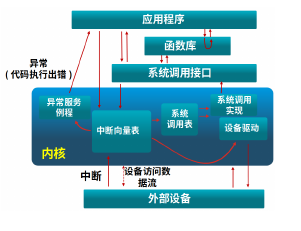

# 中断 异常 系统调用

## 基本概念与原理

|                  |                                                                                          |                   源头                   |   响应方式   |             处理机制             |
| ------------- | ---------------------------------------------------------------------- | ----------------------------------- | ---------------- | -------------------------------- |
| 系统调用 | 应用程序主动向操作系统发出的服务请求。             | 应用程序请求OS服务       | 异步或同步 | 等待和持续                     |
| 异常         | 非法指令，或其他原因导致的当前指令执行失败。 | 应用程序意想不到的行为 | 同步             | 杀死或重新执行指令     |
| 中断         | 来自硬件设备的处理请求。                                         | 外设                                     | 异步             | 持续，对应用程序透明 |

## 硬件架构支持

- **CLINT**：处理CPU内部的中断和异常
- **PLIC**：平台级中断控制器

三种标准中断源：
- 软件中断通过向内存映射寄存器中存数来触发，如IPI
- Timer
- 由平台级中断控制器引发外部中断

## 中断处理机制

1. 建立中断服务例程  
timer：设置相关寄存器，并调用OpenSBI提供的接口设置下一次时钟中断触发时间
> 在RISC-V架构中,为了S态软件能够正常运行，它需要与底层运行环境约定一种接口协议,使得它能够正常获取底层运行环境所提供的服务。这种接口协议就称为SBI
2. 让CPU能响应中断。  
设置sstatus（全局中断使能）sie（指出CPU能处理或忽略的中断），stvec（中断入口地址）
3. 响应并处理中断
4. 保存/恢复现场  
要保存的上下文：通用寄存器x[0-31]、系统状态sstatus、触发异常/中断的指令地址sepc、异常/中断的种类scause，异常/中断的附加信息stval   
产生中断后，硬件设置sepc,pc（设置为stvec）,scause,sstatus,stval。软件保存x,pc,scause,sstatus,stval.

硬件中断服务例程可能被打断，中断服务例程中需要临时禁止中断请求。

## 系统调用

RV中，ecall和sret用于系统调用

- 用户态：通过运行库管理
- 内核态：对应系统调用号，实现系统调用功能

系统调用存在堆栈切换和特权级转换，开销超过函数调用

开销：
- 切换内核堆栈
- 验证参数
- 可能切换页表
- 需要拷贝数据