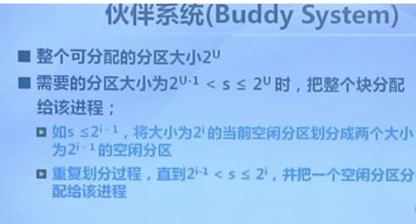
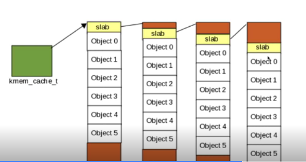

# L4 物理内存

## 计算机体系结构和内存层次

虚拟地址->MMU->物理地址

操作系统的内存管理方式：
- 重定位
- 分段
- 分页
- 虚拟存储

## 地址空间和地址生成

- 物理地址空间——硬件支持：0~MAX_sys
- 逻辑地址空间——运行的进程看到的地址：0~Max_prog

地址生成时机和限制：
- 编译时：起始地址已知
- 加载时：编译时起始地址未知，编译器生成可重定位代码
- 执行时：执行时代码可移动

## 连续内存分配

内存碎片：
- 外部碎片：分配单元之间的未被使用内存
- 内部碎片：分配单元内部的未使用内存，取决于分配内存时是否取整

操作系统需要维护：
- 所有进程的已分配分区
- 空闲分区

动态分区分配策略：（分配n字节）
- 最先匹配：使用第一个可用的空间比n大的空闲分区
- 最佳匹配：查找并使用不小于n的最小空闲分区
- 最差匹配：使用尺寸不小于n的最大空闲分区

## 碎片整理

碎片紧凑： 通过移动分配给进程的内存分区以合并外部碎片。 条件是所有应用程序可动态重定位。

分区对换：抢占并回收处于等待状态进程的分区，以增大可用内存空间。

## 伙伴系统

数据结构：空闲块按大小和起始地址组织为二维数组。初始为一个大小为2^u的空闲块

分配过程： 由小到大查找可用空闲块。如空闲块过大，对可用空闲块进行二等分，直到得到合适的可用空闲块。

释放过程：将释放的块加入空闲块数组，合并满足合并条件的块

合并条件：大小相同，地址相邻

## SLAB分配器

要解决的问题：
- 内核对象远小于页
- 内核对象频繁申请和释放
- 内核对象初始化时间超过分配和释放内存总时间

- 为每种使用的内核对象建立单独的缓冲区
- 按对象大小分组
- 两种SLAB对象：已分配或空闲
- 三类缓冲区队列：Full,Partial, Empty
- 优先从Partial分配

添加着色块以提高Cache效率

SLOB分配器是嵌入式系统的SLAB简化版本。

SLUB是SLAB的改进