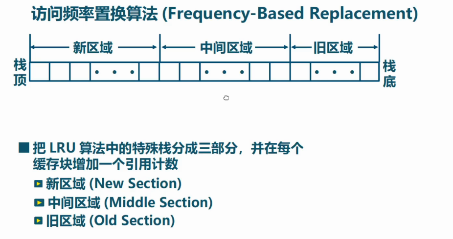
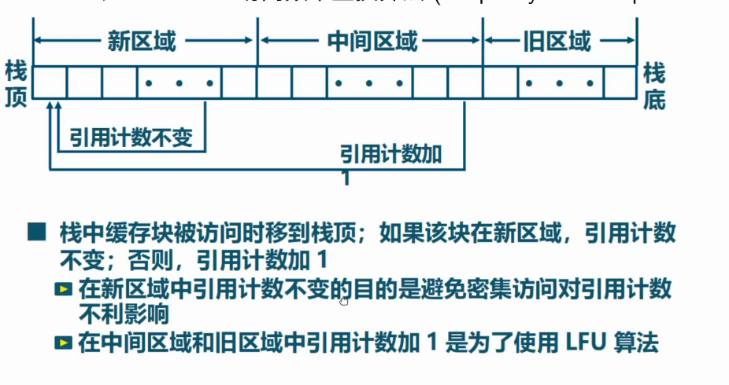
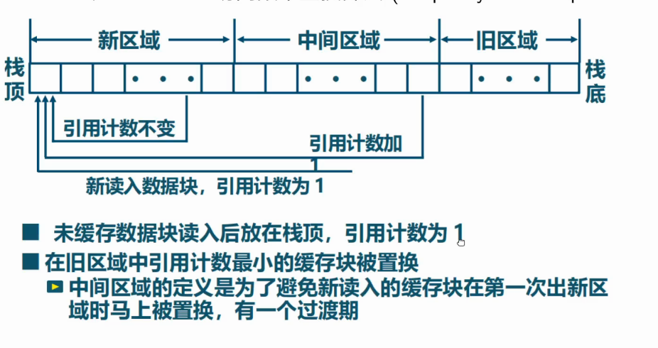
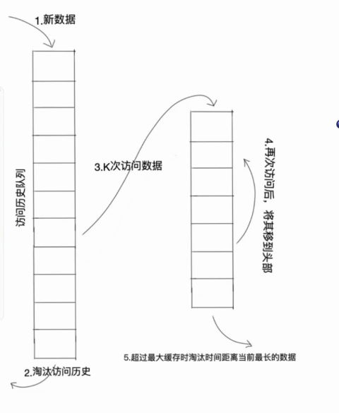

# L7 页面置换算法

出现缺页异常，需调入新页面。置换算法选择被置换的物理页面

页面锁定：描述必须常驻内存的页面，利用页表中的锁定位

- 局部页面置换算法：选择范围限于当前进程占用的物理页面
- 全局页面置换算法：----所有可换出页面

## 局部页面置换

### 最优页面置换

选择未来最长时间不访问的页面

理想情况，无法实现。性能评价依据。

### 先进先出算法

选择在内存驻留时间最长的页面

实现简单，性能差。Belady现象。

### 最近最久未使用算法

选择最长时间没有被引用的页面

开销大

实现：
- 维护页面链表，每次访存将页面移到链表首
- 活动页面栈

### 时钟页面置换算法

页表项增加访问位，页面组织为链表，指针指向最先调入的页面。

缺页时，从指针顺序查找未被访问的页面进行置换

LRU和FIFO的折中

#### 改进时钟算法

增加修改位，跳过有修改的页面

### 最不常用算法

访问页面时，访问计数+1

缺页时选择访问次数最少的页面

### Belady现象

物理页面增加，缺页数反而上升的现象

- FIFO有Belady现象
- LRU没有Belady现象

## 全局置换算法

为进程分配可变数目的物理页面

### 工作集置换算法

**工作集**是进程当前使用的逻辑页面的集合，表示为函数W(t,d)，t是时刻，d为定常的工作集窗口。W(t,d)是t时刻前d时间窗口中所有访问页面的集合。工作集是进程运行时的固有性质

**常驻集**：当前时刻进程实际驻留的页面集合。 常驻集包含工作集时缺页较少。常驻集大小达到一定数目后，缺页率不会明显下降。

算法：
- 按照窗口大小，维护访存链表。访存时，将不在工作集的页面换出，更新链表
- 缺页时，只需换入页

### 缺页率置换

**缺页率**：缺页次数/访存次数，或缺页平均间隔时间的倒数。

- 缺页率过高，则增加常驻集
- 过低，则减少常驻集

实现：  
- 访存时，设置引用位
- 缺页时，计算上次缺页时间到现在的间隔t1-t2
    + 如果t1-t2>T，则置换所有[t2,t1]未被引用的页
    + 如果t1-t2<=T, 则增加缺失页

### 抖动

抖动：进程物理页面过少，频繁缺页

通过调节并发进程数进行系统负载控制。

### 面向缓存的页置换算法

可调参数：缓存中三块的大小，调参的周期

### LRU-K 2Q

K代表最近访问次数。

LRU-K 多了一个数据访问历史记录队列(需要注意的是,访问历史记录队列并不是缓存队列,所以是不保存数据本身的,只是保存对数据的访问记录), 访问历史记录队列中维护着数据被访问的次数以及时间戳。

只有当这个数据被访问的次数大于等于 K值时,才会从历史记录队列中删除,然后把 数据加入到缓存队列中去。

2Q 算法类似于 LRU-2,不同点在于 2Q 将LRU-2 算法中的访问历史队列改为一个 FIFO 缓存队列,即:2Q 算法有两个缓存队列,一个是 FIFO 队列,一个是 LRU队列。

当数据第一次访问时,2Q 算法将数据缓存在 FIFO 队列里面,当数据第二次被访问时, 则将数据从 FIFO 队列移到 LRU 队列里面,两个队列各自按照自己的方法淘汰数据。

### LIRS

- Recency：最近被访问的不重复块数
- IRR：同一块两次访问间访问过的不重复块数

由此，将内存块划分为LIR和HIR。LIR常驻内存，HIR则不是。算法根据缺页调整LIR和HIR。