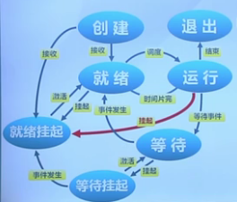

# L8 进程和线程

## 进程

### 进程的概念

进程：具有一定独立功能的程序在一个数据集合上的一次动态执行过程。 进程包含了正在运行的一个程序的所有状态信息。

特点：
- 动态
- 并发
- 独立
- 制约（访问共享数据，进程间同步）

### 进程控制块 PCB

操作系统管理进程运行所用信息的集合。每个进程在OS对应一个PCB。

- 标识信息
- 现场保存
- 控制信息：
    + 调度信息
    + 通信信息
    + 存储管理信息
    + 进程所用资源
    + 有关数据结构连接信息

PCB的组织：可以使用链表。就绪链表，阻塞链表等。

### 进程的状态

- 创建
- 执行
- 等待
- 抢占
- 唤醒
- 结束

### 三状态进程模型

就绪、运行、等待

### 挂起进程模型

挂起：进程从内存转到外存
激活：进程从外存转到内存

处于挂起状态的进程映像在磁盘上，以减少进程占用内存。

- 等待->等待挂起
- 就绪->就绪挂起
- 运行->就绪挂起

OS维护状态队列，表示不同状态。

## 线程

进程内部的一类实体
- 实体之间可以并发执行
- 实体之间共享存储空间

### 线程的概念

线程是进程的一部分，它是进程中指令流的最小单元，是CPU调度的基本单位。线程有独立的寄存器和堆栈。

### 用户线程

在用户空间实现。每个进程有私有TCB列表，无需核心态切换，允许进程有自己的线程调度算法。

缺点：
- 不支持基于线程的处理机抢占，只能依赖线程主动放弃CPU。
- 线程发起syscall时整个进程阻塞。

### 内核线程

由内核通过syscall实现线程，维护TCB。

创建、终止和切换开销更大

#### 轻权进程

进程可有多个轻量级进程，每个轻权进程对应一个内核线程，以及多个用户线程。