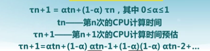

# L9 调度

- 从就绪队列挑选下一个占用CPU运行的进程。
- 从多个可用CPU挑选就绪进程可用的CPU资源

## 调度时机

- 进程从运行状态切换到等待状态
- 进程终结
- 非抢占系统：进程主动放弃CPU
- 可抢占系统：中断请求响应完成/被抢占
    - 时间片用完
    - 进程从等待切换到就绪

## 调度策略

### 比较调度算法的指标

- CPU使用率
- 吞吐量（单位时间完成的进程数量）
- 周转时间
- 等待时间
- 响应时间

### 调度算法

#### 先来先服务算法

依据进程进入就绪状态的先后顺序排列。

#### 短进程优先算法

选择就绪队列中执行时间最短进程占用CPU。 就绪队列按照**预期**的执行时间排序。

可以达到最优周转时间，但是可能导致饥饿（长进程无法获得CPU），需要预知运行时间。

变种：短剩余运行时间优先（考虑剩余运行时间，如果新进程预期时间比当前剩余时间短，允许抢占）

使用历史执行时间预估：

#### 最高响应比优先

基于SPN，不可抢占

#### 时间片轮转算法（Round Robin）

**时间片**：分配处理机资源的基本时间单元

RR算法开销：额外的上下文切换

#### 多级反馈队列算法

**多级队列算法ML**：就绪队列被划分为多个独立的子队列。每个队列拥有自己的调度策略。

队列间调度：
- 固定优先级
- 时间片轮转

优化：**多级反馈队列算法MLFQ**

- 优先级越大，时间片越小
- 如果进程在当前时间片没有完成，则降到下一个优先级

#### 公平共享调度算法

一些用户组比其他用户组更重要

## 实时调度

周期实时任务指标：
- 周期
- 执行时间
- 使用率

* 硬时限：必须在最坏情况下能够满足时限
* 软时限：通常能满足任务时限；不满足则能降级

**可调度性**：实时操作系统能够满足任务时限要求。

需要确定实时任务的执行顺序
- 静态优先级调度
- 动态优先级调度

### 速率单调调度算法RM

通过周期安排优先级，周期越短优先级越高。

### 最早截止时间优先EDF

截止时间越早优先级越高

## 多处理机调度

对称多处理器调度：
- 每个处理器有自己的调度程序
- 调度程序对共享资源的访问需要同步

### 进程分配

- 静态进程分配：进程分配到一个固定的处理器。处理器有自己的队列。
- 动态进程分配：所有处理器共享一个队列，进程可在执行中切换处理器。