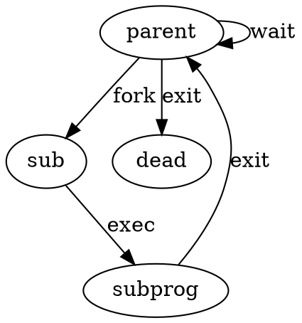

# Lab5

## E1

在load_icode的最后加上如下几句即可：

```c
    tf->tf_cs = USER_CS;
    tf->tf_ds = tf->tf_es = tf->tf_ss = USER_DS;
    tf->tf_esp = USTACKTOP;
    tf->tf_eip = elf->e_entry;
    tf->tf_eflags |= FL_IF
    ret = 0;
```

设置这些量的原因在于，load_icode的调用链是从中断服务例程开始的。只要设置好对应的参数，那么沿调用链回溯的时候，最终会到达__trapret执行iret。X86 CPU会从中断帧读取对应各段的信息，因为这里发生了权限的变更（USER_DS隐含DPL_USER)，所以还会恢复ss段寄存器和esp。

简单来说，当用户态程序使用fork创建一个子进程的时候，并没有加载对应的代码，而是复制了父进程的所有地址空间。只有调用exec后才会去读取新的程序并执行。假设exec成功执行，那么子进程就会在中断返回时开始执行子进程的第一条指令。

在Lab5中，exec过程中不会有调度，所以执行完exec后就会直接开始执行新程序。

## E2

copy_range的实现比较简单：

```c
            uintptr_t src_kvaddr = page2kva(page);
            uintptr_t dst_kvaddr = page2kva(npage);
            memcpy(dst_kvaddr, src_kvaddr, PGSIZE);
            ret = page_insert(to, npage, start, perm);
            assert(ret == 0);
```

而COW的原理就是fork时不复制整个内存空间，而是使子进程共享父进程的空间。当父进程或子进程执行写操作时，再将对应的空间复制。因为做到了按需复制，所以效率高。

要实现这种机制，可以利用页表项和虚存管理单元中的flags。在父进程和子进程的vma结构中，都置位WRITE位，表示可写。但将所有内存空间的PTE的WRITE位重置，从而不论是父进程还是子进程，在执行写操作时都会引发page fault。在这种情况下，处理例程可以区分是缺页还是COW导致的异常。如果是COW，那么就执行复制。

## E3

这四个系统调用都是和进程生命周期有关的（kill也可以算吧）。fork使得进程可以派生新的进程；exec用于切换执行的程序，多用于fork后；wait使得父进程可以等待子进程结束完毕；exit终止执行。

生命周期大概是这样的：

