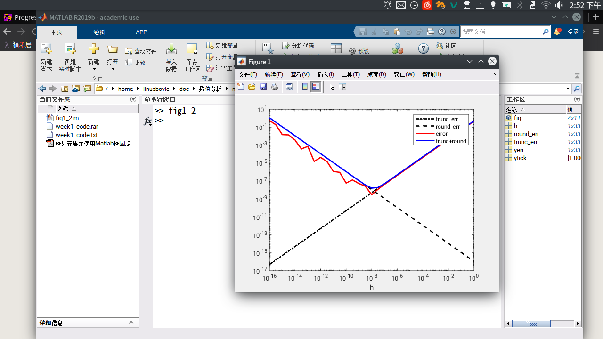

# HW1

1. 相对误差限为1%，即

$$
\epsilon_r(y) = |\frac {R^3 - {\hat R}^3} {R^3}| \leq 0.01
$$

因为

$$
\epsilon_r(R) = |\frac {R - \hat R} {R}|
$$

而当R为正数时，

$$
|\frac {R - \hat R} {R}|^3 \lt |\frac {R^3 - {\hat R}^3} {R^3}| \leq 0.01
$$

解得R允许的最大相对误差限为21.54434690031884%

2.  用一阶导数来估计，sin的绝对误差是$h\times cos(x)$； 同理，相对误差是$\frac h {tan(x)}$

条件数约等于

$$
cond \approx \frac {xcos(x)} {sin(x)} = \frac x {tan(x)}
$$

当x接近$\pi$的倍数的时候，条件数趋于无穷，问题高度敏感。

4. 
根据运算的误差近似公式，设Yn的误差是En，则$\sqrt {783} / 100$的绝对误差限是0.000005，且有：

$$ 
E_n = E_{n-1} - 0.000005
$$

28是精确数，因此，迭代一百次后的绝对误差限是0.0005.

---

**Matlab安装完成**，运行示例程序：
