# Lecture 2

## 浮点数系统 

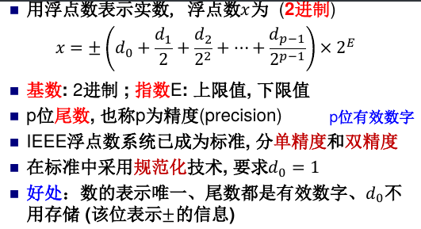

浮点数为有限个，非均匀地分布在实数轴上。

**机器精度**$\epsilon = 2 ^ {-p}$，表示1与下一个数之间间隔的一半。

使用浮点数近似表示实数x，其相对误差不超过$\epsilon$

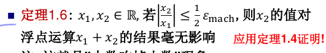

符号相同、值相近的p位数相减使结果的有效数字远少于p位，称之为抵消。

## 非线性方程求根

f(x)=0

计算此问题的敏感性：设f(x)=y，视为求y=0对应的x，则绝对条件数为

$$  
|\frac{\Delta x}{\Delta y}| \approx |\frac 1 {f'(x)}|
$$

因此$|{f'(x)}|$越小问题越敏感。当x是重根时非常敏感。

### 二分法

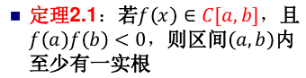

逐次将有根区间一分为二，得到区间序列{(ak,bk)}，近似解xk是区间中点。并且：

$$
|x_k - x| < (b_k - a_k) / 2= (b_0-a_0)/2^{k+1}
$$

由此可以估计要达到某个误差限所需的二分次数。

最小的有根区间长度为$2^E\times 2\epsilon$, E为准确解的浮点数指数。

二分法的误差有下限，总能收敛，缺点是有根区间的位置不易确定、收敛速度慢、无法求偶数重的重根。

### 不动点迭代法

$f(x)=0$作变换为$x = \phi(x)$，满足的x称为$\phi(x)$的不动点。x0已知，作迭代

$$
x_{k+1} = \phi(x_k)
$$

#### 判断算法是否收敛

##### 全局收敛

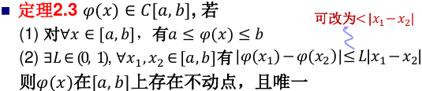

若满足2.3的条件，则对[a,b]上的任意x0，不动点迭代法都收敛到x'，且：

$$  
|x_k-x'| \le \frac {L^k}{1-L}|x_1-x0|
$$

或者：

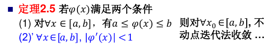

> 注：当考虑函数定义域为R时,定理2.5中的条件(1)就不需要了。这可以看成应用定理2.5的一种特殊情况。

##### 局部收敛
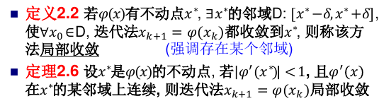

若有导数大于1，则误差扩大；等于1，则收敛性不确定。

##### 收敛阶

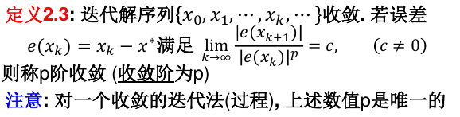

判定：
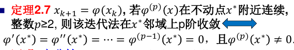

#### 牛顿法

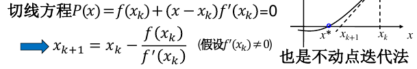

设x\*是方程f(x) = 0的单根,且f(x) 在x\* 附近有连续的二阶导数,则牛顿法局部二阶收敛.

如果是有重根的情况，只有线性阶的速度。

缺点：
- 牛顿法要求一阶导数连续。
- 局部收敛依赖初始解
- 需要计算导数

#### 迭代法判停准则

- 残差判据
- 误差判据
- 相对误差判据

### 割线法和抛物线法

#### 割线法

割线法属于拟牛顿法，使用割线来代替切线。 指定两个初始解。

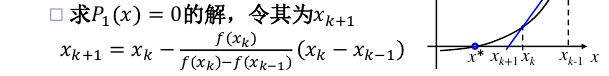

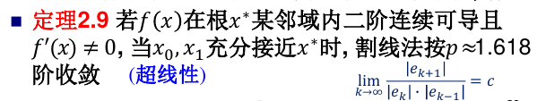

#### 抛物线法

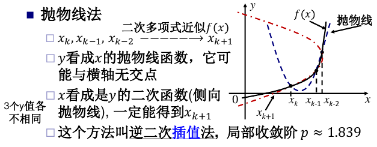