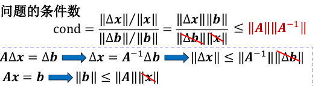
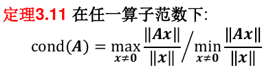
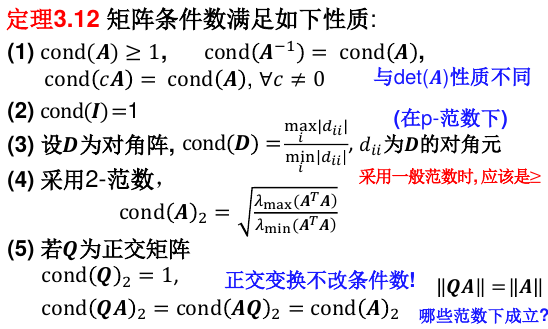
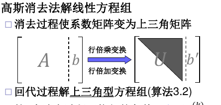
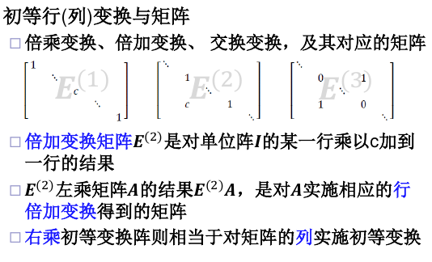

# 线性方程组的直接解法

## 范数

### 矩阵范数

矩阵也构成线性空间$R^{n\times n}$。可以定义矩阵范数。 矩阵范数增加如下要求：

常用范数：

#### 算子范数
根据某种向量范数$||x||_v$进行定义：

## 线性方程组求解问题的敏感性

设A为非奇异矩阵,称cond(A) = $||A|| \times || A^{−1}||$ 为矩阵A的条件数。推导：

矩阵条件数大则问题很病态, 也称该矩阵为病态矩阵

### 矩阵条件数的性质

## 高斯消去法

消去过程的条件：主元$a_{kk}^k$不为0（不是原矩阵对角元素，而是上三角矩阵的前n-1个对角元）

高斯消去法可以看作左乘一系列消去矩阵，最终得到一个上三角矩阵U。

消去矩阵的逆就是改变非对角元的符号。消去矩阵的逆也是消去矩阵。

## LU分解

A=LU

- L为单位下三角阵,U为上三角阵 (**Doolittle分解**)
- L为下三角阵,U为单位上三角阵 (Crout分解)

对于方程Ax=b，若执行高斯消去过程中的主元（指前n-1个）都不为0，<=>系数矩阵A**存在惟一**的LU分解。

如何分解：
1. 记录高斯消去过程中的乘数，消去的结果是U，将乘数的相反数依次填入单位阵得到L。
2. 依次计算待定系数

## 选主元

A进行高斯消去过程中不出现0主元的充要条件是，A的前n-1个顺序主子式都不为零。

否则，LU分解不存在，或有无穷多。

对于奇异阵，也可能完成消去和LU分解。

> 推论：对称正定矩阵的消去过程不会中断。

### 部分主元（列主元）高斯消去法

如果当前主元是0， 可以选择同一列下方元素不为零的行交换。只要矩阵A非奇异，一定能找到这样的新主元。

另外，通过选主元，使得主元尽可能大，减少误差。

第k步，选择第k列未消去部分绝对值最大的元素。