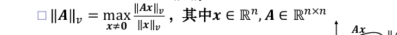
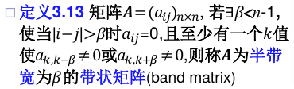

# 线性方程组的直接解法

## 范数

### 矩阵范数

矩阵也构成线性空间$R^{n\times n}$。可以定义矩阵范数。 矩阵范数增加如下要求：

#### 算子范数
根据某种向量范数$||x||_v$进行定义：

常用算子范数：

## 线性方程组求解问题的敏感性

设A为非奇异矩阵,称cond(A) = $||A|| \times || A^{−1}||$ 为矩阵A的条件数。推导：

矩阵条件数大则问题很病态, 也称该矩阵为病态矩阵

### 矩阵条件数的性质

## 高斯消去法

消去过程的条件：主元$a_{kk}^k$不为0（不是原矩阵对角元素，而是上三角矩阵的前n-1个对角元）

高斯消去法可以看作左乘一系列消去矩阵，最终得到一个上三角矩阵U。

消去矩阵的逆就是改变非对角元的符号。消去矩阵的逆也是消去矩阵。

## LU分解

A=LU

- L为单位下三角阵,U为上三角阵 (**Doolittle分解**)
- L为下三角阵,U为单位上三角阵 (Crout分解)

对于方程Ax=b，若执行高斯消去过程中的主元（指前n-1个）都不为0，<=>系数矩阵A**存在惟一**的LU分解。

如何分解：
1. 记录高斯消去过程中的乘数，消去的结果是U，将乘数的相反数依次填入单位阵得到L。
2. 直接LU分解：依次计算待定系数

## 选主元

A进行高斯消去过程中不出现0主元（LU分解惟一存在）的充要条件是，A的前n-1个顺序主子式都不为零。

否则，LU分解不存在，或有无穷多。

对于奇异阵，也可能完成消去和LU分解。

> 推论：正定矩阵的消去过程不会中断。（不用选主元）

### 部分主元（列主元）技术

如果当前主元是0， 可以选择同一列下方元素不为零的行交换。**只要矩阵A非奇异，一定能找到这样的新主元**。 另外，通过选主元，使得主元尽可能大，减少误差。

部分主元高斯消元：第k步，选择第k列未消去部分绝对值最大的元素。

部分主元LU分解：PA = LU，其中P是一个排列阵，对应于上述行交换过程。L也要对应行交换。

### 算法稳定性

采用向后误差分析的方法：

其中ρ是$A^k$最大元素和A最大元素的比，n是阶数，ε是机器精度

有以下结论：
- 选主元过程的增长因子有上限$ρ \le 2^{n-1}$
- 不选主元，可以任意大

一个选主元取上限的例子：

## 对称正定矩阵的Cholesky分解

对于一个对称矩阵，其LU分解（若不中断）可以写为A=$LDL^T$。

若是对称正定矩阵，L为对角元>0的下三角阵，则A可惟一分解为$A=LL^T$的形式，称为Cholesky分解。

分解算法
- 平方根法：类似直接LU分解，按照顺序依次计算系数

Cholesky分解增长因子小于1。

## 带状矩阵与稀疏矩阵

### 带状矩阵

带状矩阵的L、U矩阵非零元仍分布在原始带宽范围内。$\beta << n$ 时LU分解效率高。

### 对角占优矩阵

按行对角占优：

类似的，可以定义按行严格对角占优，按列（严格）对角占优。

按列严格对角占优的矩阵，在部分主元过程中不交换行。因此不选主元也稳定。

### 稀疏矩阵

**稀疏矩阵**：存在大量0元素。使用特殊技术，不处理0元素

#### 存储稀疏矩阵

- 三元组：元素，行，列。非零元的顺序可以任意。
- 压缩稀疏行（CSR格式）：元素+列+prow，prow保存各行在数组中的开始位置
- ……

## 非线性方程组的求解

表示为多向量函数形式的$x=g(x)$，仍可使用不动点迭代法

判断收敛性：

Jacobi矩阵的元素定义为：

### 牛顿法求解

在任意一点作泰勒展开，有$f(x+s)\approx f(x)+J_f(x)s$

带入xk，得xk+1的迭代步骤为：

