# 线性方程组的迭代解法

## 基本概念

使用向量序列逼近准确解，类似于不动点迭代法，构造$x=\phi(x)$。（不能用L3中的牛顿法，见[L3](Lecture%203.md)）

希望$\phi$是线性的，则有 $x^{k+1}=Bx^k+f$

其中B和f是常数矩阵和向量，这称为**一阶定常迭代法**（迭代步只涉及前一步的结果，B和f是常数系数）

构造方法：**矩阵分裂法**

选择矩阵M，N使得A=M-N，则有

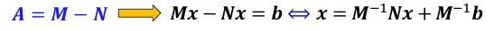

## 迭代法相关理论

### 收敛性

一阶定常迭代法收敛，需要B的幂序列$lim_{k->\infty}B^k=0$

1. 矩阵序列收敛，等价于误差的范数收敛于0
2. 
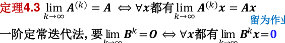

3. 矩阵的谱半径为：

4. 
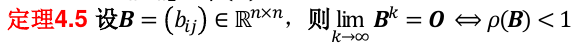
（利用定理4.3，以及特征值的定义推导出）

**迭代法基本定理**：
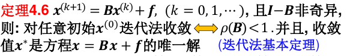
（或者参考[Lecture 3.md](Lecture%203.md)最后的定理）

因此，谱半径小于1是一阶定常迭代法的收敛判据。（全局收敛）

另外，收敛的一个**充分**条件是，在某种范数下$||B||_t<1$.

### 收敛阶

**收敛阶**定义类似：

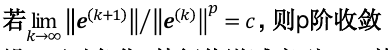

可以证明，一阶定常迭代法是一阶收敛的，且常数c为B的谱半径。

### 收敛速度

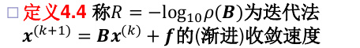

R反映了一步迭代取得的十进制精度位数

## Jacobi迭代法

如果A的**对角元不为0**，设A=D-(D-A)，其中D是A的对角阵。具体的迭代式表示如下：

- 三阶的情况
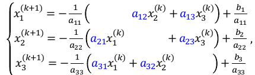
- 更一般地
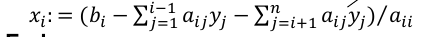

### 判停准则

类似非线性方程求根，可以用残差判据和误差判据。

- 残差的计算量较大
- 误差判据较为常用

## Gauss-Seidel迭代法

和Jacobi类似，但是计算顺序不同！

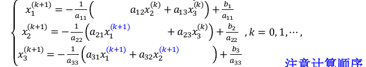

其矩阵表达式是A=L-(L-A)

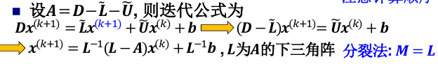

- 如果按从n到1的顺序计算分量，则得到逆向GS算法
- 如果同时使用顺序和逆向的GS算法，则得到对称GS（SGS）算法

## SOR迭代法

在GS基础上引入松弛因子ω

先按照GS法由xk算出x'k+1，然后将xk和x'k+1加权平均得到xk+1

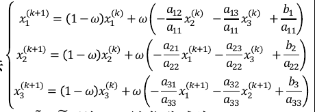

如果ω=1时就是GS方法

对应于分裂法中M=$\frac 1 \omega D - \hat L$的情况

## 三种迭代法的收敛条件

直接根据定义，计算B的谱半径往往计算量过大（Jacobi迭代法B较简单，可以直接算）

对于**Jacobi迭代法**，有如下判据：
- 如果B的1范数或无穷范数严格小于1，则Jacobi迭代法收敛
- 如果A是对角元大于0的对称阵，则迭代法全局收敛的充要条件是A和2D-A都正定

**G-S**迭代法收敛性的判断：
- 如果Jacobi方法的迭代矩阵B满足B的1范数或无穷范数严格小于1，则GS方法也收敛
- 如果A对称正定，则GS法收敛

**SOR**：
- SOR收敛的必要条件是0<w<2
- 如果A对称正定，则满足上一条件时SOR收敛

还有一些根据系数矩阵A直接判断的方法：

### 可约矩阵

如果存在排列阵P使得：

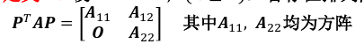

则A是**可约矩阵**

### 对角占优定理

如果A是严格对角占优矩阵，或者**不可约**的弱对角占优矩阵，则A非奇异。

对于这样的A，求解Ax=b的Jacobi和GS迭代法都收敛；如果0<w<=1,则SOR迭代法也收敛。

## 共轭梯度法

如果A是一个对称正定矩阵，则Ax=b的解也就是n元二次函数$\phi(x)=\frac 1 2 x^T A x - b^T x$的最小值点。

因此，可以转化为搜索最小值点问题。

### 最速下降法

每一步沿着下降最快的方向进行搜索。

下降最快的方向，也就是负梯度方向，等于残差$r^k$

所以$x^{k+1} = x^k + \alpha_k r^k$

其中搜索步长$\alpha_k$取为使$\phi(x^{k+1}$最小。即：

$$
\alpha_k = \frac {(r^k)^T r^k} {(r^k)^T A r^k}
$$

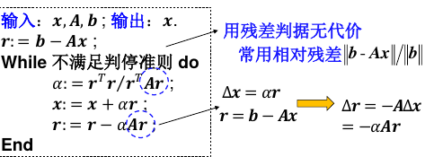

如果\phi是凸二次函数，且有惟一最小值点，则一定收敛

最速下降法的缺点：
- 局部最优，但总体效率低
- 收敛慢

### 共轭梯度法

在当前点，下降最快的方向是残差rk，前一步的搜索方向是pk-1。

则在过xk和上述两个方向张成的平面上找函数的最小值：

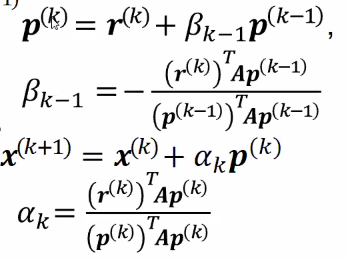

如果不考虑数值误差，n步迭代后得到准确解。但是，当k很大时，舍入误差严重；当A是病态矩阵，则收敛很慢，甚至不收敛