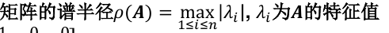

# 线性方程组的迭代解法

## 基本概念

使用向量序列逼近准确解，类似于不动点迭代法，构造$x=\phi(x)$。（不能用L3中的牛顿法，见[L3](Lecture%203.md)）

希望$\phi$是线性的，则有 $x^{k+1}=Bx^k+f$

其中B和f是常数矩阵和向量，这称为**一阶定常迭代法**（迭代步只涉及前一步的结果，常数系数）

构造方法：**矩阵分裂法**

选择矩阵M，N使得A=M-N，则有

## Jacobi迭代法

如果A的**对角元不为0**，设A=D-(D-A)，其中D是A的对角阵。具体的迭代式表示如下：

- 三阶的情况

- 更一般地

### 判停准则

类似非线性方程求根，可以用残差判据和误差判据。

- 残差的计算量较大
- 误差判据较为常用

### 收敛性

一阶定常迭代法收敛，需要B的幂序列$lim_{k->\infty}B^k=0$

## 迭代法相关理论

1. 矩阵序列收敛，等价于误差的范数收敛于0
2. 

3. 矩阵的谱半径为：

4. 

**迭代法基本定理**：

因此，谱半径小于1是一阶定常迭代法的收敛判据。（全局收敛）

收敛的一个**充分**条件是，在某种范数下$||B||_t<1$.

**收敛阶**定义类似：

可以证明，一阶定常迭代法是一阶收敛的，且常数c为B的谱半径。

**收敛速度**：

R反映了一步迭代取得的十进制精度位数

## Gauss-Seidel迭代法

和Jacobi类似，但是计算顺序不同！

其矩阵表达式是A=L-(L-A)

- 如果按从n到1的顺序计算分量，则得到逆向GS算法
- 如果交替使用顺序和逆向的GS算法，则得到对称GS（SGS）算法

## SOR迭代法

在GS基础上引入松弛因子ω

先按照GS法由xk算出x'k+1，然后将xk和x'k+1加权平均得到xk+1

如果ω=1时就是GS方法

对应于分裂法中M=$\frac 1 \omega D - \hat L$的情况