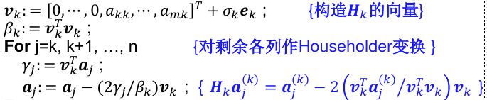
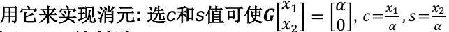
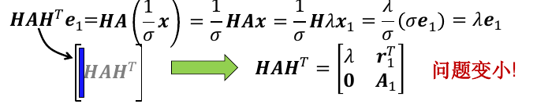

# 矩阵特征值问题

## 特征值

矩阵A的特征值与特征向量: Ax = λx , x ≠ 0.全部特征值记为$\lambda(A)$

给定一特征值λ, 特征向量是方程 (λI −A)x = 0的非零解；特征向量都不唯一，构成特征子空间。

假设$A \in R^{n \times n}$
- 特征值不一定是实数;
- 实特征值一定有实特征向量;
- 非实特征值的共轭也是特征值, 其对应的特征向量一定不是实向量

特征值的一些性质：
1. 非奇异矩阵的特征值不为0，0一定是奇异阵的特征值
2. A和A的转置有同样的特征值
3. 如果A是对角阵，或上/下三角阵，则特征值为对角元
4. 如果A是分块（方阵）对角阵或三角阵，则A的特征值是对角分块矩阵的特征值的并集
5. 相似矩阵的特征值相等
> 相似矩阵： $B = V^{-1}AV$，V非奇异
6. $\lambda(A+cI) = c + \lambda(A)$
7. $\lambda(A^k) = \lambda(A)^k$

若λ是特征方程的n重根，则n称为λ的**代数重数**；而λ的特征子空间的维数是**几何重数**。几何重数总是小于等于代数重数

不同特征值的特征向量线性无关，所有特征子空间的基形成一组线性无关向量（维数为几何重数之和，可能少于n个）。如果对任意特征值，其代数重数都等于几何重数，则称A为**非亏损阵**，否则为**亏损阵**。

非亏损阵可以做特征值分解。即$A=X^{-1}\Lambda X$， Λ是特征值组成的对角阵。一般情况下，可作Jordan分解。

实对称阵非亏损，并且特征值为实数，有n个正交的特征向量。（可正交对角化）

## 特征值的分布

**Gerschgorin圆盘**： 设A是n阶复矩阵，$r_k = \sum_{j=1,j \neq k}^n |a_{kj}|$，在复平面上以$a_{kk}$为圆心，$r_k$为半径的圆。

**圆盘定理**：
- A的特征值必然在某个圆盘上
- 若n个圆盘中有m个连通，且与其他分离，则这m个圆盘恰好有m个特征值

推论：严格对角占优阵A如果对角元都为正，则Re(λ)>0

## 幂法与反幂法

**模最大**的特征值称为**主特征值**，可能不惟一。

### 幂法

取随机非零向量v0，计算vk=A*vk-1。得到v的向量序列

如果矩阵A有惟一的主特征值λ，则vk趋向于λ的某个特征向量

问题：
- k很大时，可能出现溢出
- 收敛速度取决于次特征值和主特征值大小的比值

实用幂法使用**规格化向量**的技术防止溢出。规格化方法是$u=v/max(v)$，其中max(v)是v的绝对值最大分量，如果有多个就取编号最小的。在每一步执行规格化操作。

采用规格化操作，迭代生成的max(v)序列就趋向于主特征值，u序列趋向于某主特征向量

#### 幂法加速

**原点位移技术**：B=A-PI的特征值是A的特征值-P。对B应用幂法可能加快收敛。

**瑞利商加速**：

实对称阵A的瑞利商为R(x)=<Ax,x>/<x,x>。可以证明R(x)介于A的最大和最小特征值之间，当x取相应的特征向量时取等号。

结合幂法，每步对Vk计算瑞利商，可以加速收敛。*详见课本*

### 反幂法

A的逆的特征值是A的特征值的倒数。因此对A的逆应用幂法得到模最小的特征值。

适用范围：A按模最小的特征值惟一。

若已知A的某特征值λ，则λ-p就是B=A-PI的按模最小的特征值。因此，原点位移技术非常适合反幂法。

## QR分解

### Householder变换

设w是n维向量，且$w^Tw=1$（w的2范数是1），称$H(w)=I-2ww^T$为Householder矩阵（初等反射阵）。

性质：
- H是对称阵、正交阵
- H(w)=H(-w)

Hx实现Householder变换（属于正交变换）。几何上，Hx和x关于某平面镜像对称。

如果x和y是两个2范数相等的n维向量，则存在H矩阵使得Hx=y

已知x，y，**构造H：** 令 v=x-y，则w=$\frac v {||v||}$，由此算出H

### 用Householder矩阵进行QR分解
对于m\*n阶的实矩阵A，可以用H矩阵进行正交分解。如果A非奇异， 且R的对角元>0，则分解惟一

Hk ⋯ H2 H1 A =R

首先用初等反射阵H1消去A的第一列，之后，构造n-1阶的反射阵消去第二列的对角元之下的元素：

如此重复。m>n时需要n步，=n时需要n-1步

实际情况下，不需要算出H，只需要用到V向量和列向量的内积。（算法片段）：

### Givens旋转变换

一次Givens旋转变换只影响向量的两个元素，二阶Givens阵消元的方法是：

高阶的Givens阵只需嵌入单位阵：

Givens旋转也可以用于实现QR分解，适合稀疏矩阵

## QR迭代算法

### 收缩技术

如果已知一个特征值和特征向量（比如用幂法），使用H矩阵对特征向量作正交消去，用此反射阵对A作相似变换：

实际并不需要算HAH^T，而是可以通过先算B=HA^T,再算HB^T求得（其中H和矩阵相乘可以用一系列矩阵向量乘计算）

### QR算法

设分块上三角阵A是n阶实方阵,其对角块为1阶或2阶矩阵,则称A为**拟上三角阵**,也叫**实Schur型**

QR算法：

对非亏损阵A, 若它等模的特征值为实重特征值或复共轭特征值, 则QR迭代所得矩阵序列 Ak 基本收敛于拟上三角阵

缺点:
- 迭代计算量大
- 可能不收敛，或收敛慢

### 实用QR迭代

#### 上Hessenberg型

如果矩阵是上Hessenberg型，那么用Givens旋转变换，计算量可以降低一个幂次。

此时，不用算出Givens旋转变换的变换矩阵的乘积，再进行迭代，而是可以如下进行：

将矩阵化为Hessenberg型可以通过Houserholder变换进行：

#### 带原点位移的QR分解

简单的策略：取$s_k=A_k(n,n)$

## 奇异值分解

### 奇异值

行列数不相等的实矩阵可以定义奇异值：

其中v是n阶向量，u是m阶向量。奇异向量有无穷对，一般标准化，使其范数为1.

当m大于等于n时，A总可以分解为

$$
A=U\Sigma V^T
$$

其中U和V都是正交阵，Sigma是对角阵，其对角元素是A的n个奇异值，且满足$\sigma_1 \ge \sigma_2 ... 0$