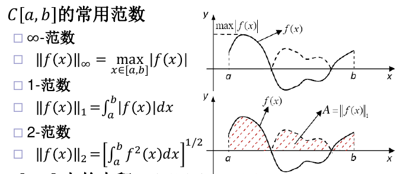
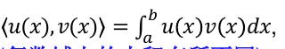
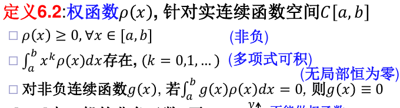
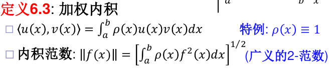
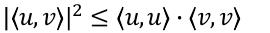
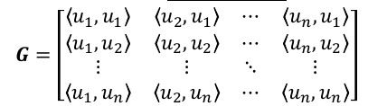
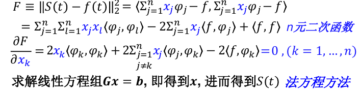
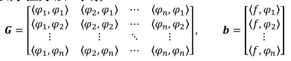
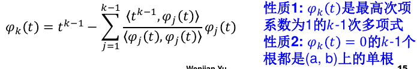
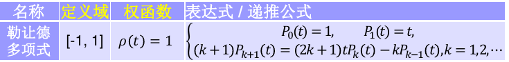

# 函数逼近和插值

## 函数逼近

### 基本概念

对给定函数f(x), 在某个较简单的函数类Φ中找p(x), 使得在某种度量意义下误差函数p(x) − f(x)最小

函数逼近的误差由某种函数空间上的范数度量：

在实连续函数空间中，可以定义内积：

**权函数**：

由此定义**加权内积**：

### 一些定理

**Cauchy-Schwarz不等式**：

**Gram矩阵**定义为：

其中u都是实内积空间S上的向量。则G非奇异的充要条件是**{u}线性无关**。

### 函数逼近的分类

按照使用的范数分类：
- 无穷范数：最佳一致逼近
- 1范数/2范数：最佳平方（最小二乘）逼近

使用2范数比较容易

### 最佳平方逼近

对函数f进行逼近，函数类Φ取为线性空间span{$\phi_1,\phi_2,...\phi_n$}

问题为求$F=||S(t)-f(t)||_2^2$最小

化简并求导数可知：

这里G是Gram矩阵，对称正定，有唯一解：

可以证明此方程的解使得误差最小。

#### 最佳平方逼近多项式

**Weierstrass定理**：多项式可以对C[a,b]上的函数逼近得任意好

如果使用多项式函数，则基为$1,t,...t^{n-1}$，此时，Gram矩阵变为Hilbert矩阵：

G矩阵此时高度病态，计算量也大

解决方法：使用正交基函数

**正交函数族**是两两正交的函数。n个次数不超过n-1的正交多项式函数，可以从一般的一组基开始，使用逐个正交化过程(**Gram-Schmidt法**)构造。

**勒让德多项式**可以直接计算，而不用正交化过程（罗德利克形式）：

此外还有很多形式的正交多项式可以递推求解。