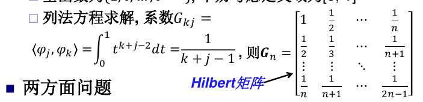
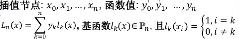

# 函数逼近和插值

## 函数逼近

### 基本概念

对给定函数f(x), 在某个较简单的函数类Φ中找p(x), 使得在某种度量意义下误差函数p(x) − f(x)最小

函数逼近的误差由某种函数空间上的范数度量：

在实连续函数空间中，可以定义内积：

**权函数**：

由此定义**加权内积**：

### 一些定理

**Cauchy-Schwarz不等式**：

**Gram矩阵**定义为：

其中u都是实内积空间S上的向量。则G非奇异的充要条件是 **{u}线性无关**。

### 函数逼近的分类

按照使用的范数分类：
- 无穷范数：最佳一致逼近
- 1范数
- 2范数：最佳平方（最小二乘）逼近

无穷范数要求在整个区间上一致地接近。 2范数和1范数则反映的是平均误差。使用2范数比1范数容易，一般使用2范数。

### 最佳平方逼近

**法方程法：**
对函数f进行逼近，函数类Φ取为线性空间span{$\phi_1,\phi_2,...\phi_n$}

问题为求$F=||S(t)-f(t)||_2^2$最小

化简并求导数可知：

这里G是Gram矩阵，对称正定，有唯一解：

可以证明此方程的解使得误差最小。

#### 最佳平方逼近多项式

**Weierstrass定理**：多项式可以对C[a,b]上的函数逼近得任意好

如果使用多项式函数，则基为$1,t,...t^{n-1}$，此时，Gram矩阵变为Hilbert矩阵：

G矩阵此时高度病态，计算量也大

解决方法：使用正交基函数

##### 正交函数族

**正交函数族**是两两正交的函数。n个次数不超过n-1的正交多项式函数，可以从一般的一组基开始，使用逐个正交化过程(**Gram-Schmidt法**)构造。

##### 勒让德多项式

可以直接计算，而不用正交化过程（罗德利克形式）：

勒让德多项式的内积性质：

如果定义域不是[-1，1]则可以用变量替换的方法，从Pk构造：

[a,b]上的勒让德多项式及对应的性质是：

此外还有很多形式的正交多项式可以递推求解。

## 曲线拟合

给定m个离散数据点（ti,fi)，以及n个基函数，**线性最小二乘拟合**是求一组S的系数使得$\sum_{i=1}^n[S(t_i)-f_i]$最小

### 表格函数

定义在离散点上的表格函数构成线性空间, 函数可用其离散点函数值构成的向量表示：

将目标函数S的基函数在离散点上的取值构成矩阵A，则问题转换为：

其中，A的每一列都是一个表格函数。

### 法方程方法

形成矩阵A，则Gram矩阵G=$A^TA$，b=$A^Tf$。解Gx=b即为系数x。

如果A列满秩，即每列形成的表格函数都线性无关，则解惟一。一般来说，表格函数是否线性无关和离散点的值有关。

对于多项式基函数，有如下结论：

> 如果m个离散点中至少有n个不同的值，则$P_{n-1}$基函数对应的表格函数线性无关

注：曲线拟合之中可以有相等的离散点。

### 正交变换法

构造表格函数的正交基，等价于用QR分解来实现正交化。

基本原理：

完整算法：

同样，A列满秩时解惟一。

## 多项式插值

插值要求曲线通过各个离散点。是一种特殊的逼近。插值还要求数据点的自变量值互不相同。

多项式插值：求n次多项式满足n+1个插值点的条件。此问题的解存在且惟一。

三种方法求插值多项式：
- 待定系数
- 拉格朗日插值法
- 牛顿插值法

### Lagrange插值法

其中lk为：

插值余项：

### Newton插值

其中，Ck是k阶差商f[x0,...,xk]。

#### 差商

差商有对称性，其自变量的顺序可以任意。

一般用差商表计算：

差商表中对角的元素是插值的系数。注意在差商表中每个元素对应一组数据点，计算高阶差商时，分母是低阶差商对应的数据点的「差」。比如：

n阶Newton插值余项是n+1阶差与w的乘积：$f[x,x0,...,xn]w_{n+1}(x)$。

## 分段插值

### 分段线性插值

### 分段二点三次埃尔米特插值

### 保形插值

## 样条插值