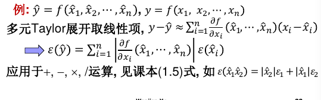

# Lecture1

## 课程信息

教材：数值分析与算法（2/3版），喻文健

参考:

+ Matlab数值计算
+ 数值分析（第五版），李庆扬

### 教学内容

- 数值计算导论
- 非线性方程解法
- 线性方程组的直接解法
- 线性方程组的迭代解法
- 矩阵特征值计算
- 函数逼近与线性最小二乘 $f(x) \approx p(x)$ $Ax \approx b$
- 函数插值
- 数值积分与微分
- 常微分方程初值问题

附加：Matlab数值计算与应用

## 数值分析的背景

数值分析/计算是研究求解连续数学问题的算法的学科。

数值计算的特点：处理连续数学的量（实数量），被求解问题一般没有解析解或理论上无法通过有限步计算求解。

## 误差分析基础

### 误差的来源

+ 计算前误差：
    - 模型误差
    - 数据误差：常数、测量值、前一步计算结果等
+ 计算中误差：
    - 截断误差/方法误差：如sin(x)的Taylor展开的有限项截断
    - 舍入误差：计算时数的表示位数有限

### 误差及其分类

#### 误差与有效数字
误差可正可负
- 绝对误差 $e(\hat x) = \hat x -x$
- 相对误差 $e_r(\hat x) = \frac {\hat x - x } {x}$
> 准确值为0时相对误差无意义；准确值未知时估计误差上限$\epsilon(\hat x)$。

**有效数字**：从左至右第一个非零数字开始的所有数字。

若$\hat x$的前p(>=1)位有效数字正确，$d_0$为x的第一位有效数字，则有

$$
|e_r(\hat x)| < \frac 1 {d_0} \times 10^{-p+1}
$$

若对某数x**保留**p位有效数字后得到近似值$\hat x$，则对应近似值的误差是上式的一半。

反之，若近似值的相对误差满足

$$
|e_r(\hat x)| < \frac 1 {2 (d_0 + 1) } \times 10^{-p+1}
$$

则或者$\hat x$的前p位有效数字正确，或者保留p位有效数字后与x相同。

> 推论：若相对误差小于$\frac 1 2 \times 10^{-p}$，则前p位有效数字正确  
>
> 推论：若相对误差小于$10^{-p}$，则**约有**前p位有效数字正确

区分两种说法：
- 精度（precision）：与表示数的有效数字位数有关
- 准确度（accuracy）：与误差大小有关

#### 数据传递误差与计算误差

f为计算方法，$\hat f$为其近似

$$
\hat f (\hat x) - f(x) = [\hat f(\hat x) - f(\hat x)]+[f(\hat x) - f(x)]
$$

前一项为单纯的计算误差，第二项为数据传递误差

计算误差两部分：数值方法近似、有限精度运算（截断误差+舍入误差）。

### 问题的敏感性

问题的敏感性是输入数据扰动对问题解的影响程度，反映问题特性，与具体算法无关。数据传递误差主要和敏感性有关。

+ 良态：不敏感
+ 病态：敏感

相对**条件数**反映问题的敏感性。Cond=|问题的解的相对变化量/输入数据的相对变化量|

如，对于函数求值问题有：

$$
cond = |\frac {[f(\hat x) - f(x)]/f(x)} {\hat x - x) / x}| \approx |\frac {xf'(x)}{f(x)}|
$$

简单的运算可直接用微积分估计数据传递误差限：

自变量误差较小时，运算的误差限计算可以参考教材1.5式：

### 算法稳定性

结果对计算过程中的扰动不敏感的算法是稳定的算法。