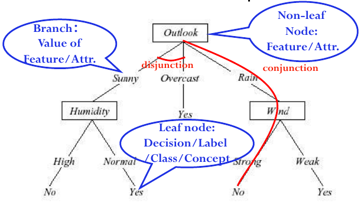

# L2 General Design

Machine Learning:
- Task
- Experience
- Performance

Basic Concepts:

given 
- Instance Space X(with attributes)
- Hypothesis Class H
- Target Function C
- Training Examples D

## Decision Tree

适用于Classical Targeting Problems:
- Discrete
- No order
- Classification problem involving nominal data

构建决策树的算法基本思路是使用熵、基尼系数等度量不确定性，并计算一个节点的信息增益，每一步选择增益最大的节点：

