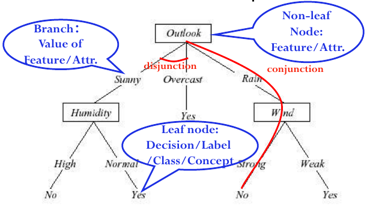
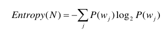
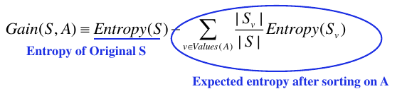
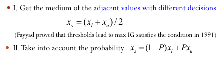
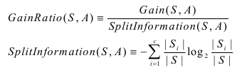

# L3 Decision Tree

适用于Classical Targeting Problems:
- Discrete
- No order
- Classification problem involving nominal data

构建决策树的算法基本思路是使用熵、基尼系数等度量不确定性，并计算一个节点的信息增益，每一步选择增益最大的节点：

（其中p是各输出类的概率）

## 停止条件

- 相同的输出类别
- 输入的label完全相同

如果输入都相同，但是输出类别不同，说明数据不足以区分。

## 过拟合

### 前剪枝

训练数据小于一定比例停止分裂

### 后剪枝

Split data into **training set** and **validation set**

Evaluate impact on validation set of pruning each possible node (plus the subtree it roots)

Greedily remove the one that most improves validation set accuracy.

剪去的分支返回的label可以是：  
- 最多的label
- 按照原来的概率随机返回label
- 如果label是数值，则可以取平均值

#### 规则后剪枝

将决策树转换为一系列判断规则，可以针对规则进行剪枝。

此时，剪枝后可能不再形成树。

## 实际应用

### 连续值

### 分支过多的属性

如果属性的分支过多，则按照IG会倾向于选择它。

可以用GainRatio替代：

### 其他

- 未知属性值
- 带Cost的属性
