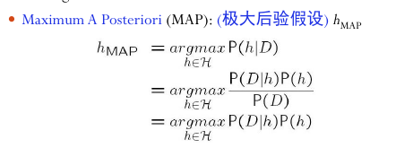

# L4

## Inductive Learning Hypothesis

Any hypothesis found to approximate the target function well over a sufficiently large set of training examples will also approximate the target function well over unobserved examples.

## Bayesian Learning

Bayes Theorem:

$$  
P(h|D) = \frac {P(D|h)P(h)}{P(D)}
$$

> P(D)可以用全概率公式计算。

可以避免P(D)的计算:

- 极大后验假设：$h_{MAP}=argmax_{h \in H}P(D|h)p(h)$
- 极大似然假设：$h_{ML}=argmax_{h \in H}P(D|h)$

如果变量独立，噪声为正态分布，则极大似然假设等于满足最小平方误差的假设。见slides

### 朴素贝叶斯分类器

假设输入数据的属性是独立的。则$P(x|y) = P(a_1, a_2, ... a_n | v) = \Pi_i P(a_i|v)$

### MDL

Minimum Description Length: $h_{MDL}=argmax_{h \in H}(L_{C_1}(h) + L_{C_2}(D|h))$

消息i的最优编码是$-log_2p$, p是i的概率。