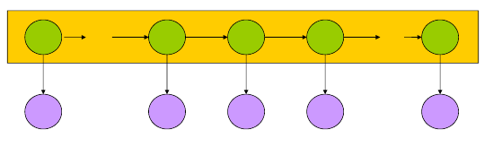

# L5 Markov Model

给定一系列数据，**一阶马尔可夫假设**：

> The probability of an observation at time n only depends on the observation at time n-1.
> 
> 某状态在时间n被观测到的概率只和n-1时间被观测到的状态有关。

从而一个状态序列的出现概率为：

**转移概率**：假设时刻n-1为状态为$S_i$, 时刻n为状态$S_j$的概率为$a_{i,j}$

转移概率的性质：
- 大于0
- 时间不变性

- 所有状态间的转移概率组成转移矩阵。

## 隐马尔克夫模型

两种状态：
- hidden state
- observed state

hidden state只依赖于上一个状态；observed state	只依赖对应的hidden state.

**输出概率**：给定hidden state下，观察到某状态的概率

**输出i独立性假设**：i时刻观察到的状态，只和i时刻的隐藏状态有关。

几种基本的问题：

### Estimation Problem

给定模型，计算观察到指定状态序列的概率$P(O|u)$

一种方法是遍历所有隐藏状态序列，利用全概率公式、转移矩阵和输出概率计算。复杂度高。

动态规划算法：

其中，α的计算方法为

### Decoding Problem

给定观察序列，求概率最大的隐状态序列。

**Viterbi算法**

