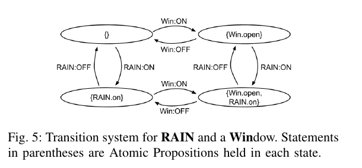

# 模型驱动大作业报告

计76 韩志磊

## 选题说明

本次模型驱动的软件开发大作业是进行相关论文的阅读和报告。我与谢兴宇同学进行了组队，选择的论文是ICSE19上的一篇论文，标题是「AutoTap: Synthesizing and Repairing Trigger-Action Programs Using LTL Properties」。这篇文章主要还是讲从模型综合程序的方法，但也算是model-driven在现实场景中的一个应用。

我们都对论文进行了较为仔细的阅读，谢兴宇同学找到了文章中的工具并进行了复现，我则负责准备汇报展示，最终课上的效果应当是不错的。另外程序综合、模型检测、LTL等也和我们之后的研究方向较为契合，所以对我们而言也非常有帮助。

这篇阅读报告会先会从论文的几个方面进行简要的说明，最后结合我的方向进行说明

## 问题与背景

这篇文章要解决的问题是在物联网飞速发展的情况下，如何提高智能设备互连的编程易用性？对于一般的用户而言，没有受过专门的编程训练，自然不能用GPL来进行编程。一般，在智能设备自动化领域，会有一些专门为此定义的DSL，而且一般是图形化的。这些编程方法统称「终端用户编程」，End-User Programming。

EUP里的一大类范式叫做Trigger-Action Programming，简称TAP。所谓Trigger也就是事件、信号，Action就是行为、动作。在TAP里，用户创建的是若干条”规则“，说明在某种事件发生的情况下，执行何种行为。这些规则可以写成：

```
IF event WHILE state THEN action
```

举例：IF it begins to rain THEN close the window

但问题在于，TAP虽然直观，但很容易出bug。比如上面这个例子看上去是没有问题的，可一般用户的主观意愿应该是「当下雨的时候，窗子应该是关的」，所以这里并没有考虑到窗子被人为打开的情况，正确的规则应该是两条：

```
1. IF it begins to rain WHILE the window is open THEN close the window
2. IF the window opens WHILE it is raining THEN close the window
```

这种「边缘情况」很容易被用户忽视。

## 论文提出的解决方法

简单来说，论文的解决方法是让用户规定设备应该满足的属性，而不用说明具体的规则。换言之，用户给出模型要满足的条件。论文随后又提出一种从这些属性中综合出TAP程序的方法，实现在他们的工具AutoTAP中。

举个例子，它允许用户以类似「下雨和窗户打开永远不能同时发生」的断言来描述系统的行为。如果没有已有的规则，AutoTAP自动综合出一个符合条件的程序；如果用户已经写了一个版本的程序，AutoTAP则会检测其是否满足这些属性，并尽可能地尝试修复。

「A和B永远不能同时发生」是一种特定类型的规范，这里的A和B可以是任意设备中定义的状态量。同样的，AutoTap还支持若干种其他的规范，比如「A总是会处于状态B」，「C发生之后，A总是会B」等。

这些规范实际上都是LTL公式的自然语言表示。LTL是一种广泛使用的模态逻辑系统，主要用来描述无限时序系统的行为。它的形式化定义是这样的：


LTL的表达力很丰富，可以表示很多系统的规范。对终端用户而言，AutoTap在LTL外加了一个包装，使得这些细节被隐藏在了用户界面之后。用户只需要从一系列已经预定的状态、事件中选取就行了。实际上作者广泛进行了用户调研，确定了用户认为比较重要的属性，最后归纳成7种情况，再在前端实现为3个大类：


总结一下，AutoTap工具解决TAP编写困难的流程是：

1. 用户在3类属性中选1类，再在所选的类别中选一种属性
2. 选择要控制的设备，再选择这个设备上预定义的状态或者事件
3. （可选）用户输入一组已有的规则
4. 如果用户没有输入规则，则从规范中综合出一个满足条件的TAP程序；如果有，就验证已有的规则满足这些规范，若是失败了就尝试修复。

## 创新

那么，AutoTap是怎么综合出符合规范的TAP程序的呢？作者在这里提出了一个比较巧妙的解决方法。

整个综合过程可以分为两步。第一步是把所有设备组成的系统表示成形式化的模型（一般是Kripke Structure），然后将其转化为等价的Büchi自动机。



LTL规范也可以转化成自动机。我们这个自动机的补和模型求交，得到一个自动机A。

A代表的是所有不满足规范，同时在系统模型里可行的无限执行路径。因此，如果A的语言不是空的，那模型一定就还不满足规范。


综合的第二步就是剪边：在自动机A中剪除若干的边，使得新的模型满足公式的要求。每一条被剪除的边，对应的都是一条规则。规则和边之间有简单的对应关系，试看下图：


那么最后的关键问题就是该剪除哪些边。本论文最核心的结论如下，它指明了删除转移边的原则：

> 如果p是LTL约束，则!p的自动机必然有惟一的终止状态，且此状态惟一的转移是自环。因此，如果有一个路径不是无限经常地经过A的终止状态，那么它一定从来不经过A的终止状态。

有了这个结论，我们只需要找到A中所有连接非终止状态和终止状态的转移边，然后就将其删除。这个算法的复杂度只有线性，所以结果算是非常理想了。

## 总结

这篇论文通过用户调研找到常见的用户想要的属性，据此设计了一个易于使用的属性输入界面，并将用户输入的属性转化为严格的 LTL。

同时，作者设计了一个根据 specification，自动化生成满足 specification 的 TAP 程序或程序补丁的算法。他们实现了AutoTap工具进行TAP程序的综合。

论文启发我们，选取合适的逻辑系统以及模型表示是比较重要的。正是因为LTL在模型检测方面已经有了很完备的方法，它到Buchi自动机的转换也已经称为了验证的经典方法，这篇文章才能在自动机操作的基础上完成综合，克服了一般的程序综合的劣势，即状态爆炸、不完备等。

这篇文章的不足之处在于，TAP本身比较简单，是为了智能设备相对有限的功能集而设计的一种DSL，所以文章中的方法不太能应用到别的领域。事实上，这篇文章通过综合的方法实现终端用户友好的编程环境，在最近几年的学术界中还是少见的。

AutoTap工具已经发布一年多，不过目前来看还属于学术工具，没有用到实际的场景。一方面原因在于，AutoTap支持的状态和事件是预定的。要进行扩展，就需要对更多的厂商的设备进行建模。如今智能设备领域产品众多，只能期望于厂商自己给出相关的规范。

从我的角度来看，因为这既用到了模型检测的技术，也用到了程序综合的技术，虽然都不深入，但是也算是融合了两种技术的成果，在相对比较实际的场景中进行了应用。我的科研方向是验证，比这些内容要偏理论得多，但是依旧可以启发我在实际落地方面进行一些尝试，在学术工具的实现程度和效果方面，我也希望能向AutoTap的作者学习。他们的工具除了功能较有限外，其他方面都是不错的。

这篇论文中提出的技术在未来可能的进一步工作，也许就是进行更多的建模，使用更有效的综合方法，以及迁移到更有表达力的语言中。