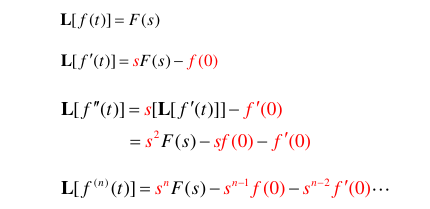
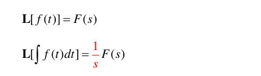
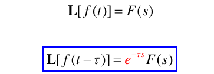
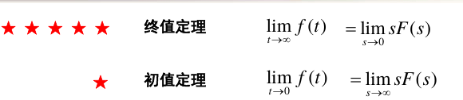
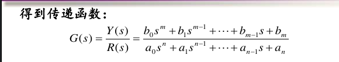
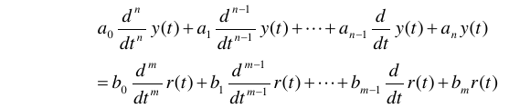

# 控制系统的数学模型

## 概述

**模型**：实际过程本质的部分信息的描述形式。

**数学模型**：输入与输出或输入、状态与输出之间的关系。

建模方法：
- 机理建模
- 系统辨识

## 拉普拉斯变换

把时域中的微分方程转化为频域中的代数方程。

对任何复值函数f和复数s

$$
F(s)=\int^{\infty}_{0}e^{-st}f(t)dt
$$

### 性质

- 线性性质
- 微分性质  

- 积分性质  

- 时延性质  

- 终值定理/初值定理

### 反变换

$$
f(t)=\frac 1 {2\pi j} \int_{\sigma-jw}^{\sigma+jw}F(s)e^{st}ds
$$

## 传递函数

线性时不变系统的传递函数:

零初始条件下，系统输出量与输入量的拉普拉斯变换之比。

其中系统可用如下线性常微分方程表示：

## 状态方程

状态方程为时域模型，不惟一（传递函数惟一）。

状态方程适用范围更广。

状态方程和传递函数的转换：…………

### 结构图

描述系统各组成部件之间信号传递关系的数学图形

基本构件：
- 方框
- 比较点
- 分支点

开环传递函数与闭环传递函数