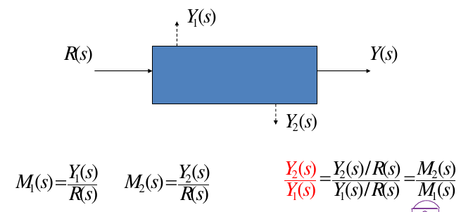

# 控制系统的数学模型

## 概述

**模型**：实际过程本质的部分信息的描述形式。

**数学模型**：输入与输出或输入、状态与输出之间的关系。

建模方法：
- 机理建模
- 系统辨识

## 拉普拉斯变换

把时域中的微分方程转化为频域中的代数方程。

对任何复值函数f和复数s

$$
F(s)=\int^{\infty}_{0}e^{-st}f(t)dt
$$

### 性质

- 线性性质
- 微分性质  

- 积分性质  

- 时延性质  

- 终值定理/初值定理

### 反变换

$$
f(t)=\frac 1 {2\pi j} \int_{\sigma-jw}^{\sigma+jw}F(s)e^{st}ds
$$

## 传递函数

线性时不变系统的传递函数:

零初始条件下，系统输出量与输入量的拉普拉斯变换之比。

其中系统可用如下线性常微分方程表示：

## 状态方程

- 状态方程为时域模型，不惟一（传递函数惟一）。
- 状态方程适用范围更广，可以应用于时变和非线性系统。

### 状态方程和传递函数的转换

#### 状态方程->传递函数

注：所有状态方程变换为的传递函数都是相同的。

#### 传递函数->状态方程

因为状态方程不惟一，所以方法不惟一。其中一种**能控标准形**：

幂次相等时，先提取出一个常数项，再重复上述步骤。

**能观标准形**：

## 结构图

描述系统各组成部件之间信号传递关系的数学图形

基本构件：
- 方框
- 比较点
- 分支点

其中G(s)称为前向通道传递函数,H(s)称为反馈传递函数。

### 开环传递函数与闭环传递函数

**开环传递函数**：

**闭环传递函数**：

### 结构图等效变换

1. 串联等效
2. 并联等效
3. 反馈等效：

4. 比较点移动：

5. 引出点移动

6. 比较点合并

### 梅逊公式

**前向通道**：从输入到输出,可循箭头方向走通,在比较点处仅通过一次的通路。

互不接触指的是不经过共同的方框和比较点

**回路**指可循箭头方向走通,在比较点处仅通过一次的闭合通路。

**回路传递函数**指沿回路的所有传递函数的乘积。 (默认信号反馈信号以负号进入比较点)

> 求两个内部变量的传递函数：
> 