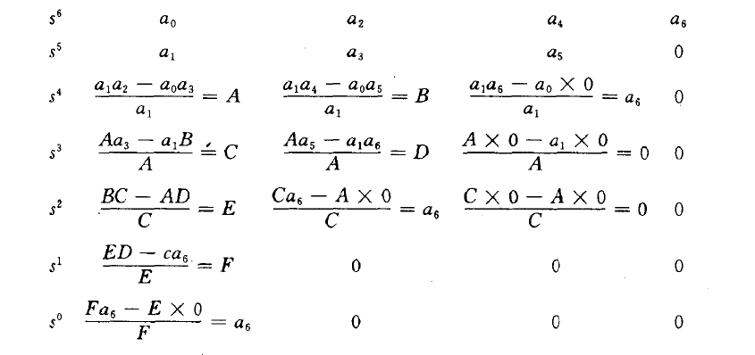
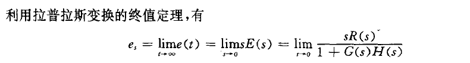

# 时域分析

## 求解时间响应

### 微分方程解解

通解+特解。 通解通过特征方程求得

求解时，初始条件应该是$y(0^{+})$，这和$y(0^{-})$的关系需要具体分析。

也可以利用拉普拉斯变换来求解，此时，可以直接用t<0方向的值。但是方程也要相应改写。

### 传递函数求解

如果是零初始状态，那么将输入量作拉普拉斯变换，和传递函数相乘后再反变换即可。

如果不是，就需要把传递函数转换回微分方程，再进行计算。

### 状态方程求解

此方法也可以用于多变量的求解。

同样要求0时刻使用t>0的值，初始条件有如下转换关系：

求解$x'=Ax$：

通解：

为避免计算矩阵的逆，也可以用拉普拉斯变换+结构图+梅逊公式计算。

#### 矩阵指数的性质

见书71页

矩阵指数也被称为**状态转移矩阵**

## 稳定性

线性定常系统稳定的充要条件是它的特征方程的解都有负实部（位于复平面左半平面）

如果没有右半平面的解，但有在虚轴上的单根，则是**临界稳定状态**

### 劳斯判据

给出劳斯表

如果第一列所有元素的符号都相同，则所有根都在左半平面。符号改变次数就是右侧根的个数

#### 特殊情况

当某行第一个元素为0， 可以用一个很小的整数代替之。

如果某行全为0，则建立辅助多项式：

对辅助多项式求导，将其系数代替原来行的元素。

## 能控性和能观性

能控性是指系统的状态是否受输入量的控制。若系统的状态能够在输入量的控制下从任意一个状态运动到另外一个任意状态,则称系统是能控的。否则,称系统是不能控的。

能观性是指在系统的输出量中是否包含有每个状态变量的信息,即能否根据输出量(输出量一般是能够测量的)来确定或重构出所有的状态变量。如果上面的结论是肯定的, 则称系统是能观的。反之,则称该系统是不能观的。

判据：

能控性和能观性和具体状态模型有关。

一个结论：如果传递函数的分子和分母有公因子，那么对应的状态方程不可能同时可控与可观，具体属于何种类型取决于状态模型的实现形式。

## 稳态性能

定义稳态误差为 e(t)=r(t)-b(t) 或E(s)=R(s)-B(s)=R(s)-H(s)Y(s)

同样的，也可以定义干扰引起的稳态误差。

再根据终值定理

回路传递函数一般有如下形式：

根据分子s项（积分环节）的个数，可以分为0型系统，1型系统……等等

### 阶跃输入时的稳态误差

Kp称为位置品质系数

1型及以上系统kp为无穷，因此为无静差系统。

### 斜坡输入时的稳态误差

Kv称为速度品质系数

- 0型系统最终误差趋于无穷
- 1型系统误差有限
- 2型及以上系统无静差

### 抛物线输入时的稳态误差

Ka称为加速度品质系数

- 0型和1型系统最终误差趋于无穷
- 2型系统误差有限
- 3型及以上系统无静差

以上分析只适用于典型系统，如果不是（如计算干扰导致的误差，还是利用终值定理计算）

## 动态性能

### 阶跃相应指标

- 超调量：$\sigma = \frac {y_m - y_s} {y_m}$
- 过渡过程时间
- 上升时间
- 延迟时间