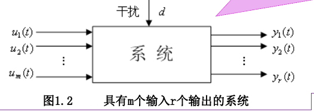
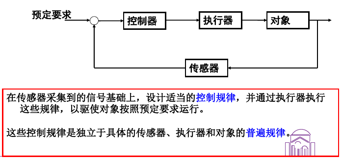
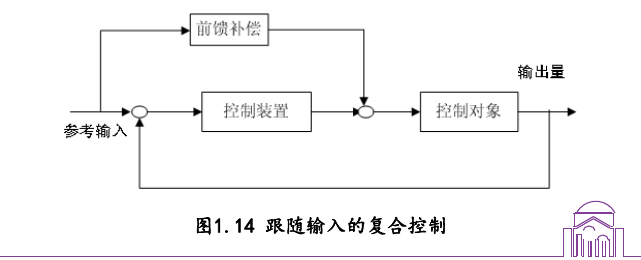
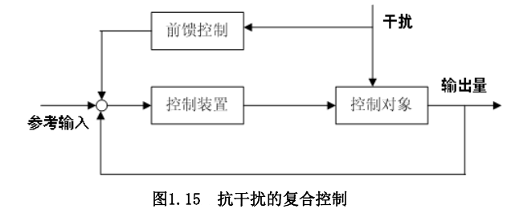

# 绪论

## 课程简介
本课程主要讲授基于传递函数的经典控制理论,初步介绍基于状态空间的现代控制理论方法。主要内容包括:

1. 控制系统的数学模型,包括微分方程、传递函数、状态方程、结构图和模型转换;
2. 控制系统的时域分析,包括时间响应计算、控制系统的稳定性、能控性、能观性、动态性能和稳态性能;
3. 控制系统的频域分析,包括 Nyguist稳定判据、Bode图、开环Bode图与控制系统的性能;
4. 控制系统的设计,包括串联校正并联校正和复合校正;
5. 采样控制系统理论,包括采样系统的模型描述、性能分析和系统设计。

## 自动化的发展

1. 制造工具：实现了手的功能延伸,但动作的发出者和执行者还是人。
2. 机器的发明：独立工作的执行器,实现了动作指令发出者和执行者的分离。
3. 智能控制：动作指令发出者和执行者统一,但都是机器。

**自动化**(Automation)是指机器设备、系统或过程(生产、管理过程)在没有人或较少人的直接参与下,按照人的要求,经过自动检测、信息处理、分析判断、操纵控制,实现预期的目标的过程。

## 基本概念

**系统**：由相互关联和相互作用的若干部分组合而成的具有特定功能的整体。

系统的表示：

系统的*分类*：
- 按照物理属性分：工程和非工程
- 按方程类型分：线性和非线性
- 按参数类型分：定常和时变
- 按信号类型分：连续和离散
- 按变量的个数分：单变量系统和多变量系统
- 按系统的规模分：一般系统、大系统和巨系统
- 按系统的复杂程度分：简单系统和复杂系统
- 按智能的高低分：常规系统和智能系统

## 控制系统

**控制系统**：通过一定的控制方法,使系统能够达到要求的性能

### 自动控制

在无人直接参与的情况下,通过控制器使被控对象自动地按照预定要求进行工作。

**分析**：
1. 稳定性：稳
2. 稳态性能：准
3. 动态性能：快

### 性能要求

- 跟踪输入的性能
- 抗干扰性能

对于参考输入为定值或很少变化的情况，这时的性能要求主要是抗干扰。这样的控制系统通常称为**调节系统**,如温度控制系统,压力控制系统等。

对于参考输入随时间变化的情况，这时由于侧重点在于跟随输入，因而常称这样一类系统为**跟踪系统**、随动系统或伺服系统。如雷达天线跟踪目标的控制系统、弧焊机器人末端跟踪焊缝的控制系统。

### 控制方法

**稳态**：被控量不随时间而变化的平衡状态(也称静态)

**静差**：稳态下输出量与给定量的偏差。分为*对给定量输入的静差*和*对负载变化的干扰的静差*。

**正反馈和负反馈**

- 负反馈:使系统的输出值与目标值的偏差愈来愈小
- 正反馈:使系统的输出值与目标值的偏差愈来愈大

#### 开环控制

控制器与控制对象之间**只有正向作用而没有反向联系**的控制过程。 

优点:结构简单、成本低廉、工作稳定；

缺点:控制精度不高

#### 闭环控制

优点:系统响应对外扰和系统参数变化不敏感。

缺点:易引起过调,“振荡”和“发散”。

#### 复合控制

如果系统要求实现复杂且精度较好的控制任务,需将开环控制与闭环控制结合,组成的经济且性能好的控制系统——复合控制系统。

跟随输入的复合控制：

抗干扰的复合控制：

