# 综合法校正

根据给定的性能指标来确定期望的开环频率特性，从而求出控制器

## 期望的开环频率特性
- 中频段斜率为-20穿过横轴
- 低频段：1个积分环节，足够大的开环增益
- 高频段：高斜率

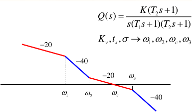

## 稳态性能K和低频段的关系

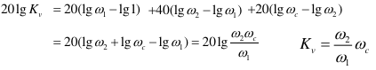

## 动态性能和中频段的关系

Q的中频段近似为下式，其中的参数可以从动态性能算出：
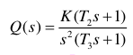

设w3和w2的比值是h，则可以推导出闭环频峰的位置是（1）：

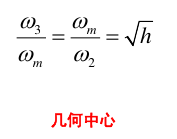

频峰的值和h的关系（2）：

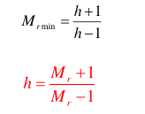

由此还可以推出wc满足（3）：

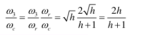

依据这些等式就可以设计出Q的中频段。基本步骤是从超调量算Mr，再由（2）算出h。用过渡时间ts算出wc，再由(3)算出w3，最后由(1)算出w2。

## 确定w1

上述求中频段的过程对Q作了近似，此时用wc、w2和稳态性能K计算出的w1并不准确，需要做修正（当然，也可以不做）：

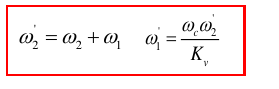

## 小时间常数
如果系统固有的传递函数G有一个小时间常数，则Q对应的也有一项T4：

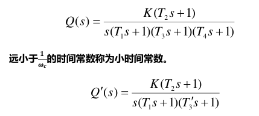

此时可以先按照上述过程算出参数T3‘，然后计算T3：

$$  
T_3=T_3'-T4
$$

## 常用串联校正传递函数

### 超前校正

提供相位超前，如果安排在wc附近，则增加相角裕度，改善系统动态性能

基本形式是：

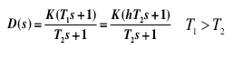
其中，最大相位发生在$w_m=\frac {w_2}{\sqrt h}$

### 滞后校正

提供相位滞后。如果安排在低频段，则可以抬高低频段，改善稳态性能

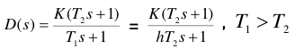

最大相位的位置和超前校正相同

### 超前-滞后校正

- 利用超前校正改变中频段的形状,改善动态性能;
- 利用滞后校正改变低频段的形状,改善稳态性能。

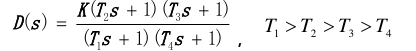