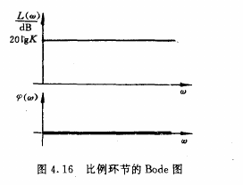
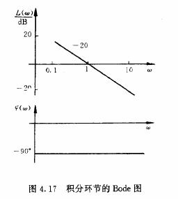
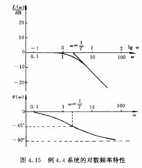
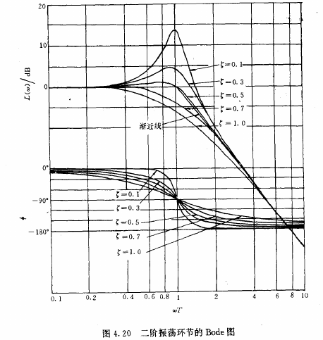
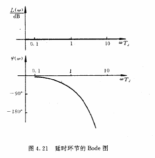
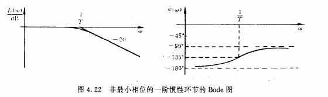
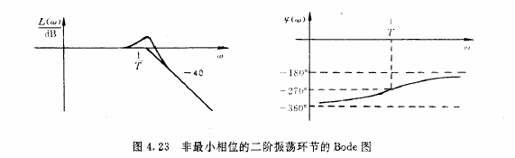
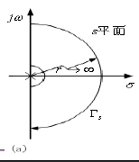
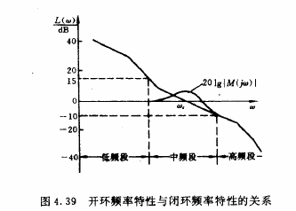

# 频域分析

## 频率特性和时域响应的关系

**频带宽度**，或频宽定义为幅频特性下降到0.707A(w=0)处的频率。频宽越大，说明惯性越小。一阶系统的频宽是时间常数T的倒数。二阶系统较为复杂，但频宽还是和T成反比关系。

二阶系统的幅频特性曲线有一个频峰。

一些规律：

- 频带越宽，T越小，过渡过程越快
- 频峰越大，系统响应振荡越激烈，超调量也越大

## 频率特性图

### 极坐标图

将w当作参数，从0变到无穷大，在复平面内画出频率特性的曲线。

一般只需要确定几个主要的点。如w=0和无穷的点，曲线和实轴、虚轴的交点。

### Bode图

横轴用w的对数坐标，幅频特性的纵轴用$20lgA(w)$，单位为分贝。相频特性直接用相位为纵坐标。

#### 比例环节

G(s)=K，Bode图就是平行横轴的直线。

#### 积分环节

G(s)=1/s.

相频固定-90度，幅频曲线为过w=1点的直线，斜率-20.

#### 纯微分环节

G(s)=s.

和积分环节的曲线关于横轴对称。

#### 一阶惯性环节
一阶环节$\frac {1} {jwT+1}$的幅频作图步骤：

- 找到横轴上w=1/T点
- 从此点向左作一条和横轴重合的渐近线，向右作一条-20dB/10倍频程的斜线。
- 在w=1/T处找出对数幅值为-3dB的点，将该点与两边的渐近线平滑连接。

相频特性图只需要找到(0,0),(1/T,-45)和(\infty,-90)三点

大致类似下图：

#### 一阶微分环节

G(s)=Ts+1;

和一阶惯性环节关于横轴对称

#### 二阶振荡环节

$$
G(s)=\frac 1 {T^2s^2+2\xi Ts+1} = \frac {w_n^2} {s^2+2\xi w_ns+w_n^2}
$$

如果阻尼系数大于等于1，可以化为两个一阶惯性环节乘积。

$0 \le \xi \lt 1$时的作图步骤：

- 找到横轴上w=1/T点
- 从此点向左作一条和横轴重合的渐近线，向右作一条-40dB/10倍频程的斜线。
- 根据不同的$\xi$，在w=1/T附近描点。最后平滑曲线

相频曲线在w=1/T处为-90度，最终趋于-180度。大致图像如下：

#### 二阶微分环节

同理，和二阶振荡环节关于实轴对称。

#### 非最小相位环节

**最小相位系统**:系统所有零极点均在左半平面或虚轴,且不存在延时环节, 则称该传递函数为最小相位的传递函数,对应的系统为最小相位系统。上述环节都是最小相位的。

否则，称为非最小相位的。

最小相位系统的曲线的斜率增大或减小时,对应的相频特性的相角也增大或减小,二者变化是一致的。因此只需要研究幅频特性。

##### 典型的非最小相位环节

延时环节$G(s)=e^{-Tt}$的Bode图：

$G(s)=\frac 1 {Ts-1}$的幅频特性曲线和一阶惯性环节相同，但是相频是从-180度变化到-90度:

当$-1<\xi<0$时，二阶振荡环节是非最小相位的。此时幅频曲线无变化，相频则从-360到-180：

$\xi <= -1$时，可以分解为两个一阶惯性环节

### 复杂传递函数的Bode图作法

1. 化为标准形式
2. 找w=1，L(W)=20lgK这一点，向左画斜率为-20r 的斜线（单位：分贝每10倍频程）
3. 从各个环节的时间常数求转折频率wi并排序，从低频开始向右画。遇到分母环节的频率向下弯，分子环节向上弯。一阶环节斜率变化为20，二阶环节斜率变化为40.
4. 平滑曲线（一阶环节补偿3db，二阶环节取决于阻尼系数）

标准形式是：

$$  
\frac {K * \Pi_{k=1}^p(T_ks+1) \Pi_{l=1}^q(T_l^2s^2+2\xi_lT_ls+1)} {s^r * \Pi_{i=1}^m(T_is+1) \Pi_{j=1}^n(T_j^2s^2+2\xi_jT_js+1)}
$$

## Nyquist判据

设开环传递函数$Q(s)=G(s)H(s)$，令一封闭曲线如下图所示：

此曲线在Q(s)下的象构成的曲线也是复平面上的封闭曲线。计算此曲线绕-1点的圈数N。有：$N=N_c-N_0$，其中Nc是闭环系统在右半平面的极点数，N0是开环系统在右半平面的极点数。

闭环系统稳定当且仅当Nc为0。因此，闭环系统稳定的充要条件是$N=-N_0$。

**注意：圈数有正负，代表绕的方向**。对于这个特定的曲线而言，顺时针是正，逆时针是负。

### 用极坐标图应用Nyquist判据

对应原始曲线，分成三个部分画图：
- 无穷大圆：象对应原点
- 正虚轴：此时s=jw,参见极坐标图的画法
- 负虚轴：和正虚轴的象关于实轴对称
- 无穷小圆：每有一个积分环节，象就在无穷大圆上顺时针绕90度

### 用Bode图应用Nyquist判据

Bode图中，相频特性曲线对应L(w)>0的部分向下穿越-180+k\*360度相角的次数，等于极坐标图中向上穿越实轴$(-\infty, -1)$的次数。同样地，向上穿越-180+k\*360的次数等于向下穿越实轴的次数。

因此，闭环系统稳定的充要条件是$2(N_{BX}-N_{BS})=-N_0$其中Nbx是向下穿越次数，Nbs是向上穿越次数。

**特别的**，如果幅频特性与0分贝线只有一个交点，且Q(s)没有右半平面的零极点，那么可以用剪切频率处的相角来直接判断：如果$\phi(w_c)>-180$则稳定，否则不稳定。

## 稳定裕度

这里记录**相位裕度**，关于增益裕度见教材。

$w_c$称为**剪切频率**，是幅频曲线取0的点。直观地看，对应的是极坐标图中正虚轴曲线的象和单位圆的交点。

定义**稳定裕度**为wc处相角和-180的距离：$\gamma = \phi(w_c)+180$

## 闭环和开环频率特性的关系

可以将频域分为**低频段，中频段和高频段**，中频段在剪切频率wc两侧。

对于一般的开环系统，其幅频曲线和0分贝线都只有一个交点，且增益总是随频率增加而下降，此时闭环和开环频率特性有如下的关系：
- 在低频段，闭环系统的增益接近1，即能使低频信号无衰减通过
- 在高频段，闭环系统的频率特性与开环频率特性基本重合，且都远小于1。即抑制高频噪声干扰。
- 中频段的频率特性形状对系统性能的影响最大。可以算出在剪切频率处$M(jw_c)=1 / {2sin\frac \gamma 2}$。其中γ是相位裕度。由此可以大致勾画处闭环系统的频率特性：

### 开环频域性能指标

剪切频率和相位裕度可以作为开环频率特性的性能指标

$\gamma$反映稳定性。30~70度被认为是可接受的范围
- 小：超调大，振荡多
- 大：过渡时间长，响应慢

wc反映响应的快速性能。wc越大，频宽wb也越大，过渡时间就越短