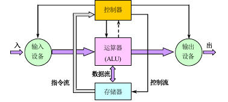
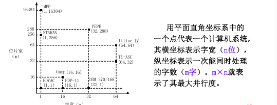
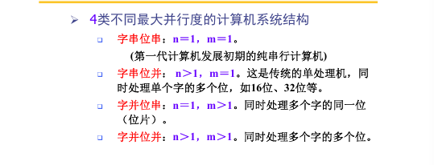

# 基本概念和设计方法

## 计算机系统结构概念

应用与硬件之间的抽象设计。

### 层次结构
计算机系统=硬件+软件
- 物理机：用硬件/固件实现的机器
- 虚拟机：由软件实现的机器

### 定义
+ 经典定义  
程序员看到的计算机系统的属性，即*概念性结构*和*功能特性*。
+ 本质定义  
确定计算机系统中的软硬件分配及软硬件界面

## 计算机系统结构发展

### 冯诺依曼结构

### 处理器发展

- 半导体工艺角度：
    + 摩尔定律： 集成电路芯片上所集成的晶体管数目每隔18个月就翻一番（减缓）
    + Dennard扩展规律：单位面积能量消耗基本保持不变（已失效）
- 从架构的角度：
    + 指令级并行达到极限，单核时代结束
    + 多核架构的速度提升减缓（->Amadahls's Law）
- 从应用角度：处理器的应用场景从原来的桌面电脑变成了个人移动设备和云端超大规模服务器,带来了新的设计约束。

能效比称为目前最重要的指标

领域专用处理器架构DSA：针对应用领域做优化的架构。

## 计算机系统分类

### Flynn分类法

按照指令流和数据流的多倍性特征分类

- SISD 典型单处理机
- SIMD 单指令多数据： 并行处理机、阵列处理机、向量处理机、相联处理机、超标
量处理机、超流水线处理机
- MISD：实际不存在这样的计算机
- MIMD 多处理机系统

### 冯氏分类法

用最大并行度进行分类

## 计算机系统的性能评价

### 性能评价指标

执行时间有多种定义。

CPU时间：CPU执行给定的程序花费的时间，不包含IO和运行其他程序的时间
- 用户CPU时间
- 系统CPU时间

### 基准测试程序

最佳选择是真实应用程序。采用同一种编译器和编译标志。

基准测试程序套件

### 性能比较方法

- 总执行时间
- 平均执行时间
- 加权执行时间
- （加权）调和平均值法
- （加权）几何平均值法

## 计算机系统的设计技术

### 定量原理

1. 以经常性事件为重点
2. Amdahl定律   
如果只针对整个任务的一部分进行改进，那么获得的加速比不超过1/(1-可改进比例)
3. CPU时间=时钟周期数*时钟周期时间
4. 程序的局部性原理

### 主要设计方法

- 由上往下
- 由下往上
- 从中间开始