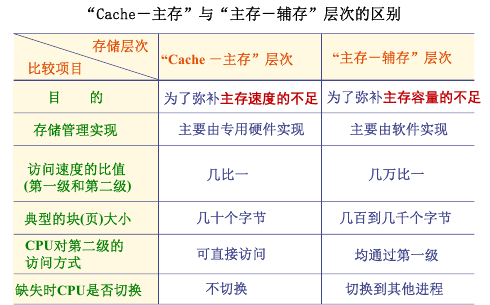
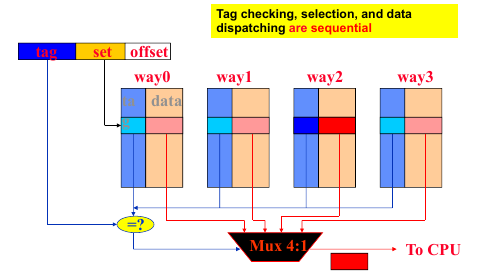
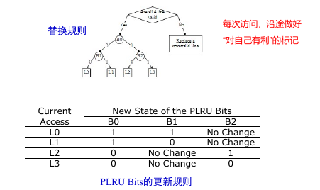

# Cache

局部性：
- 时间局部性：重复访问一个单元（包括循环重复指令）
- 空间局部性：被访问单元的相邻单元被访问（包括顺序执行指令）

Cache设计的问题：
- 映射规则
- 查找算法
- 替换算法
- 写策略

Cache LIne <= Cache Block + 元数据

映射规则：
- 全相联
- 直接映射
- 组相联

## Cache查找

- 标签比对。Cache目录表项：有效位、标识tag。
- 顺序查找
- 并行查找：利用相联存储器（类似Key-Value存储）或者单体多字比较器

三种缺失：
- 强制缺失（冷启动缺失）
- 容量缺失
- 冲突缺失（组相联、直接映射）

### Cache替换

- Least Frequently Used
- Least Recently Used

实现：
- 堆栈法
- 比较对法
- 二叉树（近似LRU）

### 写策略

- 写直达 => 写缓冲区
- 写回

写缺失时的调块：
- 写分配：先调入Cache
- 写绕过：直接写入下一级存储器