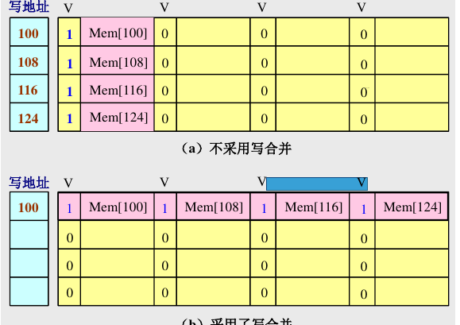

# L4 Cache优化

## 降低缺失率

### 增加Cache块大小

对于给定的Cache容量,当块大小增加时,缺失率开始时下降,后来上升。

Cache容量越大,使缺失率达到最低的块大小就越大。

增加块大小降低强制性缺失，但是增加冲突缺失（块变少），也增加缺失损失。

### 增加Cache容量

容量缺失随着容量的增加而减少(给定相联度)。

增加了命中时间

### 提高相联度

相联度越高，冲突缺失越少

>  2:1 Cache经验规则
>
> 容量为N的直接映象Cache的缺失率和容量为N/2的
两路组相联Cache的缺失率差不多相同。

增加命中时间为代价

### 伪相联Cache

先按照直接映射的方式处理，如果命中则和直接映射一样（快命中）；否则，再到同一组的其他位置寻找（伪命中/慢命中）。

### 牺牲者Cache

在Cache和下一级存储器之间的通路设置一个小的全相联Cache，称为「牺牲者」。用于存放被替换出去的块。

对于减少冲突缺失很有效，尤其对于直接映像数据Cache。

### 硬件预取

预取内容可以放入Cache也可以放入缓冲区。

### 编译器控制的预取/编译器优化

1. 代码和数据重组
2. 循环交换/融合
3. 分支优化

## 降低缺失损失

### 读缺失优先于写

推迟对读缺失的处理；检查写缓冲区的内容。

### 写缓冲合并

如果写缓冲器中已经有了待写入的数据,就要把这次的写入地址与写缓冲器中已有的所有地址进行比较,看是否有匹配的项。

如果有地址匹配而对应的位置又是空闲的,就把这次要写入的数据与该项合并。称为写缓冲合并。

如果写缓冲器满且又没有能进行写合并的项,就必须等待。

### 请求字处理技术

调入的块中，立即需要的字为请求字

尽早将请求字发送给CPU：  
- 尽早重启动;调块时,从块的起始位置开始读起。一旦请求字到达,就立即发送给CPU,让CPU继续执行。
- 请求字优先:调块时,从请求字所在的位置读起。这样,第一个

### 非阻塞Cache技术

Cache缺失时仍允许CPU进行其它的命中访问。即允许“缺失下命中”

### 两级Cache

