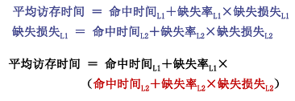
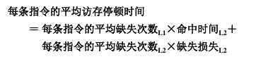
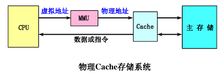
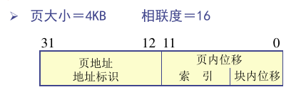

# L4 Cache优化

## 降低缺失率

### 增加Cache块大小

对于给定的Cache容量,当块大小增加时,缺失率开始时下降,后来上升。

Cache容量越大,使缺失率达到最低的块大小就越大。

增加块大小降低强制性缺失，但是增加冲突缺失（块变少），也增加缺失损失。

### 增加Cache容量

容量缺失随着容量的增加而减少(给定相联度)。

增加了命中时间

### 提高相联度

相联度越高，冲突缺失越少

>  2:1 Cache经验规则
>
> 容量为N的直接映象Cache的缺失率和容量为N/2的两路组相联Cache的缺失率差不多相同。

增加命中时间为代价

### 伪相联Cache

先按照直接映射的方式处理，如果命中则和直接映射一样（快命中）；否则，再到同一组的其他位置寻找（伪命中/慢命中）。

不能用于一级Cache（不均衡）

### 牺牲者Cache

在Cache和下一级存储器之间的通路设置一个小的全相联Cache，称为「牺牲者」。用于存放被替换出去的块。

对于减少冲突缺失很有效，尤其对于直接映像数据Cache。

### 硬件预取

预取内容可以放入Cache也可以放入缓冲区。

### 编译器控制的预取/编译器优化

1. 代码和数据重组
2. 循环交换/融合
3. 分支优化

## 降低缺失损失

### 读缺失优先于写

有写缓冲器时，推迟对读缺失的处理，先检查写缓冲区的内容。

降低缺失损失，但是增加了命中时间

### 写缓冲合并

如果写缓冲器中已经有了待写入的数据,就要把这次的写入地址与写缓冲器中已有的所有地址进行比较,看是否有匹配的项。

如果有地址匹配而对应的位置又是空闲的,就把这次要写入的数据与该项合并。称为写缓冲合并。

如果写缓冲器满且又没有能进行写合并的项,就必须等待。

### 请求字处理技术

调入Cache容量≤页大小×相联度
的块中，立即需要的字为请求字

尽早将请求字发送给CPU：  
- 尽早重启动;调块时,从块的起始位置开始读起。一旦请求字到达,就立即发送给CPU,让CPU继续执行。
- 请求字优先:调块时,从请求字所在的位置读起。这样,第一个读出的字就是请求字，将其立即发给CPU

### 非阻塞Cache技术

Cache缺失时仍允许CPU进行其它的命中访问。即允许“缺失下命中”

### 两级Cache

一些概念：

- 局部缺失率：该级Cache的缺失次数/到达该级的访存次数
- 全局缺失率：该级Cache的缺失次数/CPU发出的访存次数

评价L2时应使用全局缺失率。

或者：每次访存的平均访存停顿时间=平均访存时间 - L1命中时间。指令平均访存停顿时间=平均访存停顿时间*指令平均访存次数

从缺失率来看，如果L2比L1大得多，二级Cache的全局缺失率和单级Cache的缺失率接近。但是降低了缺失损失

## 降低命中时间

命中时间直接影响处理器的时钟频率

### 容量小、结构简单的Cache

使Cache足够小，可以放在CPU片内

折衷方案：
- 将Cache标识放在片内，将数据放在片外
- 将一部分Cache放在片内，其他放在片外
- ……

### 虚拟Cache

传统物理Cache标识存储器中和进行地址检测时都使用物理地址，因此地址转换（MMU）和Cache串行执行。

#### 全虚拟

直接用虚拟地址访问Cache，标识存储器中也是虚地址，进行地址检测用的也是虚拟地址。

问题：
- 进程切换时，Cache清空问题
    + 解决方法：加入PIDs字段
    + 比较三种方式：单进程、PID和清空
- 同义和别名

一种改进：全虚拟用散列

### 伪虚拟

虚拟索引+物理标识

利用了页面大小，可以直接使用虚拟索引。兼具虚拟Cache和物理Cache的好处

限制：Cache容量≤页大小×相联度

### Cache访问流水化

访问需要多个周期

### 踪迹Cache

存放CPU所执行的动态指令序列