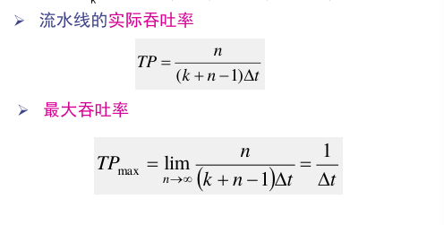
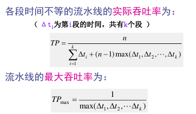
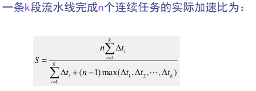
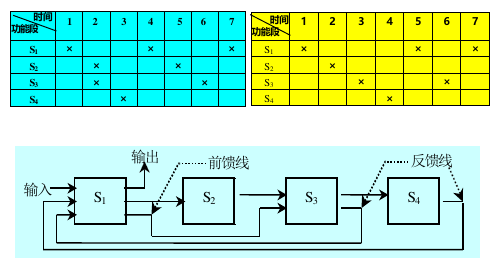

# L5 流水线

## 基本概念

把一个处理过程分解为若干个子过程,每个子过 程由专门的功能部件来实现。

把多个处理过程在时间上错开,依次通过各功能段,这样,每个子过程就可以与其它的子过程并行进行。

流水线中的每个子过程及其功能部件称为流水线的**级或段**,段与段相互连接形成流水线。流水线的段数称 为流水线的**深度**。

流水线可以用时空图表示。

流水线各段的时间应该尽可能相等。时间最长的段成为流水线的**瓶颈**。

流水线每段后需要一个缓冲寄存器（锁存器）。

- **通过时间**：第一个任务从进入到流出的时间
- **排空时间**：最后一个任务从进入到流出的时间

## 分类

按照粒度分：
- 部件级流水线（运算操作）
- 处理机级流水线（指令）
- 系统级流水线（多台处理器串行连接起来）

按照功能：
- 单功能流水线
- 多功能流水线
    + 静态流水线：同一时间，多功能流水线各段只能按同一种功能连接工作
    + 动态流水线

按照反馈分类：
- 线性流水线：串行连接，无反馈
- 非线性流水线：有反馈回路。可能不止一次经过某段

按照顺序分类：  
- 顺序流水线
- 乱序流水线（OOO）

## 量化分析

### 吞吐率

单位时间流水线完成的任务数量n/T

对于各段时间相等的流水线，有

对于各段时间不完全相等的流水线，

### 加速比

顺序执行和流水线执行所用时间的比

各段相等时，实际加速比为

$$
s = \frac {nk} {n+k-1}
$$

不完全相等时：

### 效率

实际使用时间和整个运行时间的比值

当流水线各段时间相等时，效率与吞吐率成正比。$E=TP * \Delta t$

效率是流水线实际加速比和最大加速比的比值

从时空图上看，效率就是n个任务占用的时空图面积和k个段总的面积的比。

### 流水线设计的若干问题

#### 瓶颈问题

机器的时钟周期取决于瓶颈段的延迟时间。

解决流水线瓶颈的常用方法
- 细分瓶颈段
- 重复设置瓶颈段

#### 流水线的额外开销

- 流水寄存器的延迟
- 时钟偏移开销

冲突问题

## 非线性流水线调度

向非线性流水线的输入端连续输入两个任务的时间间隔称为**启动距离**

会引起流水线功能段使用冲突的启动距离称为**禁用启动距离**

非线性流水线调度的目标是找出一个**最小**循环周期。按照此周期输入任务，流水线各段都不会发生冲突，而且流水线的吞吐率、效率最高。

### 表示

连接图不能唯一表示工作流程，引入**预约表**。一个连接图对应多个预约表

### 冲突

非线性流水线的冲突指几个任务争用同一个流水段。

### 无冲突调度法

**TODO**