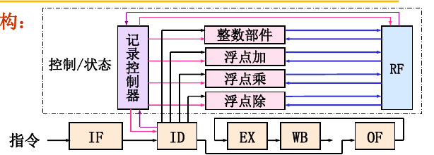
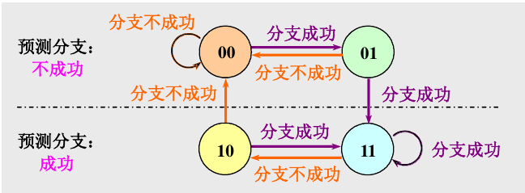
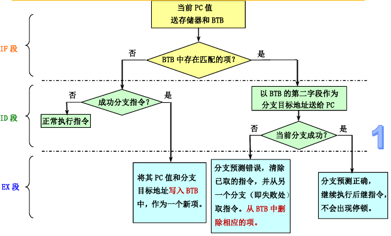

# L6 动态调度

ILP，指令级并行: 指指令之间存在的一种并行性,利用它计算机可以并行执行两条或两条以上的指令。

两种开发方法：
- 静态调度
- 动态调度

## 乱序执行

指令的执行顺序与程序顺序不相同。指令的完成也是乱序完成的

为支持乱序执行，将译码阶段分为**流出**和**读操作数**两个阶段。
- 流出：指令译码,检查是否存在结构冲突
- 读操作数：等待数据冲突消失,然后读操作数。

乱序执行导致**写后读**和**写后写**冲突成为可能

同时，异常处理较为复杂。可能产生**不精确异常**。

> **不精确异常**：当执行指令i导致发生异常时,处理机的现场(状态)与严格按程序顺序执行时指令i的现场不同。

## 动态调度技术

### 记分牌

使用记录控制器集中记录各功能部件、流水线中各指令、源和目的REG的状态(记分牌),然后进行统一调度

有冲突则推后进入，进入后有相关则进入后推后执行。

- 发射/流出阶段：检查记分牌，等待，解决控制相关和WAW。**注意**：发射如果暂停，不发射后面的指令
- 读操作数阶段：等待，解决RAW
- WB阶段：等待，解决WAR

记分牌的结构：

- 每个正在执行的指令状态（阶段）
- 每个功能部件的状态：
    - 空闲位
    - 该部件执行的操作类型
    - 目的寄存器编号
    - 源寄存器编号
    - 产生源操作器中操作数的部件
    - 记录源寄存器中的数据是否就绪，是否被取走
- 每个寄存器的结果状态：指示是哪个功能部件对该寄存器进行写操作

### Tomasulo算法

使用重命名技术解决两类名称冲突（WAW和WAR）；以及分布式动态调度技术将状态记录和控制分散到各个功能部件中

功能单元中有一系列RS：
- OP code
- Vj&vk：源操作数的值
- Qj&Qk：产生源操作数的RS
- BUSY位
- A：立即数

此时算法有三个阶段：
- 发射：只要FU还有空闲的RS就发射。发射后，分配RS，并依据寄存器状态填入操作数，或者设置等待
- 执行：检查RAW，等俩个操作数就绪就执行。
- 写：通过总线，把结果传给等待此结果的RS。

## 动态分支预测

**动态分支预测**:在程序运行时,根据分支指令过去的表现来预测其将来的行为，尽快找到分支目标地址(或指令)

在预测错误时,要作废已经预取和分析的指令,恢复现场,并从另一条分支路径重新取指令。

### 分支历史表BHT

用BHT来记录分支指令最近一次或几次的执行情况(成功还是失败 ),并据此进行预测。

一位分支预测只需要1bit，最简单

两位分支预测的性能与n位(n>2)分支预测的性能差不多。

BHT方法只在以下情况下才有用: 判定分支是否成功所需的时间大于确定分支目标地址所需的时间。

### 分支目标缓冲器BTB

将分支成功的分支指令的地址和它的分支目标地址都放到一个缓冲区中保存起来,缓冲区以分支指令的地址作为标识。

### 推测执行

对分支指令的结果进行猜测,并假设这个猜测总是对的,然后按这个猜测结果继续取、流出和执行后续的指令。只是执行指令的结果不是写回到寄存器或存储器,而是写入一个称为再定序缓冲器ROB(ReOrder Buffer)中 。等到相应的指令得到“确认”(commit)之后, 才将结果写入寄存器或存储器。

对Tomasulo算法加以扩充,就可以支持推测执行：写结果和指令确认分为两个阶段

