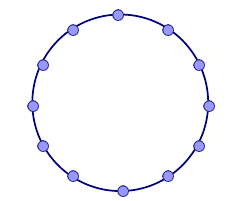
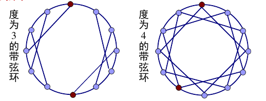
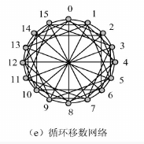
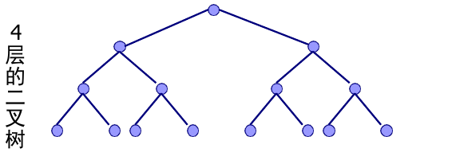
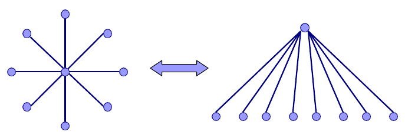
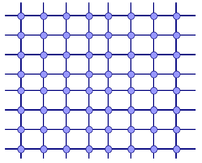
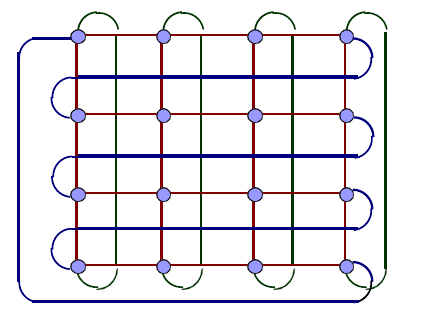

# L7 互联网络

## 分类

- OCN: On Chip Network
- SAN: System Area Network
- LAN: Local Area Network
- WAN: Wide Area Network

## 拓扑

### 拓扑分类

- 直接型（每个路由关联一个终端）
- 间接型（路由节点区别于终端）

按照交换拓扑分类：
- 总线型
- 交叉开关型

### 静态网络

静态网络由点—点直接相连而成,这种连结方式在程序
执行过程中不会改变。

#### 环

- 双向环：链路数为N,直径「N/2」,度为2,对称,等分宽度为2。
- 单向环：链路数为N,直径N-1,度为2,对称,等分宽度为2。

##### 带弦环

##### 全连接网络

全连接网络是带弦环的一种特殊情形。全连接网络中的每个结点和其他结点之间都有单一的直接链路

##### 循环移数网络结构

将环上每一个结点与其距离为2的整次幂的结点连接起来

若网络规模N=$2^n$, 则网络连接度d=2n-1,网络直径D=n/2。

#### 树形

一棵k层完全二叉树有N = $2^k-1$个结点,结点度为3,直径为2(k - 1)(即右边任意一个叶子结点到左边任意一个叶子结点)。不对称,等分度为1。

#### 星形

星形实际上是一种二层树

#### 网格和环网格

有N个结点的r*r网，有2N - 2r条链路, 直径为2(r-1),结点度为4,非对称,等分宽度为r

##### IIIiac网

有2N 条链路,直径为r-1,结点度为4。

#### 其他

- 2d环
- 超立方体
- 环形网

### 动态网络

网络的开关元件有源,可通过设置这些开关的状态来重构链路。

大多数动态网络是多级互连网络

多级互连网络三要素：
- 开关单元
- 级间互连模式
- 控制方式

输入和输出的连接方式可以用置换表示。置换方式可以用互连函数表示：

- 恒等函数
- 方体函数
- 洗牌函数：循环左移一位。变体：超洗牌，子洗牌，逆洗牌……
- 蝶式：最高位与最低位交换
- PM2I

多级互连网络：
- 多立方体结构
- Omega网络