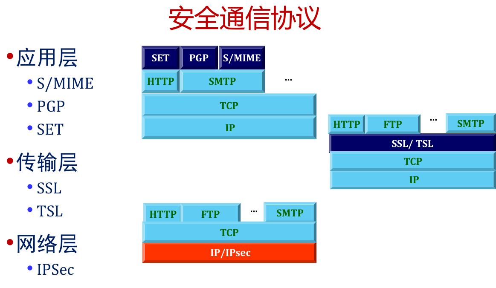
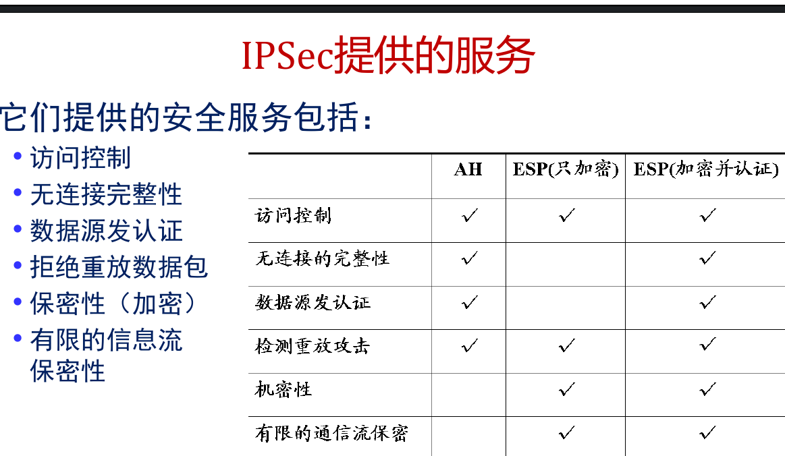
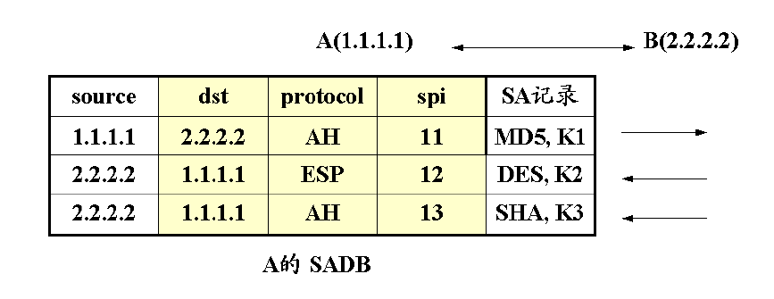
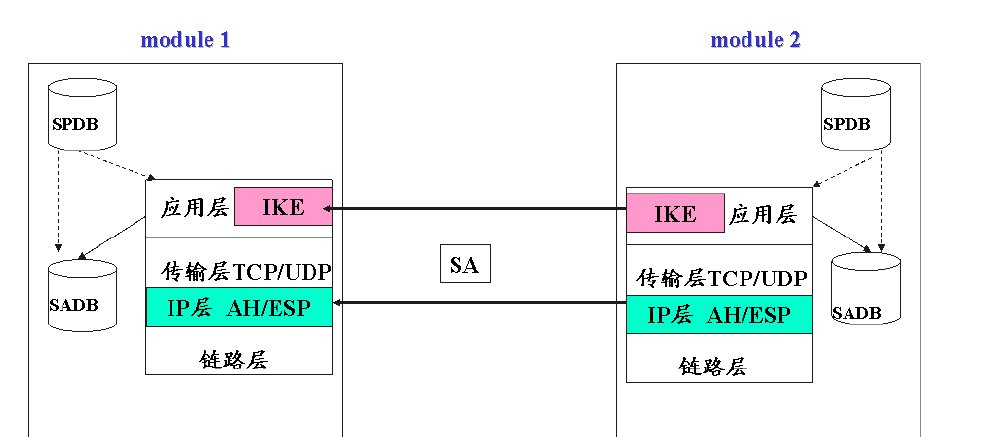
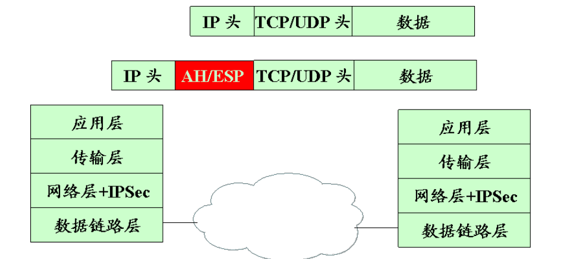
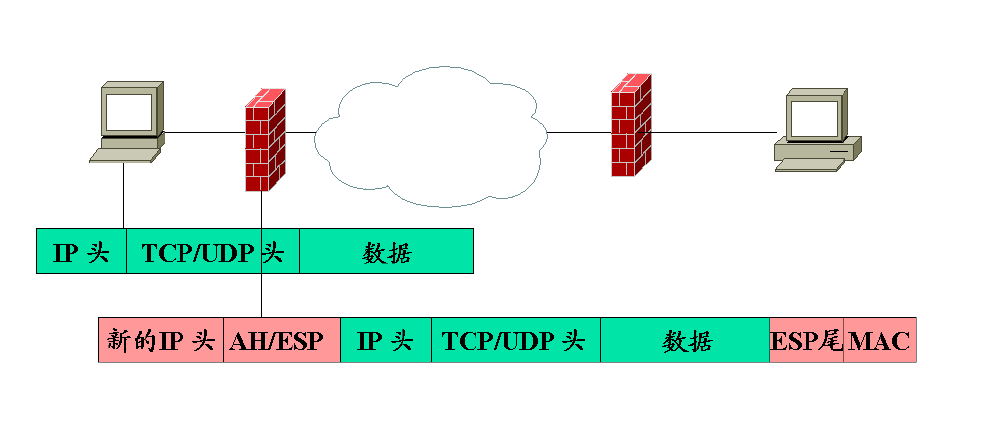
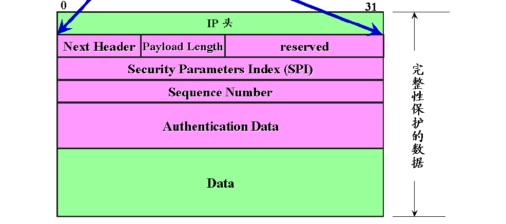
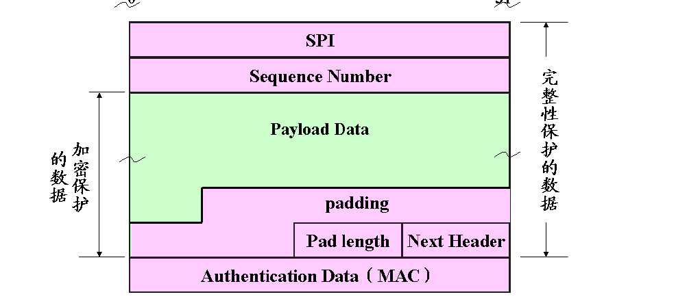
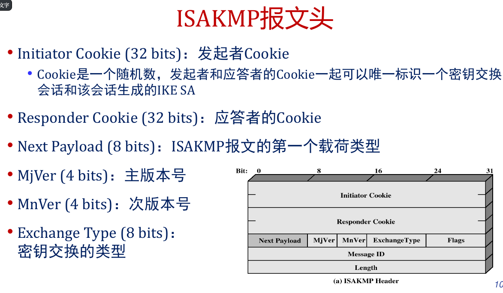

# IPSec

IPsec保障了IP级的安全性,包括:
1. 认证:确保收到的包是从包头标识的源端发出的,而且该包在传输过程中未被篡改
2. 保密:将报文加密后传输,防止第三方窃听
3. 密钥管理:密钥管理机制与密钥的安全交换相关

IPSec的实施:防火墙、路由器

## 安全关联
安全关联SA是IPsec通信双方之间对某些要素的一种协商,一组安全信息参数集合
关联是发送方和接收方之间的单向关系,该关联为双方的通信提供了安全服务
如果需要双方安全交换,则建立两个安全关联
安全服务可由AH或者ESP提供,但不能两者都提供

一个安全关联SA由三个参数唯一确定
1. 安全参数索引SPI  SPI由AH和ESP携带,使得接收方能够选择合适的SA处理接收包
2. IP 目的地址IPDA 只允许使用单一地址,表示SA的目的地址
3. 安全协议标识 标识该关联是一个AH安全关联或ESP安全关联

在任何IPSec实现中,都有一个安全关联数据库SADB,它定义了与每个SA相关联的参数

在IP包中,安全关联由IPv4或IPv6报头中的目的地址唯一标识,SPI被封装在AH或者ESP扩展头中
IP流量与特定SA相关是通过安全策略数据库SPDB的，每个SPDB入口由一个IP集合和上层协议定义,称为选择子选择子用于过滤输出流量,并将它们映射到某个特定的SA

每个IP包的输出过程如下:
* 在SPDB中比较相应域的值,寻找匹配的入口,可能是零或多个
* 如果存在SA,则选定SA和其关联的SPI执行所需的IPSec处理(AH或ESP)

## 模式
AH和ESP均支持两种模式:传输模式和隧道模式
传输模式(Transport Mode)主要为上层协议提供保护, 同时增加了IP包载荷的保护

隧道模式(Tunnel Mode)对整个IP包提供保护

## AH
认证头AH支持数据完整性和IP包的认证

**反重放攻击**
重放攻击是指攻击者在得到一个经过认证的包后,又将其传送
到目的站点的行为
重复接收经过认证的IP包可能会以某种方式中断服务或者产生不可预料的后果,序列号域就可以防止重放攻击
当建立了一个新的SA时,发送方将序列号初值设为0,每次在SA上发送一个包,则计数器加1并将值放入序列号域,则使用的第一个值就是1
发送方不允许循环计数,否则,同一个序列号就可以产生多个合法的包;如果该序列号到达2^32-1,则SA必须中止,用新的密钥协商声称新的SA

认证数据AD域包含完整性校验值ICV,ICV是一种报文认证编码MAC或者MAC算法生成的截断代码

## ESP

封装安全载荷ESP提供保密性服务包括报文内容保密和
流量限制保密,ESP还可以提供和AH同样的认证服务

## 安全关联组合
安全关联组合(安全关联束)是指提供特定的IPSec服务集所需的一个SA序列,SA可以通过两种方式组合成束

1. 传输邻接:在不使用隧道的情况下,对一个IP包使用多个安全协议。组合AH和ESP的方法仅允许一级组合
2. 隧道迭代:指通过IP隧道应用多层安全协议;
由于每个隧道可以在路径上的不同IPSec节点起始和结束, 因此该方法允许多层嵌套

# IKE
 IKE(Internet Key Exchange)协议
为IPSec提供了自动协商交换密钥、
建立安全关联SA的服务,
简化了IPSec的使用和管理
92
IKE的精髓在于:永远不在不安全的网络上直接传送密钥,而
是通过一系列的数据交换,通信双方最终计算出共享密钥
## 报文

ISAKMP可以在任何传输层协议(UDP、TCP)或IP层上实现,利
用UDP协议的端口500进行传输
ISAKMP双方交换的信息以“报文头+载荷”的形式传输,每个
ISAKMP报文由一个定长的报文头和不定数量的载荷组成

### 报文头

Flags (8 bits): 每个标志位都代表密钥交换的一个特定
属性,目前只定义了最低三位,其余位必须被置0
Message ID (32 bits):由第二阶段密钥协商的发起者生成的随机数,
用来标志一个第二阶段密钥协商会话
• Total Message Length (32 bits):ISAKMP报文的总长度,即报文头和
所有载荷的总长度,加密可能会导致报文长度增大

### 载荷
ISAKMP定义了13种载荷,具有相同格式的载荷头

## 阶段
IKE使用了两个阶段的ISAKMP框架
• 第一阶段,协商创建一个通信信道(IKE SA),并对该
信道进行验证,为双方进一步的IKE通信提供机密性、
消息完整性以及消息源验证服务
• 主模式:6个消息交互
• 积极模式:3个消息交互
• 第二阶段,使用已建立的IKE SA建立IPsec SA
• 快速模式:3个消息交互

发起方和响应方采用
Diffie-Hellman密钥交换算法
计算共享密钥

## 工作模式

1. 端节点到端节点:采用传输模式
两个端节点均实现IPsec,通常使用传输模式
2. 安全网关到安全网关:采用隧道模式
端系统均不需要实现IPsec,由网络节点完成保护功能
3. 常见的上面两种模式的嵌套组合