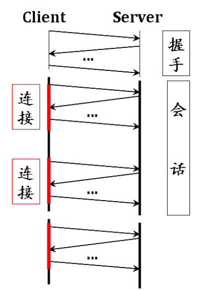
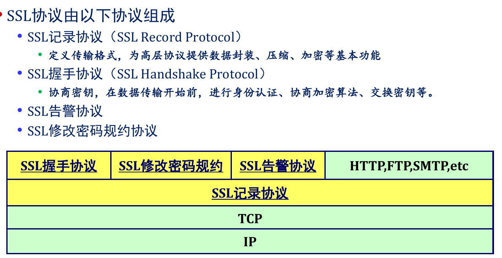
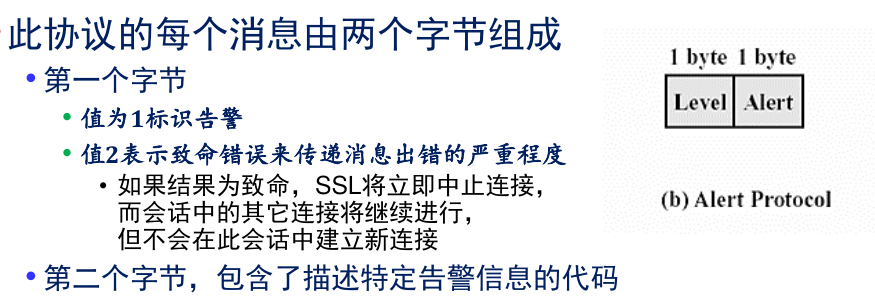
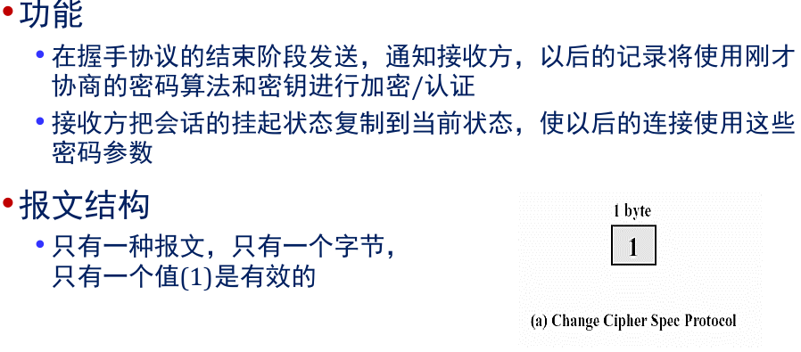
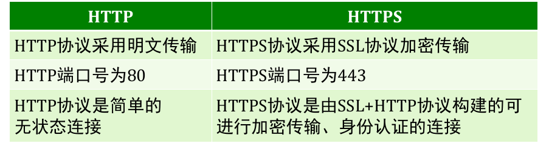

# SSL

会话(Session)
SSL会话是客户端和服务器之间的一个关联(association),即一个虚拟的连接关系。通过握手协议建立,用以协商密码算法、主密钥等信息,一个会话协商的信息可以由多个连接共享

## 记录

## 握手
握手协议由一系列在客户端和服务器之间交换的报文组
成,完成认证、密钥和算法协商

每个报文具有三个字段:
• 类型(1字节):指示10种报文中的一个
• 长度(3字节):以字节为单位的报文长度
• 内容(>=1字节):和这个报文有关的参数

### p1
客户向服务器发送client_hello报文
•服务器向客户端发送server_hello报文

### p2
服务器发送其SSL数字证书Certificate
如果密钥交换算法使用匿名DH算法,就不需要服务器发送证书,但是很难防止中间人类型的攻击;如果密钥交换算法使用Ephemeral DH、RSA等算法,需要发送server_key_exchange 报文,用来交换密钥
服务器发送sever_hello_done报文,等待客户端响应

### p3
收到服务器发来的sever_hello_done以后,客户端验证server提供的证书是否有效
客户端发送client_key_exchange,此消息包含pre_master_secret和消息认证码密钥,在后续阶段, pre_master_secret 用来计算master_secret

### p4
客户端使用一系列加密运算将pre_master_secret转化为master secret ,派生出用于加密和消息认证的所有密钥
客户端发出change_cipher_spec,服务器转换为新协商的密码对
客户发送在新算法、密钥的finished,验证密钥交换和认证过程是否成功
服务器发送change_cipher_spec,将挂起状态迁移到当前的cipher_spec,并发送结束报文
握手完成,客户和服务器可以交换应用层数据

## 告警
告警协议用于向对等实体传递SSL相关的警报,和使用SSL的其它应用一样,告警消息按照当前状态压缩和加密

### 修改密码规约

# HTTPS
HTTPS是HTTP和SSL/TSL协议的合并,解决了数据加密、完整性校验、对服务器的身份认证等问题

使用HTTPS协议依旧无法避免ARP欺骗和嗅探攻击,但是由于HTTPS采用SSL加密传输,即时被嗅探到也无法得到明文信息
使用HTTPS后,内容不压缩也是无法识别的密文,攻击者无法对通信内容进行篡改