# 密码学简介

**处理明文的方法**：
1. 流密码：连续处理输入元素，每次输出一个元素
2. 分组密码：每次处理一个分组，相应输出一个分组。

**密码学的发展阶段**：
1. 古典密码(手工、机械阶段 ~1949年)
数据的安全基于算法的保密
2. 近代密码(计算机阶段:1949~1975)
加密体系的安全性并不依赖于加密的方法本身,而是依赖于所使用的密匙
3. 现代密码(1976~现在)
密码学的新方向 --- 公钥密码学

## 古典密码
### 代换
代换技术是将明文字母替换成其他字母、数字或者符号的方法

单表代换密码：
1. **Caeser密码**：用字母表之后的第n个字母替换。
2. 密钥词密码:设一个密钥词放在前面,其余字母按顺序
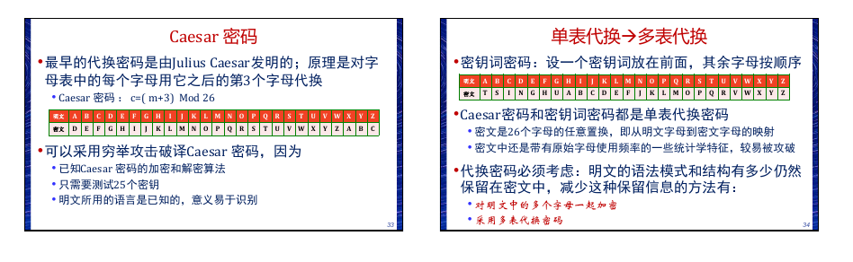
多表代换密码：
**Playfair密码**
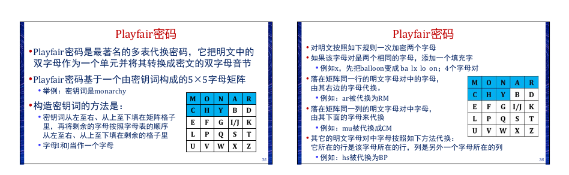
**Hill密码**：使用矩阵乘，加密连续m个字。
**Vinegere密码**：用一个字符串作为密钥（代表使用哪些转换表），多个转换表循环使用。

### 置换
置换密码是通过置换形成新的排列
最简单的例子是栅栏技术 按照对角线的顺序写入明文,按照行的顺序读出做为密文
更复杂的方案是把消息一行一行写成矩形块,然后按列读出,同时把列的次序打乱;列的次序就是算法的密钥
单步置换还是容易被识破,一般采用多步置换密码就安全多了

一次置换（按列读）：
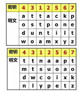

## 对称密钥密码
加密和解密使用相同的密钥，密钥必须使用秘密的信道分配

### S-DES
S-DES加密算法的输入为一个8位明文组和一个10位的密
钥,输出为8位的密文组。
S-DES解密算法的输入为一个8位密文组和一个10位的密
钥,输出为8位的明文组。
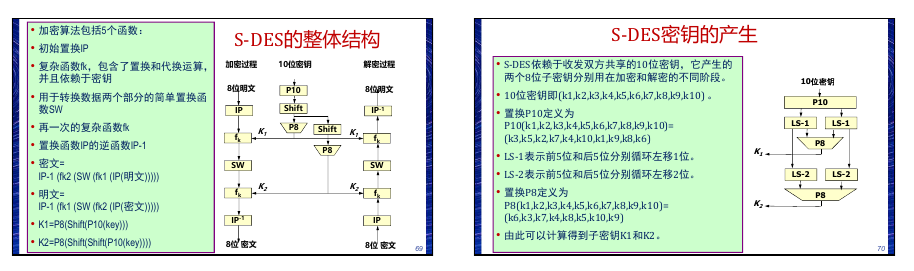
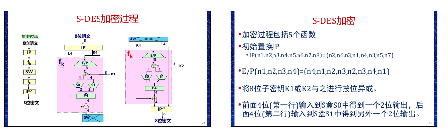
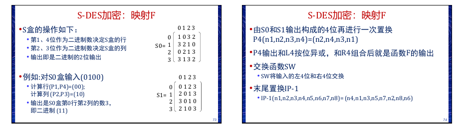

### Feistel密码结构
对称分组密码。交替使用代换与置换

**混淆和扩散**
Shannon引入混淆和扩展来刻画任何密码系统的两个基本构件,所关注的是如何挫败基于统计方法密码分析
* 扩散是指使明文的统计特征消散在密文中,让每个明文数字尽可能地影响多个密文数字
* 混淆是尽可能地使密文和加密密钥间的统计关系更复杂, 以挫败推导出密钥的企图

**Feistel结构**
输入是长度为2w位的明文组和密钥K，明文组被分成两个部分: L0和R0;这两半数据经过n轮迭代后组合成密文组
第i轮迭代的输入来自于上轮迭代的输出
* 代换作用在数据左半部分,它通过轮函数F作用在数据的右半部分后,与左半部分进行异或来完成
* 每轮迭代的轮函数相同,但是输入的子密钥Ki不同
* 代换之后,交换数据的左右两半完成置换
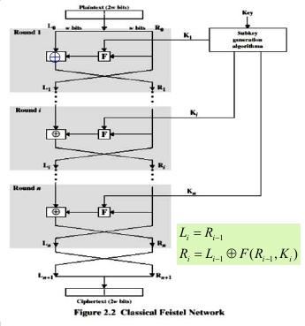

### DES
DES采用分组加密,是一种对称密钥算法 密钥长度为56bits 分组长度是64 bits
* 初始置换,IP
* 16轮迭代,Ti , i=1,2,...16
* 末尾置换,IP-1
除了初始置换和末尾置换,DES的结构与Feistel密码结构完全相同

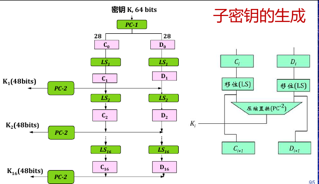
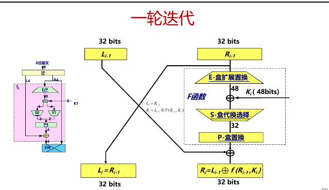

#### 3-DES
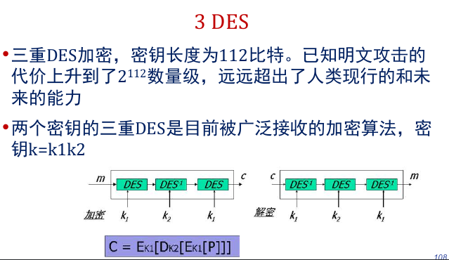

## 非对称密码

公钥密码系统是基于陷门单向函数的概念
单向函数是求逆困难的函数;单向陷门函数,是在不知陷门信息下求逆困难的函数,当知道陷门信息后,求逆是易于实现的

公钥密码系统有三种用途:
• 加密/ 解密
• 数字签名:如果电子文件都需要签名,如何能够确保数字签名是出自某个特定人,而且通信双方无异议。发送方用自己的私钥签署报文,接收方用对方的公钥验证对方的签名
• 密钥交换:双方协商会话密钥,用于对称密钥数据加密

### RSA
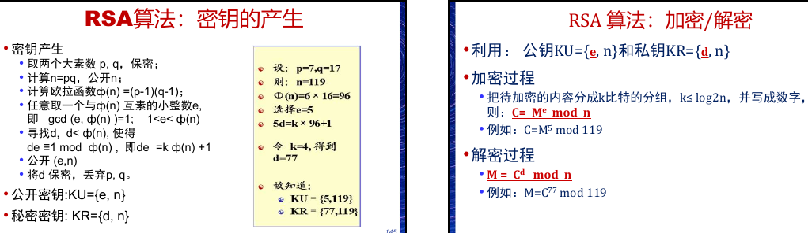

### Diffie-Hellman

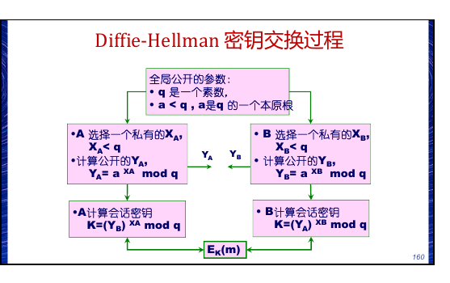

## 密钥分配

三种情况：
• 情况一:传统的对称密码分配
• 情况二:非对称密码中的公钥分配
• 情况三:公钥密码用于传统密码体制的密钥分配

### 传统的对称密码分配

**KDC**
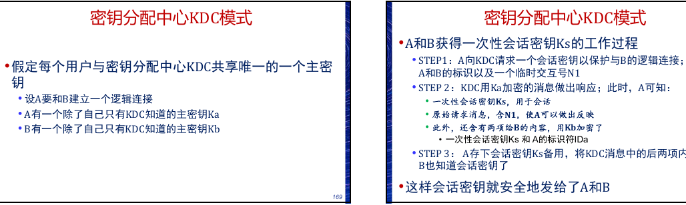

### 公钥的分配

常用的公钥分配方法有四种:
• 公开发布
• 公开可访问目录
• 公钥授权
• 公钥证书

### 利用公钥分配传统密码的密钥
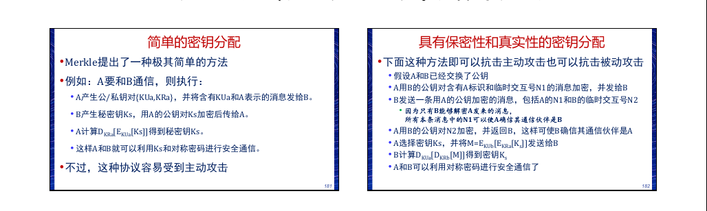