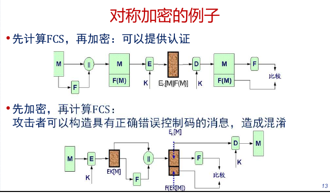
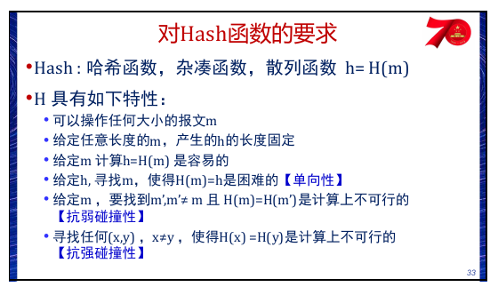
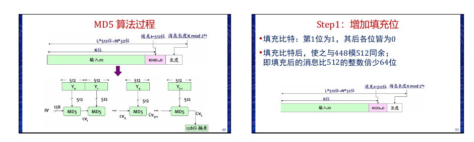
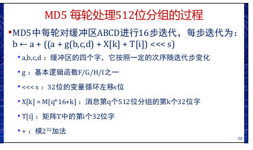
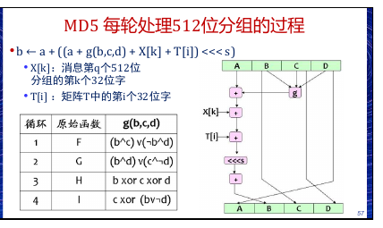
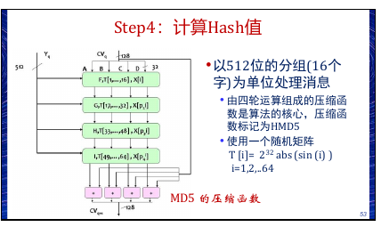
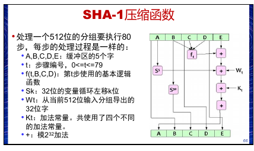
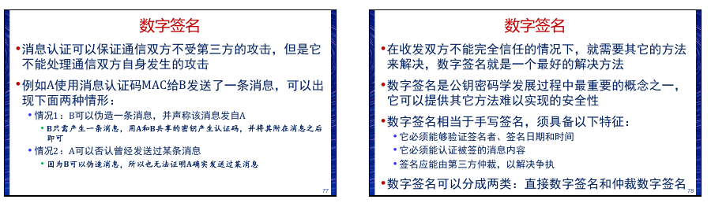
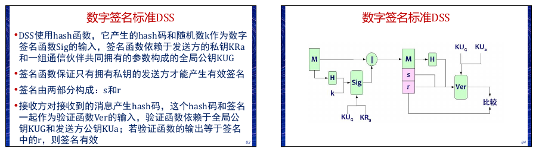
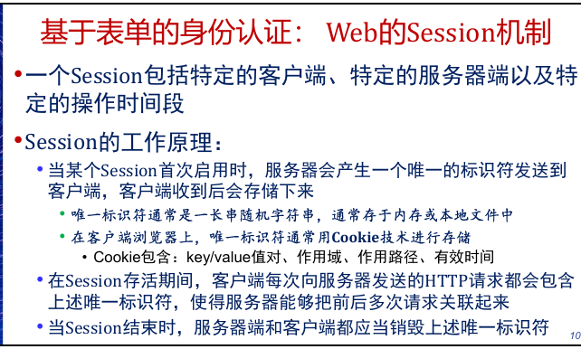

# 认证技术

## 消息加密

### 对称密码
加密前对每个消息附加一个错误检测码,也称之为帧校验序列FCS或者校验和
**顺序很重要**

### 公钥加密
公钥加密只提供保密性,不能提供认证
如果既要提供保密性,又要提供认证,发送方A可以先用其私钥加密(数字签名),然后用B的公钥加密
这种方法的缺点是执行了四次附加的公钥算法运算

## MAC
 消息认证码MAC也是一种认证技术,它利用密码生成一
个固定长度的短数据块,并将该数据块附加在消息之后
 MAC函数与加密类似,区别就是MAC算法不要求可逆性,
而加密算法必须可逆

## Hash
与消息认证码一样,hash函数的输入是大小可变的消息 M,输出是固定大小的hash码H(M)
与MAC不同的是,hash码并不使用密钥,它仅仅做为输入消息的函数,hash码也称为消息摘要(Message Digest , MD)

Hash提供认证；如果用私钥加密Hash码，则提供签名。

### Hash函数
迭代hash函数将输入消息分为L个固定长度的分组,每个分组长度为b位,最后一个分组不足b位时,需要填充成b位。输入中包含长度,增加了攻击的难度。

#### MD5
MD5的输入是任意长度的消息,对输入按照512位的分组为单位进行处理,算法的输出是128 位的消息摘要。

填充：

之后加上64位长的长度字段（小端序）。

**压缩函数：**
每轮有四步，每步16次迭代，每步用不同的逻辑函数：
*T是从正弦函数构造的表*

最后和输入相加：

#### SHA
SHA算法建立在MD4之上,基本框架与MD4类似
输出是160位的消息摘要,输入消息以512位的分组为单位进行处理

**压缩函数：**

#### RIPEMD-160算法

RIPEMD-160算法的输入是任意长的消息,输出是 160 位的消息摘要;输入以512位的分组单位进行处理,hash值和链接变量是160位
由十轮运算组成的压缩函数是算法的核心,十轮运算分成两组,每组**五轮**,每轮执行16步迭代

## 数字签名
签名和认证不同：

**DSA**：只能用于签名

## 网站身份认证

### Basic认证
用户身份凭证:账号+静态口令
由于HTTP协议是面向一次连接的无状态网络协议,因此需要在每次发出HTTP请求时,把用户身份凭证的明文发送到服务器端,服务器与存储在服务器端的用户凭证进行比较。
这是HTTP的Basic认证机制

优点
* 没有复杂的交互过程
* 使用非常简单

缺点
* 每次都需要传递账号和口令,易于被监听、盗取,安全性低
* 本地(浏览器)还需要保存账号和口令,存在安全隐患
* 服务器端处理每个HTTP请求都要进行一次身份验证过程,效率低

### 基于表单的认证
基于表单的Web身份认证过程通常包括三个步骤:
1. 第一步:客户端向服务器发送请求,服务器返回包含表单的页面
2. 第二步:用户按要求填写表单的内容完成后,客户端把表单内容发送到服务器;服务器获取表单中的内容后,进行验证,验证通过则启动Session并返回给客户端
3. 第三步:客户端后续的请求包含Session 的唯一标识符,服务端验证唯一标识符的合法性
通常基于一个以标识符为key的哈希表数据结构

优点:简单、方便、易用
缺点:安全性低,账号和口令明文在网络上传输,很大程度上存在被监听盗取的可能

**Session**

