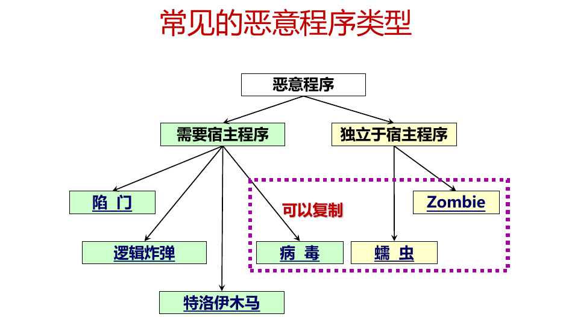
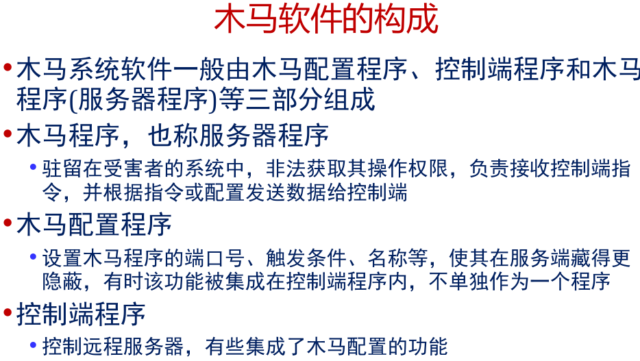

# 软件入侵

## 陷门
陷门是一个程序的秘密入口

## 逻辑炸弹
逻辑炸弹是最早出现的恶意软件之一,它是嵌在合法程
序中的,只有当待定的事件出现时才会进行破坏的一组
程序代码,一般会预先规定了病毒和蠕虫的发作时间

## 木马
特洛伊木马是一种实际上或者表面上看起来有某种有用
功能的程序,但它内部含有隐蔽代码;当被调用时会产
生一些意想不到的后果
特洛伊木马会欺骗用户或者系统管理员进行安装,并在
计算机上与其它正常程序一起混合运行,将自己伪装得
看起来是个正常程序在工作
•如果一个程序仅仅提供远程访问,那么它只是一个后门;
如果攻击者将这些后门功能伪装成某个良性程序,那么
就具有了特洛伊木马属性

## Zombie
Zombie秘密地接管其它依附在Internet上的计算机,并
使该计算机发动攻击,而且这种攻击很难通过追踪
Zombie的创建者查出来
•Zombie一般被用在拒绝服务攻击上,尤其是对Web站点
的攻击

## 病毒

病毒是一种可以通过修改自身来感染其它程序的程序,
这种修改包括对病毒程序的复制,复制后生成的新病毒
同样具有感染其他程序的功能

## 蠕虫
一种能够自我复制的计算机程序,它利用网络上计算机
系统的漏洞自主的将自己复制到其它计算机上
一个独立的计算机程序,不需要宿主
自我复制,自主传播
占用系统或网络资源、破坏其他程序
不伪装成其他程序,靠自主传播
